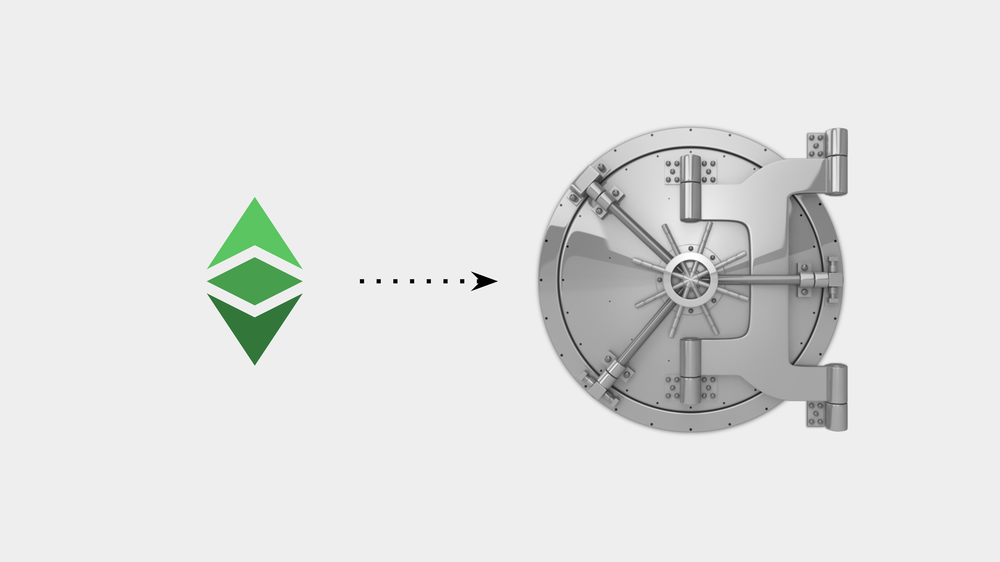

---
**You can listen to or watch this video here:**

[video]

---

The major paradigm shift that a blockchain as Ethereum Classic (ETC) brings to the world is that it transfers the possession and control of wealth from trusted third parties to the original owners.

It does this in two ways. First, people and businesses may hold their wealth with their own private keys under their own addresses on the blockchain directly, and this gives them direct and exclusive control. 

Second, it separates the property registry from the state and corporations and moves it to the secure environment of the blockchain, this guarantees the immutability of property.

In addition to the above, a programmable blockchain as ETC has the extra benefit that smart contracts may be written and deployed in it making them decentralized autonomous agents. These decentralized applications can perfectly replace trusted third parties altogether by providing the same services (banking, payments, investing, insurance, property registries, contracts, etc.) as traditional centralized institutions, but in a totally decentralized, thus permissionless and censorship resistant way.

However, this presents a new and huge responsibility to users. This responsibility is that, from now on, people and businesses will have to know how to manage their private keys in secure ways to ensure that their ETC, and crypto wealth in general, will not be lost to crime, confiscation, or error.

This is the subject of this post.

## Private Keys

With regards to keeping your ETC secure, it is important to know two things from the start: 

- If you keep your crypto assets in trusted third parties as centralized exchanges or other financial institutions, then they have control over them, not you.
- If you keep your crypto assets under your private keys on the blockchain, then you have exclusive control over them, nobody else.

With this is mind we will explain what are the different formats of private keys.

### Raw Private Keys

A raw private key, or private key, is like a secret password that controls an address on the blockchain. Your ETC are under this address, which is known to the public. 

A private key looks more or less like this:

`36fdbed2213dd215e1c81b4d581697a9f006f24567953ab067677132108e11c8`

This key is associated, by means of a cryptographic mathematical function, to your address on Ethereum Classic. The address is public and anyone may see it, but the only way to sign transactions and move assets or interact with decentralized applications on the network is through the private key.

### Secret Passphrases

Secret passphrases may be now the most popular way of storing raw private keys. They are usually sets of 12 to 24 secret words from which, by means of a cryptographic algorithm, your addresses and private keys on the blockchain may be generated.

Secret passphrases, also called mnemonic phrases, are very convenient because with one set of 12 or 24 words you may generate addresses and their corresponding private keys in several blockchains and hold all your assets under them.

### Keystore JSON Files

This was a popular way of generating addresses and private keys for Ethereum Classic and Ethereum in the early days. JSON means “JavaScript Object Notation” and is a type of file that is used for machines to communicate with other machines.

Under this format, there is a standard that is used to generate single addresses and private keys on Ethereum Classic and other blockchains.

### Custodial vs Non-custodial Wallets

Many people have their coins at Coinbase, Binance or other financial institutions and call their accounts “wallets”. This can’t be further from the truth. A wallet is another name for an address on the blockchain directly. When you have your ETC on Coinbase, Binance or other centralized exchanges, you have an account with them and they owe you your coins, but you do not have possession or control of them. This trusted third party risk is exactly what blockchains as ETC seek to avoid.

On the other hand, whether you have raw private keys, secret passphrases, or private key JSON files, if you use them through non-custodial wallets, then you control your ETC and nobody else.

Popular non-custodial wallet brands are Metamask, Trust Wallet, and Exodus. These applications may be downloaded to your devices, they usually generate the 12 or 24 word secret passphrases for you, and then you may manage your ETC and other crypto assets from there.

### Software Wallets

When you are using your devices such as your computer or your phone, and you have a non-custodial wallet as the ones mentioned above, you are using what are called software wallets. This is because they are just software apps on your devices and you manage your ETC or crypto assets from there.

Software wallets usually give you your 12 or 24 word secret passphrase for you to store safely, and then they keep the encrypted private keys in your devices for convenient use and to sign transactions on a day to day basis.

### Hardware Wallets

Hardware wallets are a more secure way of keeping your private keys because they are devices separated from your computer and your phone that store your encrypted private keys, and they are never connected to the internet so a huge attack vector is eliminated for hackers and criminals to capture your ETC.

However, hardware wallets are a little less convenient to use as a tradeoff to their security because you have to connect them to your devices every time you want to sign a transaction. But, the tradeoff is worth it, because remember that if someone captures your private keys and they steal your ETC, then they may be lost forever.

Hardware wallets also give you a 12 or 24 word secret passphrase in case you lose them. This means that your private keys and addresses on the blockchain are recoverable as long as you stored the secret passphrase safely. 

## Private Key Security Management

Now that we know what are the different private key formats and different types of wallets, we may describe how to keep them as safe as possible.

### Paper vs Digital Storage

Whether you control addresses on the blockchain through raw private keys or secret passphrases, they may be stored in digital or paper form.

It is conventional wisdom in the industry that the best way to store private keys and secret passphrases is by writing them on paper or printing them, making two or three copies, and then storing those paper copies in safe places, more or less how you would store the most important things and documents you may hold such as passports, contracts, last wills, trust agreements, etc.

The keystore JSON file is usually stored in digital form, and the raw private keys and secret passphrases may also be stored in digital form. 

In these cases the best way to do it is to store copies in two or three pendrives (a.k.a. thumb drives, USB keys, memory sticks, disc drives, etc.) and to put them in a safe place.

Sometimes, a good setup is to have an old phone or computer and to store these digital copies in such devices.

The important thing about all these digital copy setups, similar to the concept of hardware wallets, is for your private keys, secret passphrases, or keystore JSON files to be disconnected from the internet, therefore inaccessible to hackers and criminals over cyberspace.

### Do Not Use Cloud Services

This is a typical mistake by many newbies. It is imperative for you to NOT store any of your ETC private keys, secret passphrases, or keystore JSON files (or any kind of crypto data, passwords, or private information for that matter) in cloud services, such as Google Drive, iCloud, Microsoft OneDrive, or Dropbox. 

This is because they have access to all your files, even if they are encrypted.

They own the private keys to decrypt all your files that you store with them.

As an example, following is the text of Dropbox’s documentation:

***Who can see the stuff in my Dropbox account?***

*Like most major online services, Dropbox personnel will, on rare occasions, need to access users’ file content (1) when legally required to do so; (2) when necessary to ensure that our systems and features are working as designed (e.g., debugging performance issues, making sure that our search functionality is returning relevant results, developing image search functionality, refining content suggestions, etc.); or (3) to enforce our Terms of Service and Acceptable Use Policy. Access to users’ file content is limited to a small number of people.*

Link: https://help.dropbox.com/security/file-access

Again, the most secure way to store your raw private keys, secret passphrases, or keystore JSON files in digital form is by keeping them in separate devices under your own control. This means that you must have good rules and policies with regards to keeping these things secure and accessible.

### Never Send Them by Email or Text

This is another mistake people do (and have done historically with passwords, for example). Never send raw private keys, secret passphrases, or private key JSON files by email or text. Neither through direct messaging or social media private messaging systems such as Twitter DMs or Facebook Messenger.

All tech companies, small or large, have access to your messages, emails, and information, whether encrypted or not, because, legally, they need to be able to respond to government inquiries and they usually put on their terms of services that they must have access for security and housekeeping reasons.

The only way to distribute or communicate your raw private keys, secret passphrases, or keystore JSON files to family members, business partners, lawyers, or anyone who needs to know them is by transferring the paper copies you hold, making new copies, or transferring pendrives or devices to them physically and directly.

Never use tech company controlled communications channels or storage services. Never.

## How Much to Put in Cold and Hot Storage

The last concept that is important to know about keeping your ETC secure is to understand the concepts of cold storage and hot storage.

### Cold Storage

The examples given above about hardware wallets or keeping raw private keys, secret passphrases, or keystore JSON files in pendrives or old devices that you don’t use anymore and are not connected to the internet is because, through the internet, your information may be captured by hackers and criminals.

Cold storage means that you have an address with ETC on the Ethereum Classic blockchain and that the raw private key, secret passphrase, or keystore JSON file that controls that address is stored in a device or piece of paper that is separated from the internet. 

This setup is very inconvenient for daily use so, usually, people store in this format more or less 80% or 90% of their savings in crypto because it is usually the proportion that is left for long term holding.

For cold storage, people usually use the hardware wallets, such as Ledger or Trezor, that are seldom used to move ETC, but are highly secure.

### Hot Storage

If you use any of the popular brands of software wallets, those are usually hot wallets because they hold your encrypted keys inside your devices that are used on a  daily basis and are frequently connected to the internet.

For setups to use on a daily basis, the conventional wisdom is to use these wallets to hold more or less 10% to 20% of your ETC and other crypto assets. 

Hot wallets are usually the most common brands such as Metamask, Trust Wallet, and Exodus.

---

**Thank you for reading this article!**

To learn more about ETC please go to: https://ethereumclassic.org
