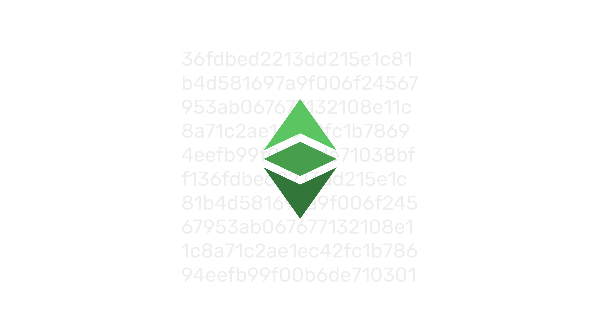
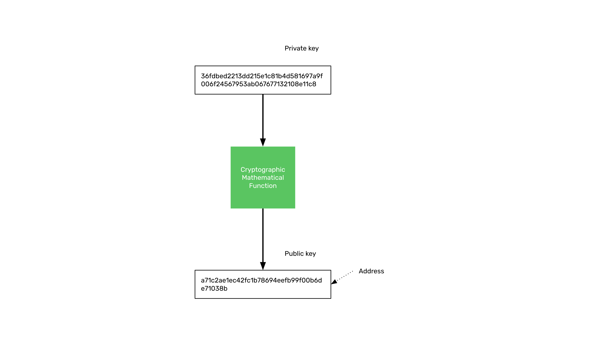
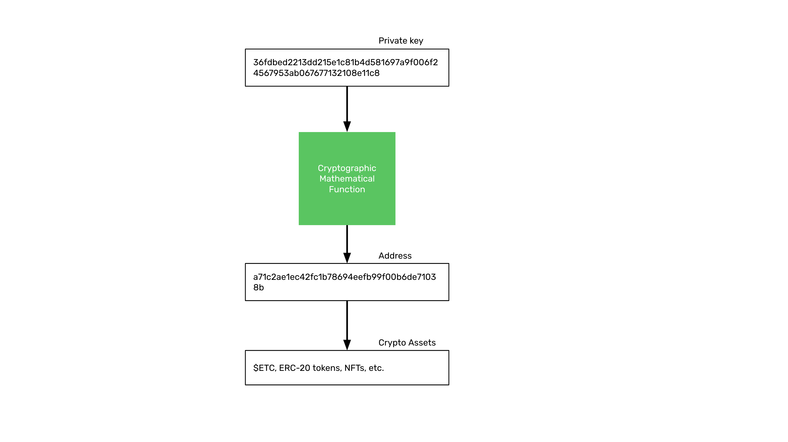

---
**You can listen to or watch this video here:**

<iframe width="560" height="315" src="https://www.youtube.com/embed/cxJa0xRz4mE" title="YouTube video player" frameborder="0" allow="accelerometer; autoplay; clipboard-write; encrypted-media; gyroscope; picture-in-picture; web-share" allowfullscreen></iframe>

---

In the first class of this course we learned what is public key cryptography and in the last few classes we saw how Ethereum Classic works. 

In this class we will review the concepts of public key cryptography again, and then we will focus in the next few classes on how to manage your addresses and crypto assets in ETC.

The topics we will cover are: 

- What Are Private Keys, Public Keys, and Addresses? (this class).
- The Difference Between Wallets and Addresses (class 18)
- What Are Raw Private Keys, Private Key JSON Files, and Secret Passphrases? (Class 19)
- What are Custodial and Non-custodial Wallets? (class 20)
- What Are Hardware and Software Wallets? (class 21)
- What Are Hot and Cold Wallets? (class 22)

## Public Key Cryptography

As we learned in the first class, the way public key cryptography works is that there is a cryptographic mathematical function that transforms a very large number into another very large number. 

The first number is the secret or private key, and the resulting number, when passing the private key through the function, is the public key that may be known by anyone.

It is very easy to generate the public key, but by knowing the public key, it is practically impossible to figure out the private key.

This system is what is used now for the account system in blockchains such as Ethereum Classic, Ethereum, and Bitcoin.

## Your Public Key Is Your Address on the Blockchain

The public key is your address on the blockchain. “Address” is just another name for your public key. 

Some people call these addresses “accounts”, but this is a misnomer as we will see in the next section.

The way it works is that your address in ETC is only controlled by your private key. So, when you have the private key of an address on the blockchain with a balance of ETC, you have exclusive access, possession, and control of that ETC.

## Your Address and Your Crypto Assets

As an analogy, we could say that the address is like a bank account but on the blockchain. 

However, the bank account represents what the bank owes you, so you have no control over it. This is why calling an address an “account” is a misnomer.

Your address is completely under your exclusive control and no one else has access to it, this is the major paradigm change brought by the blockchain industry.

Under that address is where crypto assets are sent by others, received by users, and stored.

The only way to access or send crypto assets to other addresses is to sign transactions using the private key.

With regards to keeping your ETC secure, it is important to know that, because now you are in control, if you lose your private keys, then you may lose your ETC and other crypto assets.

## Address Formats In Different Blockchains

As we also explained in the first class, although all blockchains use the same public key cryptography model for users to manage and control their assets, the formats of the addresses may vary.

For example, Ethereum Classic and Ethereum public addresses are identical because they are both fully compatible under the Ethereum Virtual Machine standard and both share the same formats. This means that the same private and public keys may be used on both blockchains.

However, in Bitcoin, the design choice was that the public key had to be processed with an additional function to transform the public key into a special base 58 number to make it more human readable and avoid the confusion of some special characters.

---

**Thank you for reading this article!**

To learn more about ETC please go to: https://ethereumclassic.org
