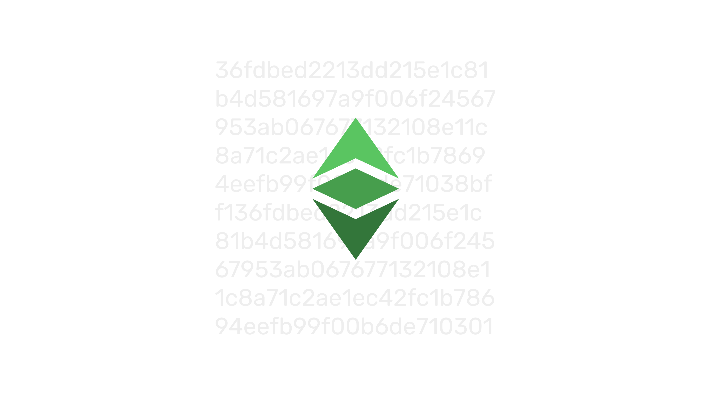
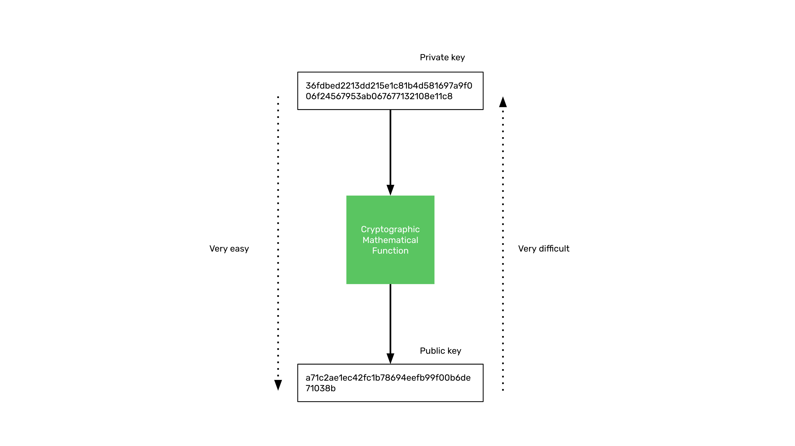
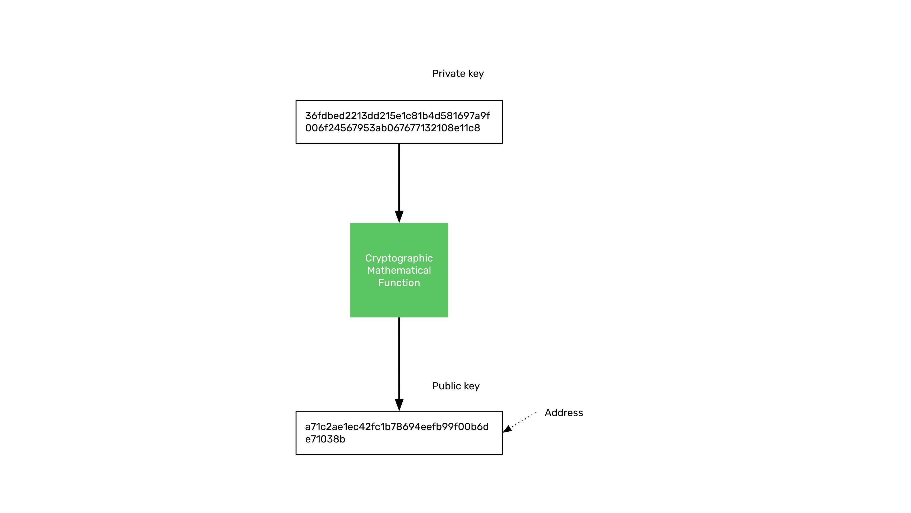
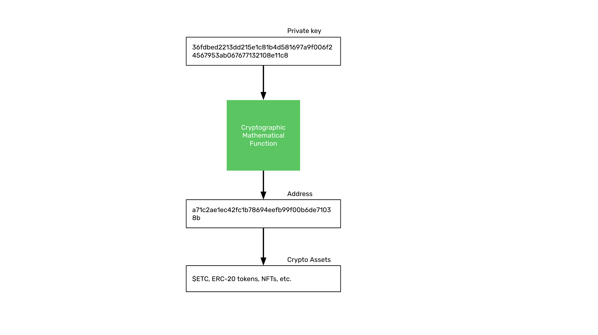
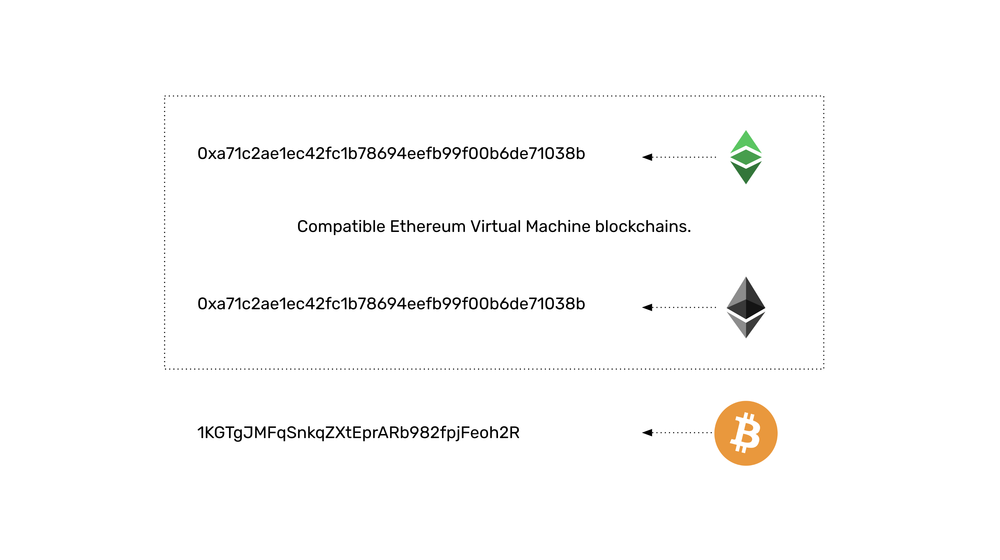

---
**欢迎由此收听或观看本期内容:**

<iframe width="560" height="315" src="https://www.youtube.com/embed/cxJa0xRz4mE" title="YouTube video player" frameborder="0" allow="accelerometer; autoplay; clipboard-write; encrypted-media; gyroscope; picture-in-picture; web-share" allowfullscreen></iframe>

---

在本课程的第一节课中，我们学习了什么是公钥密码学，而在最近几节课中，我们了解了以太经典是如何运作的。

在本节课中，我们将再次回顾公钥密码学的概念，然后在接下来的几节课中，我们将重点介绍如何管理您在以太经典中的地址和加密资产。

我们将要涵盖的主题包括：

- 什么是私钥、公钥和地址？（本课）
- 钱包和地址的区别（第18课）
- 什么是原始私钥、私钥 JSON 文件和秘密口令？（第19课）
- 什么是托管和非托管钱包？（第20课）
- 什么是硬件和软件钱包？（第21课）
- 什么是冷热钱包？（第22课）

## 公钥密码学

正如我们在第一课中学到的，公钥密码学的工作原理是有一个加密数学函数，可以将一个非常大的数字转换成另一个非常大的数字。

第一个数字是私钥，通过这个函数得出的结果数字就是公钥，任何人都可以知道公钥。

生成公钥非常容易，但是通过知道公钥来推断私钥几乎是不可能的。

现在，这个系统被用于像以太经典、以太坊和比特币这样的区块链账户系统。

## 您的公钥是区块链上的地址

公钥是您在区块链上的地址。 “地址”只是您的公钥的另一个名称。

有些人将这些地址称为“账户”，但这是一个错误的叫法，我们将在下一节中看到。

它的工作方式是，您在ETC上的地址仅由您的私钥控制。 因此，当您拥有具有ETC余额的区块链地址的私钥时，您全权拥有、占有和控制该ETC。

## 您的地址和加密资产

作为类比，我们可以说，地址就像区块链上的银行账户。

但是，银行账户代表银行欠您的，因此您对其没有控制权。这就是称地址为“账户”的原因是错误的原因。

您的地址完全受到您的独家控制，没有其他人可以访问它，这是区块链行业带来的主要范式变革。

在该地址下，其他人发送的加密资产由用户接收并存储。

访问或向其他地址发送加密资产的唯一方法是使用私钥签署交易。

关于保护您的ETC安全，重要的是要知道，因为现在您有控制权，如果您丢失了私钥，则可能会丢失您的ETC和其他加密资产。

## 不同区块链的地址格式

正如我们在第一课中解释的那样，尽管所有区块链都使用相同的公钥密码学模型来让用户管理和控制他们的资产，但地址的格式可能会有所不同。

例如，以太经典和以太坊公共地址是相同的，因为它们都完全兼容以太坊虚拟机标准，并且都共享相同的格式。这意味着可以在两个区块链上使用相同的私钥和公钥。

然而，在比特币中，设计选择是必须使用一个额外的函数处理公钥，将公钥转换成一个特殊的58进制数，使其更易于人类阅读，并避免一些特殊字符的混淆。

---

**感谢您阅读本期文章!**

了解更多有关ETC内容，请访问: https://ethereumclassic.org
