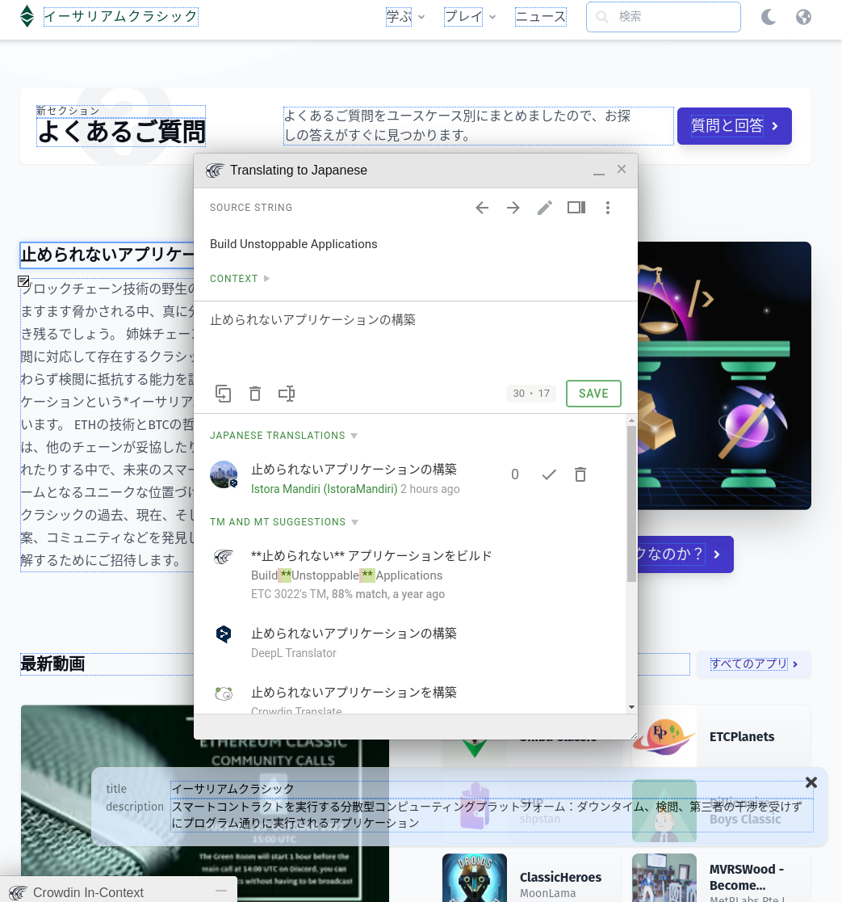

Es un placer anunciar que el sitio web EthereumClassic.org ahora está disponible en 22 idiomas.

Hoy, además de los idiomas inglés, chino, español, japonés, coreano y ruso habilitados anteriormente, se han habilitado otros 16 locales. En total, ahora están disponibles los siguientes idiomas:

- Inglés
- 中文 (chino)
- اَلْعَرَبِيَّةُ (árabe)
- Deutsch (alemán)
- español (español)
- Ελληνικά (griego)
- Français (francés)
- עִבְרִית (hebreo)
- हिन्दी (Hindi)
- Hrvatski (croata)
- italiano (italiano)
- 日本語 (japonés)
- 한국어 (coreano)
- malayo
- Holanda (holandés)
- portugués (portugués)
- русский (ruso)
- ภาษาไทย (tailandés)
- Türk (turco)
- Tiếng Việt (vietnamita)
- 粵語 (cantonés)

El contenido principal de este sitio web ha sido traducido automáticamente a estos idiomas y se puede ver utilizando el ícono del globo terráqueo en la parte superior derecha de cada página.

Las publicaciones de blog históricas y el contenido enviado por los usuarios, como las aplicaciones, no se traducen, pero se pueden traducir. También se pueden enumerar videos y enlaces de noticias disponibles en idiomas específicos.

Como estas traducciones no se crearon manualmente, es posible que haya errores gramaticales y contextuales en todo momento, pero ahora que el sistema de internacionalización (i18n) y el flujo de trabajo de contribución están activos, alentamos a los miembros de la comunidad a que nos ayuden a mejorar este contenido.

Las traducciones se gestionan a través de [Crowdin](https://crowdin.com), un servicio popular para colaborar en la localización, que debería hacer que el proceso de contribución sea lo más fluido posible. Crowdin ha otorgado amablemente al proyecto Ethereum Classic una licencia de código abierto, que nos permite usar su servicio sin pagar.

Si desea ayudar a contribuir con Ethereum Classic sugiriendo idiomas adicionales o corrigiendo traducciones, consulte las instrucciones para contribuir en el Repositorio de GitHub del sitio web de [ETC](https://github.com/ethereumclassic/ethereumclassic.github.io).