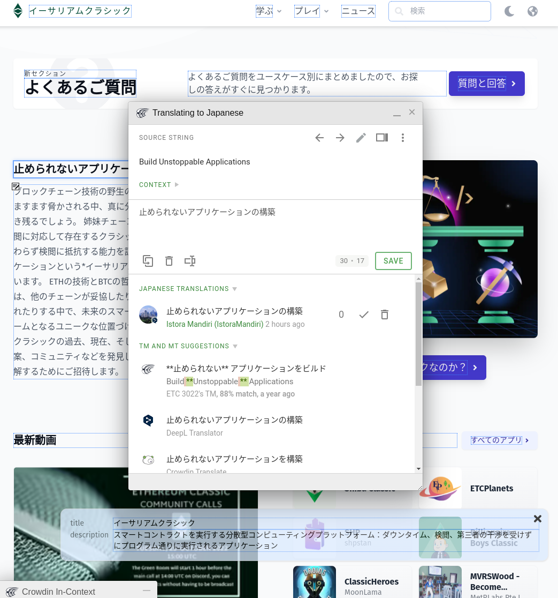

EthereumClassic.org のウェブサイトが 22 の言語で利用できるようになったことをお知らせできることを嬉しく思います。

現在、以前に有効化されていた英語、中国語、スペイン語、日本語、韓国語、ロシア語に加えて、さらに 16 のロケールが有効化されました。 合計で、次の言語が利用可能になりました。

- 英語
- 中文（中国語）
- アラビア語
- ドイツ語 (ドイツ語)
- Español (スペイン語)
- Ελληνικά (ギリシャ語)
- フランセ（フランス語）
- ヘブライ語 (ヘブライ語)
- हिन्दी (ヒンディー語)
- Hrvatski (クロアチア語)
- イタリア語 (イタリア語)
- 日本語 (日本語)
- 한국어（韓国語）
- マレー語
- オランダ語 (オランダ語)
- Português (ポルトガル語)
- русский (ロシア語)
- ภาษาไทย (タイ語)
- トルコ語（トルコ語）
- Tiếng Việt (ベトナム語)
- 粵語 (広東語)

この Web サイトのメイン コンテンツは、これらの言語に自動的に機械翻訳されており、各ページの右上にある地球のアイコンを使用して表示できます。

過去のブログ投稿やユーザーが投稿したアプリなどのコンテンツは翻訳されませんが、翻訳される可能性があります。 特定の言語で利用可能なビデオとニュースのリンクも一覧表示できます。

これらの翻訳は手動で作成されたものではないため、全体に文法的および文脈上のエラーがある可能性がありますが、国際化 (i18n) システムと貢献ワークフローが有効になったため、コミュニティ メンバーにこのコンテンツの改善を支援していただくことをお勧めします。

翻訳は [Crowdin](https://crowdin.com)を介して管理されます。これは、ローカリゼーションの共同作業で人気のあるサービスであり、貢献プロセスを可能な限りシームレスにする必要があります。 Crowdin は、イーサリアム クラシック プロジェクトにオープン ソース ライセンスを快く許可してくれました。

追加の言語を提案したり、翻訳を修正したりして Ethereum Classic への貢献を支援したい場合は、 [ETC Web サイト GitHub リポジトリ](https://github.com/ethereumclassic/ethereumclassic.github.io)で貢献の手順を確認してください。