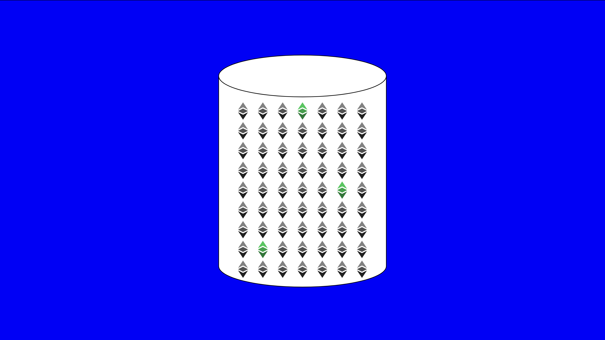

---
**You can listen to or watch this video here:**

<iframe width="560" height="315" src="https://www.youtube.com/embed/Alxz8pDfMhg" title="YouTube video player" frameborder="0" allow="accelerometer; autoplay; clipboard-write; encrypted-media; gyroscope; picture-in-picture; web-share" allowfullscreen></iframe>

---

## What Is Composability?

In traditional systems, when you try to book a flight, a hotel, a car rental, and pay everything at once with a credit card with the condition that the dates and prices you reserved are exactly what you selected, the process of closing and paying that composed transaction is very difficult technologically because all the services are hosted in many isolated datacenters of the different providers. 

Consequently, it is very likely that the transaction will be partitioned and executed sequentially with a high risk that any of the service terms may have changed or with no availability by the time the transactions are processed in each system.

If all these services were on a blockchain as Ethereum Classic (ETC) they would be hosted in the same system in the form of smart contracts and the transaction would be executed instantaneously in a single block.

This ability of a system to host all the services in the same place as modular components that may interact together in many ways and combinations is called composability.

From a developer perspective, composability is also extremely valuable because all the ecosystem of smart contracts inside ETC becomes a collection of services that may be reused and leveraged, thus reducing development time and increasing innovation.

All the components and services inside ETC are like lego blocks that both users and developers may put together as they please. This has enabled a very unique experience in this type of technology.

This level of composability is very likely an unintended benefit not anticipated by Satoshi Nakamoto when he invented Bitcoin, although he did envision that it would have smart contracts eventually, an idea that proved very difficult to come true due to that system’s design.

## Composability vs Interoperability

The heart of composability in ETC and other smart contract networks is the replicated database, which is what we know as the blockchain. 

The blockchain is a ledger that stores accounts, balances, and smart contracts, and it is replicated because each time a new transaction or smart contract is sent to the network it is distributed and copied in every node of the system. 

This feature was originally intended to provide a high degree of redundancy for security reasons, but also proved to have additional benefits such as composability.

Interoperability, on the other hand, is the ability of different blockchains to interact with one another. This is distinct from composability because it needs everything inside the same network, while interoperability is the ability of doing things with resources and services from different isolated networks.

Therefore, composability is lost when services are hosted in different blockchains. 

## Composability vs Layering

Similar to interoperability, layering also affects composability. 

Layering is similar to interoperability, but instead of looking to interact with other blockchains, it seeks to increase scalability of transactions.

If a blockchain is limited to more or less 1.5 million transactions per day, then it falls short of consumer level needs that run in the billions per day. Layering basically moves the high volume and low value transactions out of the base layer blockchain to higher layer systems that process these quantities more efficiently and then settle final netted transactions on the lower layer unscalable system.

As may be guessed, just for the fact that transactions, thus some dapps or their components, will be moved to higher layer systems to satisfy transaction volumes, composability will be affected as everything is not inside the same network.

Ethereum Classic has this kind of constraint, it will be able to comfortably handle up to about 1.5 million transactions per day, but if users need all of their things to be done at the base layer, then they will likely end up paying higher fees in exchange for the security guarantees.

## Sharding, Sidechains, and Parachains are Anti-Composability

Sharding, sidechains, and parachains are anti-composability because they break up the blockchain and divide it in silos, thus disconnecting smart contracts that could interact in real time.

Because the base layer beacon chains that they use don’t actually record the states of every smart contract, then composability is broken, even if all the shards, sidechains, and parachains are connected through them.

The idea of breaking up a blockchain is not only contrary to the principle of security of a blockchain given by replication, but it forces node operators to actually run all the separate components anyway just to preserve a basic goal of these systems: self verification.

## Composability Design in Service Modules

To give an example of how composability will be of extraordinary value in Ethereum Classic, imagine someone buying a home where all these things are hosted inside the network:

- The home is represented as an NFT in ETC
- There is a real estate NFT exchange in ETC
- The official property registry and title of the home is inside ETC
- The mortgage loan is a smart contract in ETC
- The lien and its loan enforcement rules is a smart contract in ETC
- The mortgage payments are done inside ETC

All of the above can be significantly automated and coordinated in composable transactions, simplifying the whole process in ways that would never be possible in traditional isolated systems controlled by trusted third parties.

In our example, the initial purchase transaction of the home in an exchange, together with the mortgage loan, the registration in the official property registry, the title, and automated monthly payments could be configured and setup in one single transaction.

Then, as time passes by, if the buyer were to default or not pay many monthly payments, then the lien smart contract could be automatically activated removing the property from the buyer until they become current or the property may be liquidated in the real estate NFT market again to pay for the loan.

The above could be done as well in the case of car purchases, and many other types complex transactions that are now possible due to composability in ETC.

---

**Thank you for reading this article!**

To learn more about ETC please go to: https://ethereumclassic.org
