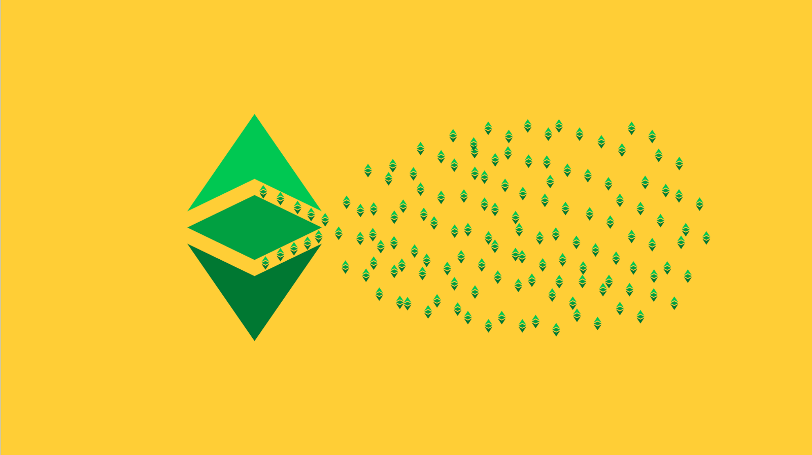

---
**You can listen to or watch this video here:**

<iframe width="560" height="315" src="https://www.youtube.com/embed/TbsxAUtlcjk" title="YouTube video player" frameborder="0" allow="accelerometer; autoplay; clipboard-write; encrypted-media; gyroscope; picture-in-picture; web-share" allowfullscreen></iframe>

---

This is the fifth part of a series that will explain how to contribute to Ethereum Classic (ETC) in a variety of ways. 

The videos and posts in the series will contain the title “How to Contribute to ETC:” with the following topic extensions: 

1. The Improvement Proposal Process (ECIP)
2. The Community Website
3. Community Tweets
4. Community Volunteering
5. Mining
6. Operating a Node
7. Donating Money
8. Building a Dapp

## What Is Mining?

The Ethereum Classic (ETC) blockchain is a network of computers around the world dedicated to maintaining a ledger with accounts, balances, and decentralized software programs called smart contracts.

For users to move money or use the smart contract decentralized applications (dapps) in ETC they need to send transactions to the network. These transactions are transmitted and replicated to all computers in the system.

The way that transactions are included in the database of the network, which is also fully replicated in all participating computers, is by having a subgroup of the machines do a lot of computational work, burning a lot of electricity, to generate a cryptographic stamp, also called hash, to seal batches of transactions, called blocks, that they then send to the rest of the network for verification and inclusion into the database (hence the term blockchain).

The process of creating the cryptographic stamp, which requires a lot of computational work, is called mining and the computers that do this work are called miners.

## The Mining Business

Contributing to ETC by mining is both a way of supporting the network and a good business!

The way it works is that each time a miner produces a block that is included in the blockchain, the network pays that miner a reward with newly issued coins.

The block reward paid to miners is decreased on a pre-determined schedule. For the first era of five million blocks which started in 2015, Ethereum Classic's block reward was 5 ETC per block. Era two, the next five million blocks, saw that reward reduced by 20% to 4 ETC per block. It then decreased to 3.2 ETC for the next era. The latest reduction makes the reward for the current era 2.56 ETC per block. Rewards will continue to be discounted by 20% every era of five million blocks going forward until the payments diminish completely.

As ETC will have a supply cap of 210,700,000 ETC, and at the time of this writing there were 140,313,583 already issued, then there are 70,386,417 still to be issued. This is an estimated value of $1,407,728,340 in revenues at current ETC prices of around $20, of which $770,231,821 will be paid to miners in the next 10 years. 

However, because of its fixed monetary policy, continued growth, excellent positioning, and security guarantees, mining revenues are likely to be significantly higher.

## Ethereum Classic’s Potential

As described in the previous section, ETC has a very valuable position in the market. It is the largest proof of work smart contracts blockchain in the world, has a market value of around $3 billion at the time of this writing, and is the fourth largest proof of work blockchain in the world after Bitcoin, DogeCoin, and Litecoin.

As nearly all the other smart contract blockchains in the market are proof of stake, a much less secure consensus mechanism that tends to centralization, ETC may be considered the most secure programmable decentralized platform in the world.

The above, coupled with its strong core principles and its capped supply, promise an incredible potential for the ETC. 

This potential may be harvested by miners as the business itself is a way of acquiring ETC at discounted prices due to its profitability.

## Ethereum Classic’s Mining Algorithm

One of Ethereum Classic’s unique features is the ETC Hash mining algorithm.

As Ethereum was using the ETH Hash algorithm before it migrated to proof of stake, Ethereum Classic had to differentiate its mining format to defend itself from 51% attacks that came from the Ethereum computing base. This led to the creation of ETC Hash.

ETC Hash is a modification of ETH Hash wherein one component, the DAG, a large file that must be used during the mining process, was reduced in size and its growth slowed to permit GPU miners with 3GB, 4GB, and 6GB; of memory per GPU card to mine Ethereum Classic for a longer period of time before DAG growth exceeds their hardware limitations..

The above is a significant benefit for smaller miners who may have these machines or may acquire them cheaply in the secondary market.

## Mining Gear

Ethereum Classic may be efficiently mined with ASIC machines, which are especially configured computers to exclusively mine the ETC Hash and ETH Hash algorithms, or GPU machines which are regular graphics processing computing devices that may mine ETC with the correct software and configuration. ETC is very inefficient to mine with CPU machines.

Because the market has become very competitive, it is advisable to acquire ASIC machines to mine ETC. We have reviewed the [iPollo V1 Mini SE Plus ASIC miner](https://ethereumclassic.org/blog/2023-03-14-mining-ethereum-classic-with-an-ipollo-asic-through-2miners-pool) and will soon publish a post about the Bitmain Antminer E9 ASIC miner.

These mining machines may be acquired in the following links:

**Buy iPollo:** https://ipollo.com/products/ipollo-v1-mini-se-plus

**Buy Antminer:** https://bt-miners.com/products/bitmain-antminer-e9

## Mining Pools

Mining pools are companies that aggregate many miners around the world who provide their computing power to produce blocks. 

The benefit of mining pools is that they smooth out the cash flows for miners because blocks are found more frequently by participating in a larger computing base and they distribute the payments evenly in time. 

In exchange for this service mining pools charge a percentage of the reward payments as a commission that usually ranges between 1% and 3%.

Popular mining pools in ETC are:

**F2pool:** https://f2pool.io/mining/guides/how-to-mine-ethereum-classic/

**2miners:** https://etc.2miners.com/

**Ethermine:** https://etc.ethermine.org/

**Poolin:** https://help.poolin.me/hc/en-us/articles/5027017873689-Poolin-Supports-ETC-Mining

**Antpool:** https://support.antpool.com/hc/en-us/articles/5984283054745-ETC-Mining-Instruction

---

**Thank you for reading this article!**

To learn more about ETC please go to: https://ethereumclassic.org
