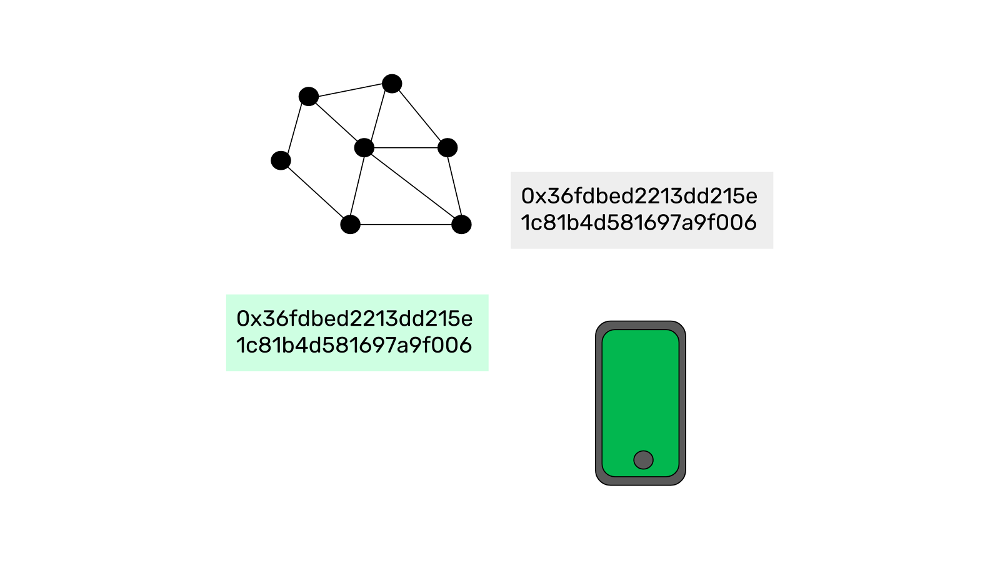
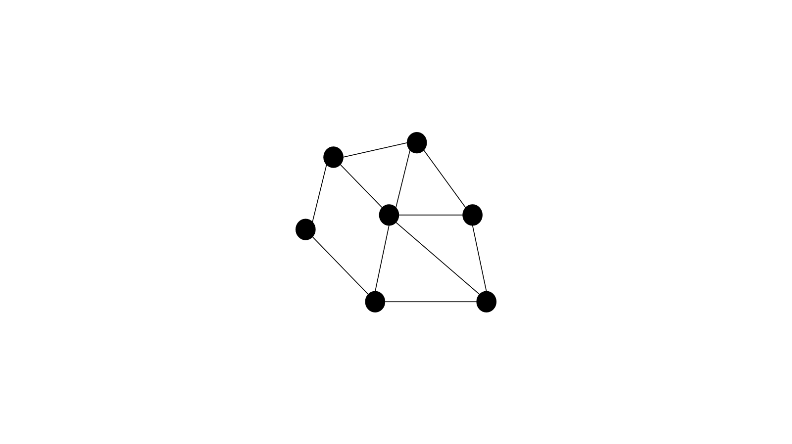
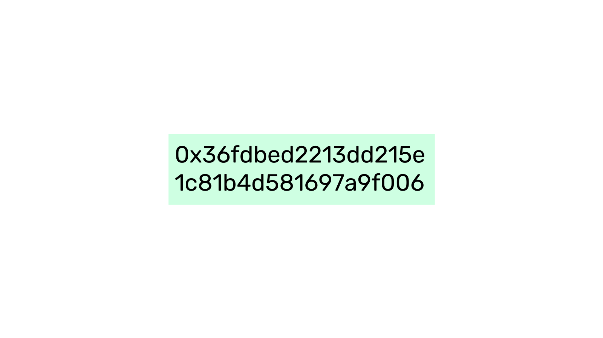
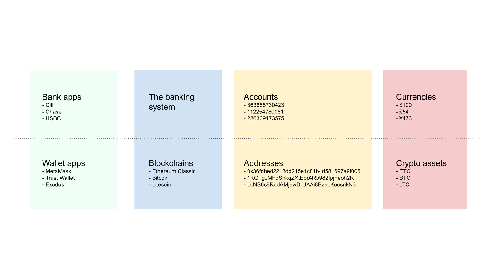

---
**You can listen to or watch this video here:**

<iframe width="560" height="315" src="https://www.youtube.com/embed/Vd_ALJRbC3A" title="YouTube video player" frameborder="0" allow="accelerometer; autoplay; clipboard-write; encrypted-media; gyroscope; picture-in-picture; web-share" allowfullscreen></iframe>

---

Migrating from traditional systems to using the blockchain is not only a change in paradigm from centralization to decentralization but also a change in terminology and nomenclature that may be daunting and confusing.

In previous classes we have learned what are private and public keys, how they work in the context of the blockchain industry, and how crypto assets are held under them.

In this class we are going to go to a higher level and explain the big picture to give a more general view of what component is what.

So, to explain the difference between wallets and addresses we will describe four related concepts: what are blockchains, accounts, addresses, and wallets.

## What Are Blockchains?

A blockchain as Ethereum Classic is a network of computers around the world that share the same database, or what we call a chain of blocks, or blockchain, which contains accounts, balances, and smart contracts.

Note that we wrote “accounts, balances, and smart contracts”. This is because the database is structured like a ledger that tracks the credits and debits of money in the accounts and keeps their latest balance. The ledger also contains a space to store software programs that when sent to the network are also replicated and shared across all participating machines, hence they become decentralized as well.

The blockchain is the higher level concept in this explanation, it is the system that contains the accounts, crypto assets, and smart contracts.

## What Are Accounts?

The number inside the blockchain that groups and under which our crypto assets are held is called an account.

Accounts on a blockchain are similar to bank accounts because they are assigned to us and used to list our assets.

However, as we explained in our previous class, to call these numbers “accounts” is a misnomer because a bank account is really just an entry in a ledger fully controlled by the institution that shows what they owe us, but they are not actual digital property that we exclusively control.

Because of how public key cryptography works, these accounts are structured so that they are large numbers, usually between 30 and 64 characters.

## What Are Addresses?

The accounts on a blockchain are also called addresses. They are exactly the same thing!

However, to call the accounts “addresses” is much more accurate because they are more akin to physical locations where we may hold, possess, and control objects or assets.

So, the same number on the blockchain where we hold our crypto-assets may be called account, address, or even public key as, technically it is the public key that corresponds to a specific private key, as we learned in the previous class.

## What Are Wallets?

Now that we have explained what are blockchains and addresses, we can now understand what is a wallet.

A wallet is an app that you may have on your phone or computer that may be used to see and manage your addresses and smart contracts (or decentralized applications or dapps) on various blockchains.

Sometimes people confuse all these terms and refer to their addresses on the blockchain as wallets. But it is more appropriate to call them addresses and to refer to the external apps on our devices that we use to manage them as wallets.

Popular brands of wallets in the market are MetaMask, Trust Wallet and Exodus.

These apps contain our encrypted private keys, and from them we can send and receive crypto assets and check our balances. 

## Putting it All Together

**Wallets** such as Metamask, Trust Wallet, and Exodus are external to the networks and may have the ability to connect to several blockchains.

**Blockchains** like Ethereum Classic, Bitcoin, and Litecoin are the networks themselves and physically contain our addresses and crypto assets.

**Addresses** are inside blockchains and are the numbers under which our crypto assets are grouped and held.

**Crypto** assets are the native cryptocurrencies, tokens, or NFTs that we may have under our addresses.

From another angle, and continuing with the analogy of the banking system, the different components we explained in this class may be comparable like this:

- Wallet apps are like the banking apps on our phones
- Blockchains are like the banking system
- Addresses are like bank accounts
- And crypto assets are like the money we have in our accounts

## The Overwhelming Importance of Private Keys

As we also explained in our previous class, the major paradigm change in the blockchain industry is that wealth is now held and controlled by the owners directly rather than by trusted third parties. This means an enormous responsibility because the private keys now have become the only way to possess and control our assets.

If we lose our private keys, then it is very likely that we may lose our crypto assets for good. Hence, it is very important to store and manage our private keys as securely as possible.

---

**Thank you for reading this article!**

To learn more about ETC please go to: https://ethereumclassic.org
