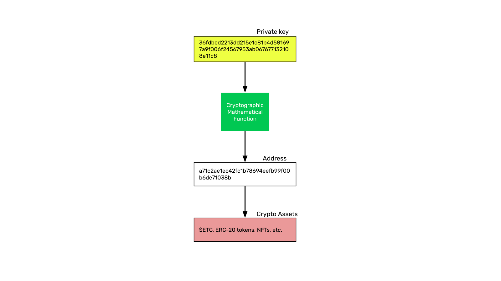

---
**欢迎由此收听或观看本期内容:**

<iframe width="560" height="315" src="https://www.youtube.com/embed/Vd_ALJRbC3A" title="YouTube video player" frameborder="0" allow="accelerometer; autoplay; clipboard-write; encrypted-media; gyroscope; picture-in-picture; web-share" allowfullscreen></iframe>

---

从传统系统迁移到使用区块链不仅是从集中化到去中心化范式的变化，而且是术语和命名法的变化，这可能令人生畏和困惑。

在之前的课程中，我们已经学习了什么是私钥和公钥，它们在区块链行业中是如何工作的，以及加密资产是如何在它们下持有的。

在这门课上，我们将进入一个更高的层次，解释一个大的画面，给出一个更一般的组件是什么。

因此，为了解释钱包和地址之间的区别，我们将描述四个相关的概念:什么是区块链、账户、地址和钱包。

## 什么是区块链?

区块链如以太经典是一个全球计算机网络，共享同一数据库，或我们所称的区块链，其中包含账户、余额和智能合约。

请注意，我们写“账户、余额和智能合约”。这是因为数据库像分类帐一样结构化，跟踪账户中的钱的借方和贷方，并保持其最新余额。该分类帐还包含存储软件程序的空间，当这些程序发送到网络时，它们也会被复制并共享到所有参与计算机上，因此它们也变得分散化。

区块链是这个解释中的更高级概念，它是包含账户、加密资产和智能合约的系统。

## 什么是账户?

在区块链中，聚集和持有我们的加密资产的数字称为账户。

区块链上的账户类似于银行账户，因为它们被分配给我们，并用于列出我们的资产。

但是，正如我们在上一节课中所解释的那样，将这些数字称为“账户”是错误的，因为银行账户实际上只是完全由机构控制的分类帐中的一项，显示他们欠我们的钱，但它们不是我们独立控制的实际数字财产。

由于公钥密码学的工作原理，这些账户被构造为大数字，通常在30到64个字符之间。

## 什么是地址?

区块链上的账户也被称为地址，它们是完全相同的东西！

然而，将账户称为“地址”更加准确，因为它们更类似于我们可以持有、拥有和控制对象或资产的物理位置。

因此，我们持有加密资产的区块链上的同一数字可以称为账户、地址，甚至是公钥，因为从技术上讲，这是与特定私钥相对应的公钥，正如我们在之前的课程中学到的那样。

## 什么是钱包?

现在我们已经解释了什么是区块链和地址，我们现在可以理解什么是钱包了。

钱包是一款您可以在手机或电脑上使用的应用程序，可用于查看和管理各种区块链上的地址和智能合约（或去中心化应用程序或dapp）。

有时人们会混淆所有这些术语，并将其区块链上的地址称为钱包。但更适合称它们为地址，并将我们用于管理它们的外部应用程序称为钱包。

市场上流行的钱包品牌包括MetaMask小狐狸、Trust Wallet和Exodus。

这些应用程序包含我们加密的私钥，从中我们可以发送和接收加密资产并检查我们的余额。

## 将一切合并起来

**钱包**，如MetaMask小狐狸、Trust Wallet和Exodus，是外部网络，可以连接到多个区块链。

**区块链**，如以太坊经典、比特币和莱特币，是网络本身，物理上包含我们的地址和加密资产。

**地址**在区块链内部，是我们的加密资产所在的编号。

**加密货币**资产是我们可能拥有的本地加密货币、代币或NFT。

从另一个角度来看，继续使用银行系统的类比，我们在这节课中解释的不同组成部分可以类比如下：

- 钱包应用就像我们手机上的银行应用
- 区块链就像银行系统
- 地址就像银行账户
- 加密资产就像我们账户中的钱

## 私钥的无比重要性

正如我们在之前的课堂上解释的那样，区块链行业的主要范式转变是财富现在由所有者直接持有和控制，而不是由可信的第三方持有。这意味着一个巨大的责任，因为私钥现在已经成为持有和控制我们资产的唯一途径。

如果我们丢失了私钥，那么我们可能会永久失去我们的加密资产。因此，以尽可能安全的方式存储和管理我们的私钥非常重要。

---

**感谢您阅读本期文章!**

更多ETC相关内容，欢迎访问: https://ethereumclassic.org
