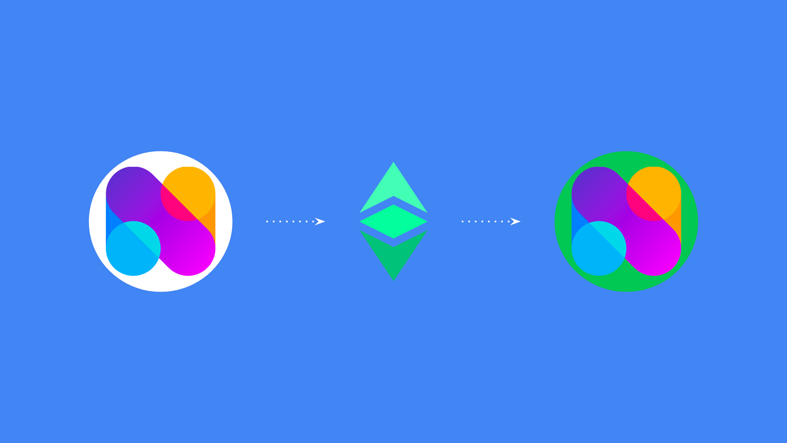
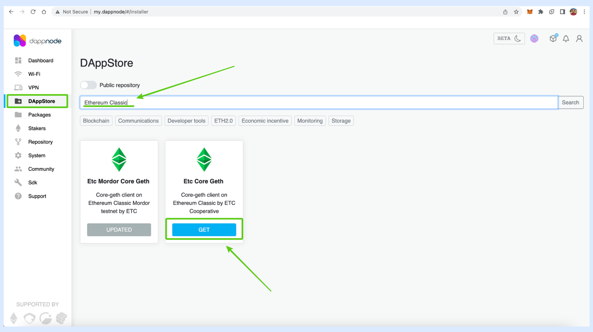
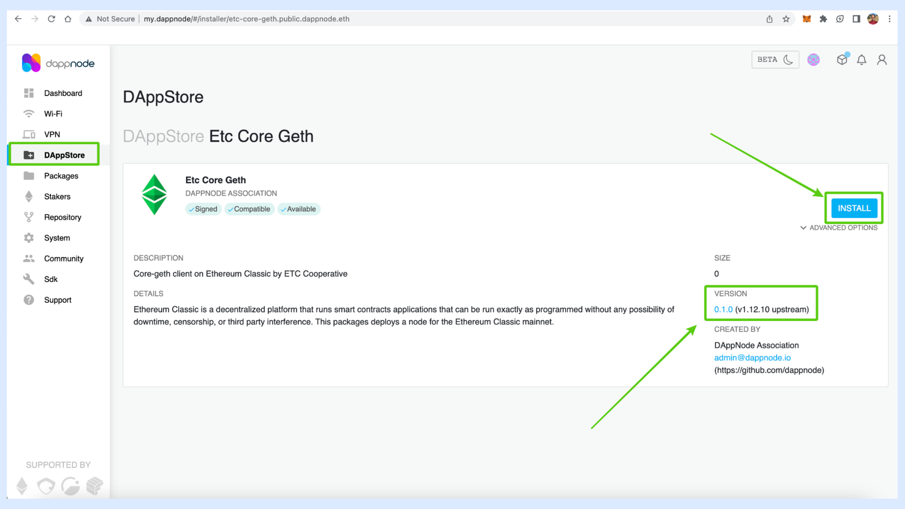
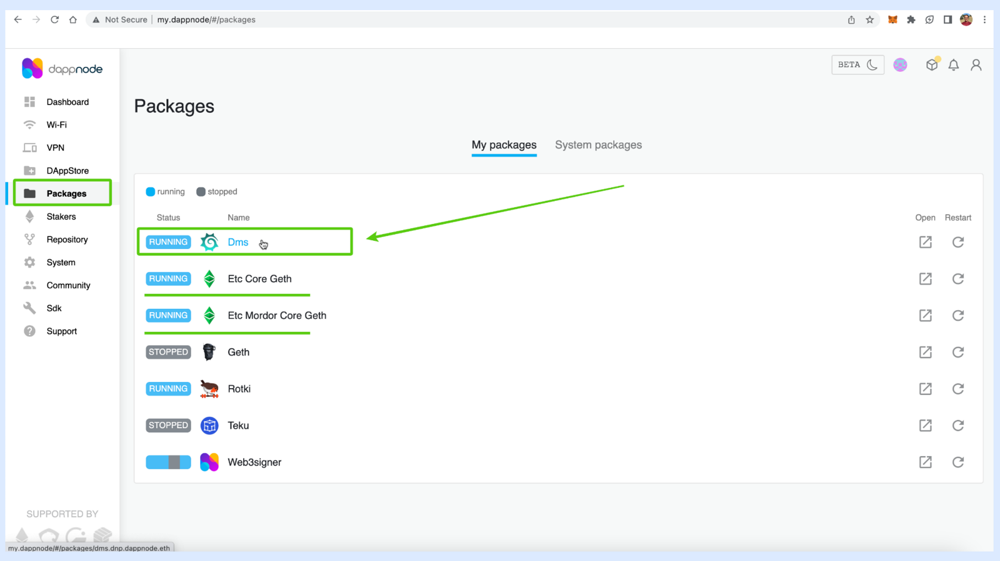
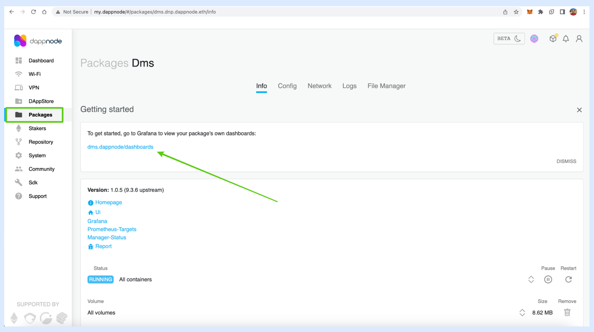

---
**You can listen to or watch this video here:**

<iframe width="560" height="315" src="https://www.youtube.com/embed/WoFInpj3Y2Y" title="YouTube video player" frameborder="0" allow="accelerometer; autoplay; clipboard-write; encrypted-media; gyroscope; picture-in-picture; web-share" allowfullscreen></iframe>

---

## What Is a Blockchain Node?

Blockchains are peer-to-peer networks of computers where each node is a machine running a software client that enables it to communicate with other nodes. 

All new transaction data is transmitted to all participating machines and is replicated in all of them. Consensus on which is the latest state of the database, also known as the blockchain, is reached through a consensus mechanism, which may usually be a proof of work or proof of stake algorithm.

Because the security paradigm of blockchains is to replicate the same identical database in as many machines as possible, so there may be as much redundancy and self verification as possible, without the need to trust third parties, then the more nodes in as many diverse regions, cultures, and parts of the world as possible, the better.

A blockchain node is one of these participating machines running the software client that contains the protocol to be able to be a member of the network.

## Benefits of Running a Node

As blockchains have miner nodes and verifying nodes, to run more verifying nodes also increases the security of the network.

Running a node provides higher security to users and dapp developers as well. It is also very important for exchanges, investors, institutions, and general blockchain services.

Running a node is a way to access the blockchain directly, thus more securely, to query accounts, balances, and dapps, and to send transactions.

By accessing the network directly, rather than through trusted third parties, end users, developer teams, and all other economic node operators gain the highest degree of security possible because they may query the chain and send transactions without risk of fraud.

As long as there is an internet connection, in a proof of work blockchain as Ethereum Classic (ETC) running a node provides the highest degree of censorship resistance and permissionlessness when interacting with the system.

## What Is DappNode?

Because running nodes is relatively costly due to the size of the blockchain (an ETC full node size is currently around 80 GB), it is difficult to run them on regular computers, much less on machines that are meant for daily use.

To solve this problem, there are companies that have developed very practical specialized devices that are only dedicated to running blockchain nodes.

DappNode is one such company with its product DappNode Home which is a device that connects to the local WiFi network at home or office, and from there users may set up different blockchain nodes, including ETC.

## Use Cases of DappNode With Ethereum Classic

As said before, running your own node has higher security guarantees than using trusted third parties, gives higher control to users and teams, and it is faster than using remote cloud node services.

**Some of the use cases for running an ETC node on DappNode are the following:**

**Your local wallet:** Instead of using third parties, users may have their non-custodial wallet in their local machines connect to the blockchain through their own direct nodes.

**Access globally:** DappNode may be setup to provide access through VPN connection to its owners even if they are away, anywhere in the world.

**Make public:** The node may be set up as a public endpoint, providing access to the blockchain to the public.

**Your dapp:** Dapp developer teams may use their DappNode to provide access to the chain for their dapps so they don’t have to depend on the large centralized cloud node providers.

**Automatic updates:** DappNode may be set up to update the Ethereum Classic software client automatically so no upgrades, bug fixes, or hard forks are missed.

**Censorship resistant:** By running a full node, the level of security achieved is the highest possible.

## 1. Get DappNode and Install it.

To run an ETC mainnet or testnet Core Geth node, the first thing you need to do is to buy a DappNode Home at this address:

https://dappnode.com/shop

When you get the device, you have to set it up by following the instructions and connect it to your local WiFi at home or office.

## 2. Checkout the Dashboard

Once set up, the DappNode instructions will let you know how to connect to the device through your web browser.

When you type the local area network address, you will see the home of your local DappNode and you will land on the dashboard.

In the sample dashboard below we have already installed the ETC Core Geth for the Mordor testnet.

In the next few sections we will show how to connect an ETC Core Geth mainnet node.

## 3. Install the Ethereum Classic Core Geth Mainnet Node 

To begin with, go to the “DAppStore” tab on the left menu.

There you will see a search field where you will type “Ethereum Classic” so that the two packages of ETC Core Geth will appear below.

As you may see, the Mordor version is already installed.

To install the Mainnet version, click on “GET”.

## 4. Press Install

In the next screen you will see the “INSTALL” button and some information about the ETC Core Geth node client.

Press “INSTALL”.

## 5. See Install Stats

In the next screen you will see the status of the download.

## 6. See Your Chains on the Dashboard

If you go to the “Dashboard” tab on the left menu again, you will see the Mordor instance and now the new Mainnet instance as well.

The blockchain takes a few hours to download.

## 7. Check Out the Grafana Dashboard Stats

In the meantime you may want to checkout the Grafana dashboards to see the node stats when it is running.

To go to the Grafana dashboard, click on the “Packages” tab on the left menu and then select “Dms”.

## 8. Click on Dashboards

In the next screen you need to click on the dms.dappnode/dashboards link.

## 9. Select the ETC Mainnet Core Geth Instance

In the next screen you will be on the Grafana app that is integrated into your local DappNode and you will see that you may select the Mainnet or Mordor networks.

Select the Mainnet network.

## 10. See All Node Data

In the next screen, you will see all the stats of your ETC Core Geth mainnet node.

In our example, the data was not yet updated, but when your node is fully synchronized it will be populated with the stats. 

## 11. Check Out All Other Blockchain Nodes You May Run With DappNode

If you wish to run more nodes such as Bitcoin, Ethereum, or others, you may go to the “DAppStore” tab again on the left menu and wait until the page is populated with all the possible node packages for you to choose which one you would like to run.

---

**Thank you for reading this article!**

To learn more about ETC please go to: https://ethereumclassic.org
