---
**由此收听或观看本期内容:**

<iframe width="560" height="315" src="https://www.youtube.com/embed/WoFInpj3Y2Y" title="YouTube video player" frameborder="0" allow="accelerometer; autoplay; clipboard-write; encrypted-media; gyroscope; picture-in-picture; web-share" allowfullscreen></iframe>

---

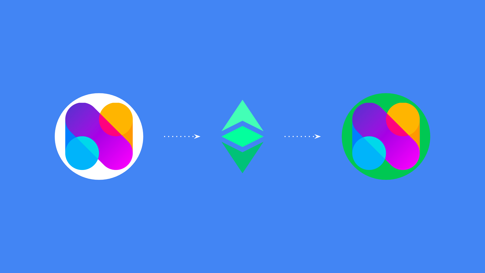

## 什么是区块链节点?

区块链是计算机的点对点网络，其中每个节点都是一台运行软件客户端的机器，使其能够与其他节点通信。

所有新的交易数据被传输到所有参与的机器，并在所有机器中复制。关于数据库的最新状态(也称为区块链)的共识是通过共识机制达成的，该机制通常可以是工作量证明或权益证明算法。

因为区块链的安全范式是在尽可能多的机器上复制相同的数据库，所以可能会有尽可能多的冗余和自我验证，而不需要信任第三方，那么在尽可能多的不同地区、文化和世界各地的节点越多越好。

区块链节点是运行软件客户端的参与机器之一，该客户端包含能够成为网络成员的协议。

## 运行节点的好处

由于区块链有矿工节点和验证节点，运行更多的验证节点也增加了网络的安全性。

运行节点也为用户和dapp开发人员提供了更高的安全性。它对交易所、投资者、机构和一般bb0服务也非常重要。

运行节点是直接访问区块链的一种方式，因此更安全，可以查询帐户、余额和dapp，并发送交易。

通过直接访问网络，而不是通过可信的第三方，最终用户、开发团队和所有其他经济节点运营商获得了最高程度的安全性，因为他们可以查询链并发送交易，而不会有欺诈风险。

只要有互联网连接，在区块链作为以太坊经典(ETC)的工作证明中，运行节点在与系统交互时提供最高程度的审查阻力和无权限性。

## 什么是DappNode?

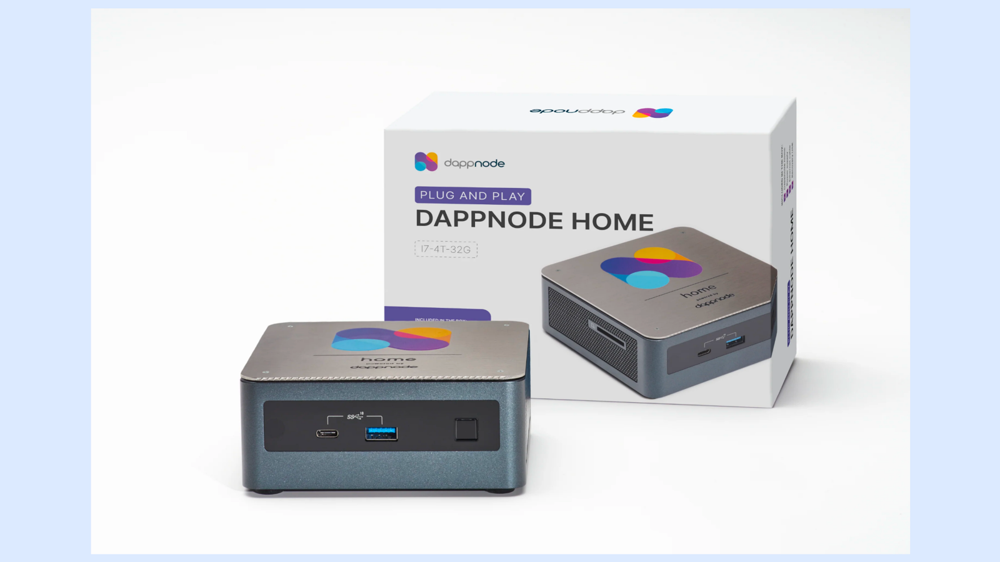

因为区块链的大小较大（ETC全节点大小目前约为80GB），因此运行节点相对成本较高，难以在普通计算机上运行，更不用说在日常使用的机器上运行。

为了解决这个问题，有些公司开发了非常实用的专用设备，专门用于运行区块链节点。

DappNode就是这样一家公司，他们的产品DappNode Home是一种连接到家庭或办公室本地WiFi网络的设备，用户可以在其中设置不同的区块链节点，包括ETC。

## 在Ethereum Classic上使用DappNode的用例

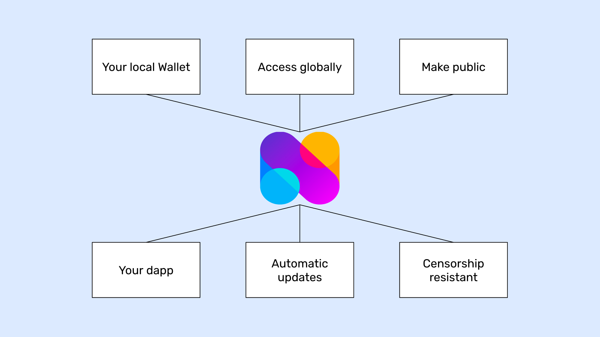

如前所述，运行自己的节点比使用受信任的第三方具有更高的安全保证，为用户和团队提供更高的控制权，并且比使用远程云节点服务更快。

**运行ETC节点的一些用例如下:**

**本地钱包:** 用户可以在本地计算机上运行非托管钱包，并通过自己的直接节点连接到区块链，而不是使用第三方。

**全球访问:** DappNode可以设置为提供VPN连接，即使用户身处世界各地也可以访问它。

**公开访问:** 可以将节点设置为公共端点，向公众提供访问区块链的机会。

**您的Dapp:** Dapp开发团队可以使用他们的DappNode为他们的dapp提供访问链的方式，以便他们不必依赖大型集中式云节点提供商。

**自动更新:**  DappNode可以设置为自动更新Ethereum Classic软件客户端，以便不会错过升级、错误修复或硬分叉。

**抗审查:** 运行完整节点，所达到的安全级别是最高的。

## 1. 获取DappNode并安装它。

要运行ETC主网或测试网的Core Geth节点，您需要做的第一件事是在以下地址购买DappNode Home：

https://dappnode.com/shop

获得设备后，您必须按照说明进行设置，并将其连接到家庭或办公室的本地WiFi网络。

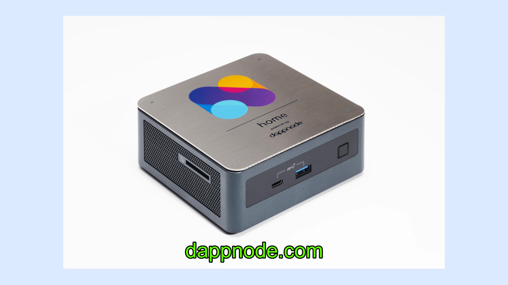

## 2. 查看控制面板

一旦设置完成，DappNode的说明将告诉您如何通过Web浏览器连接设备。

当您输入本地网络地址时，您将看到本地DappNode的主页，并且您将会进入仪表板。

在下面的示例仪表板中，我们已经为Mordor测试网安装了ETC Core Geth。

在接下来的几节中，我们将展示如何连接ETC Core Geth主网节点。

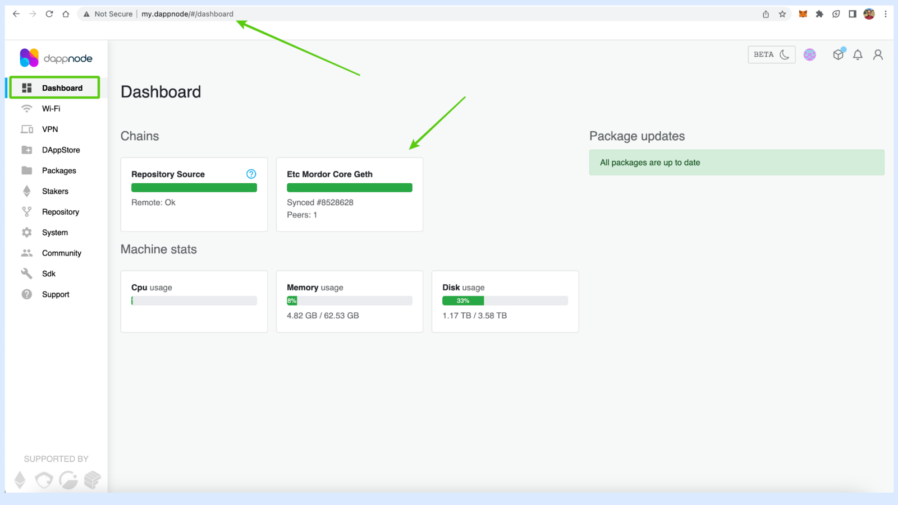

## 3. 安装ETC Core Geth主网节点

首先，转到左侧菜单上的“DAppStore”选项卡。

在那里，您将看到一个搜索字段，在其中键入“Ethereum Classic”，以便下面出现两个ETC Core Geth软件包。

您可以看到，Mordor版本已经安装了。

要安装主网版本，请单击“GET”。

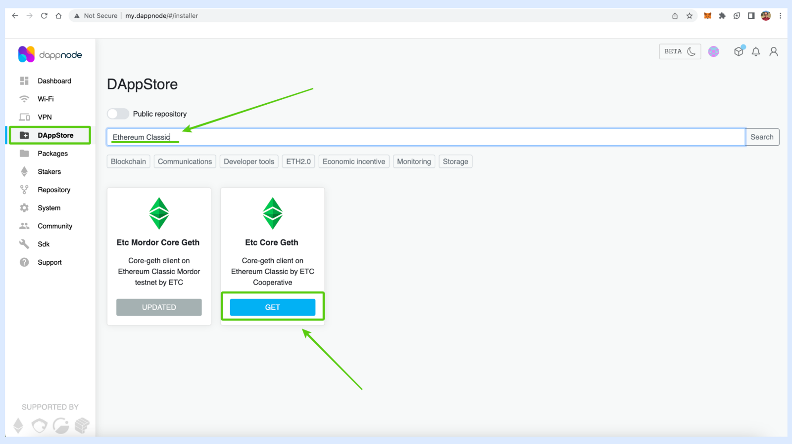

## 4. 点击安装

在下一个屏幕上，您将看到“INSTALL”按钮和有关ETC Core Geth节点客户端的一些信息。

点击“INSTALL”。

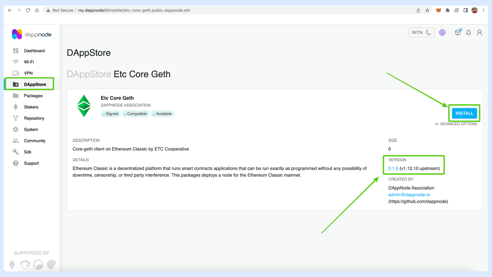

## 5. 查看安装状态

在下一个界面中，您将看到下载的状态。

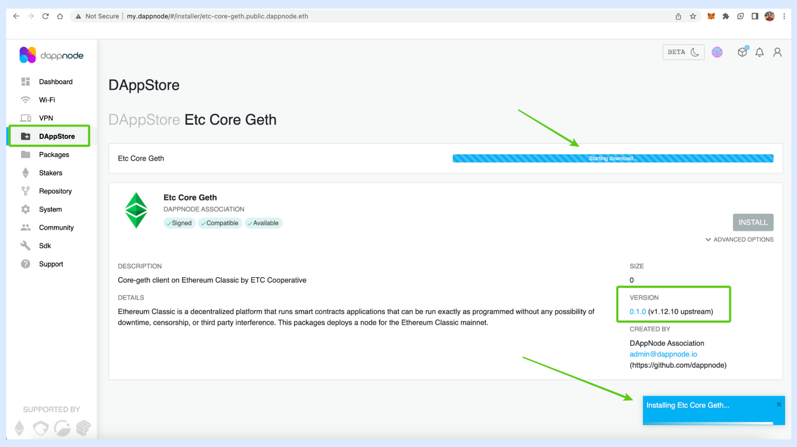

## 6. 在控制面板上查看您的链

如果您再次转到左侧菜单中的“控制面板”选项卡，您将看到Mordor实例以及新的主网实例。

区块链需要几个小时来下载。

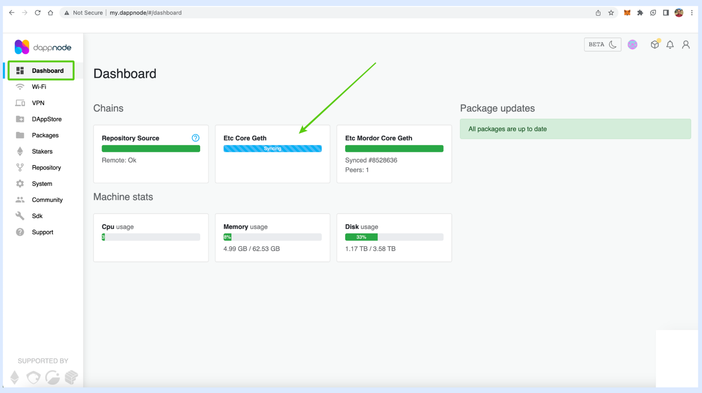

## 7. 检查Grafana控制面板状态

同时，您可能希望查看Grafana控制面板，以查看运行时的节点状态。

要进入Grafana控制面板，请单击左侧菜单中的“软件包”选项卡，然后选择“Dms”。

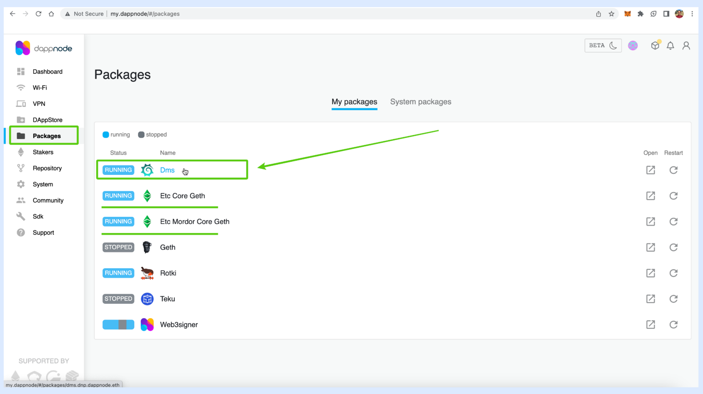

## 8. 点击控制面板

在下一个界面中，您需要单击dms.dappnode/dashboards链接。

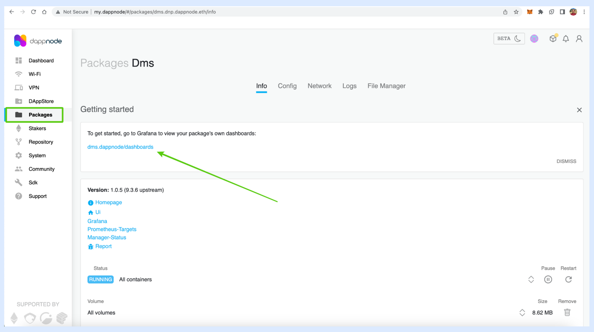

## 9. 选择 ETC Mainnet Core Geth 实例

在下一个屏幕上，您将进入集成在本地 DappNode 中的 Grafana 应用程序，并且您将看到您可以选择 Mainnet 或 Mordor 网络。选择 Mainnet 主网。

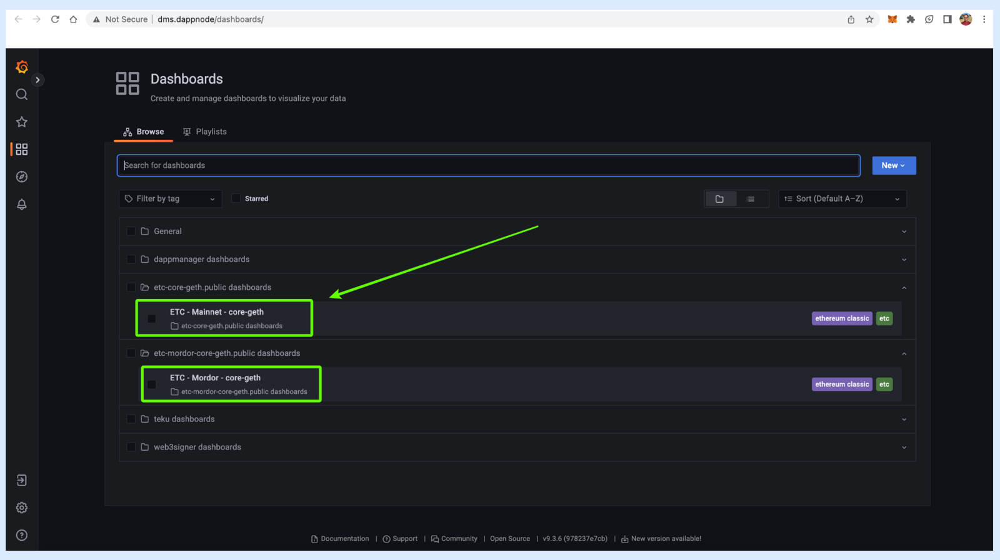

## 10. 查看所有节点数据

在下一个屏幕上，您将看到您的 ETC Core Geth 主网节点的所有统计数据。

在我们的示例中，数据尚未更新，但是当您的节点完全同步时，它将被填充统计数据。

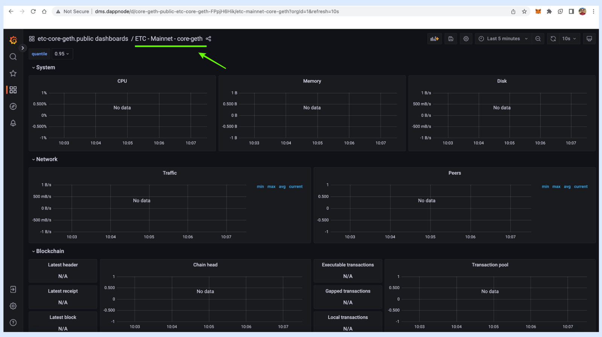

## 11. 查看您可以在 DappNode 上运行的所有其他区块链节点

如果您希望运行更多节点，例如比特币、以太坊或其他节点，您可以再次转到左侧菜单上的“DAppStore”选项卡，并等待页面加载完成，以选择您想要运行的节点包。

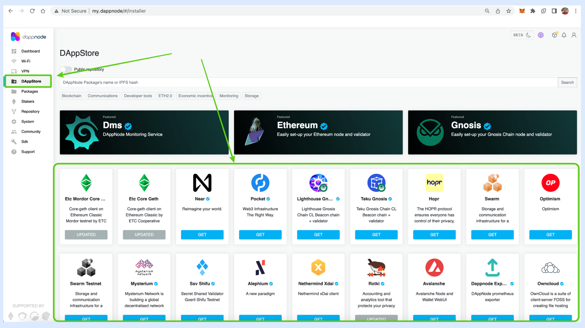

---

**感谢您阅读本期文章!**

了解更多有关ETC，请访问: https://ethereumclassic.org
