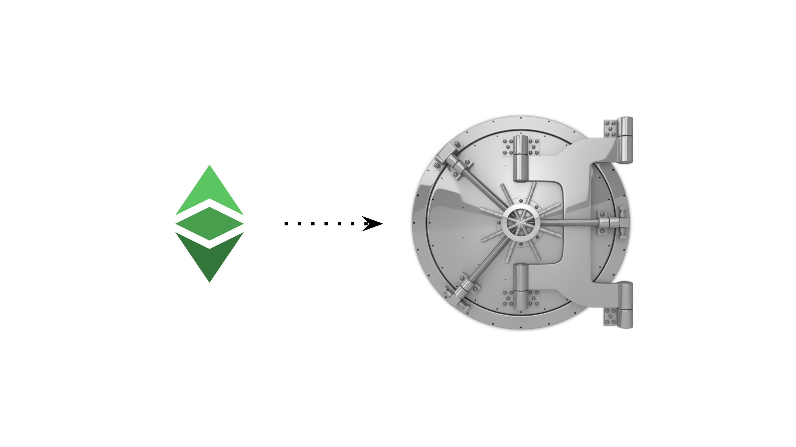
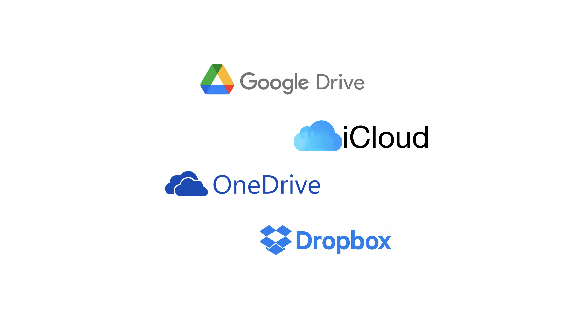

---
**You can listen to or watch this video here:**

<iframe width="560" height="315" src="https://www.youtube.com/embed/1zMg9FpxEyk" title="YouTube video player" frameborder="0" allow="accelerometer; autoplay; clipboard-write; encrypted-media; gyroscope; picture-in-picture; web-share" allowfullscreen></iframe>

---

In the last few classes we went over what are private keys, public keys, and addresses (class 17), and the difference between wallets and addresses (class 18).

In this class we will go a step further and see how you can store your private keys.

We will study what are raw private keys, private key JSON files, and secret passphrases, also known as mnemonic phrases.


The core of the system is the private key as seen in the image. From the private key we derive the public key, which is also called the address, and under the address we hold our crypto assets on the public blockchain.

It’s also important to consider how to keep your private keys secure, so we will touch on this here as well.

## What Are Raw Private Keys?


As we explained before, a raw private key, or private key, is like a secret password that controls an address on the blockchain. Your ETC are under this address, which is known to the public.

A private key looks more or less like this:

```
36fdbed2213dd215e1c81b4d581697a9f006f24567953ab067677132108e11c8
```

The private key is associated, by means of a cryptographic mathematical function, to your address on Ethereum Classic. The address is public and anyone may see it, but the only way to sign transactions and move assets or interact with decentralized applications on the network is through the private key.

The “raw” private key is basically the number itself with no extra formatting.

## What Are Private Key JSON Files?


This was a popular way of generating addresses and private keys for Ethereum Classic and Ethereum in the early days. 

JSON means “JavaScript Object Notation” and is a type of file that is used for machines to communicate with other machines.

Under this format, there is a standard that is used to generate single addresses and private keys on Ethereum Classic and other blockchains.

Usually, to generate a private key JSON file, one needs to enter a password so the private key is encrypted.

The private key JSON file is a more elaborate format for storing private keys.

## What Are Secret Passphrases?


Secret passphrases may be the most popular way of storing raw private keys now a days. 

They are usually sets of 12 to 24 secret words from which, by means of a cryptographic algorithm, your addresses and private keys on the blockchain may be generated.

Secret passphrases, also called mnemonic phrases, are very convenient because with one set of 12 or 24 words you may generate addresses and their corresponding private keys in several blockchains and hold all your assets under them.

## How to Keep Your Private Keys Secure



With regards to keeping our private keys secure, it is important to know two things from the start:

- If we keep our crypto assets in trusted third parties as centralized exchanges or other financial institutions, then they have control over our assets, not us.

- If we keep our crypto assets under our private keys on the blockchain, then we have exclusive control over our assets, nobody else.

Whether you control addresses on the blockchain through raw private keys or secret passphrases, they may be stored in digital or paper form.

It is conventional wisdom in the industry that the best way to store private keys and secret passphrases is by writing them on paper or printing them, making two or three copies, and then storing those paper copies in safe places.

The keystore JSON file is usually stored in digital form, and the raw private keys and secret passphrases may also be stored in digital form.

In these cases the best way to do it is to store copies in two or three pen drives (a.k.a. thumb drives, USB keys, memory sticks, disc drives, etc.) and to put them in a safe place.

Sometimes, a good setup is to have an old phone or computer and to store these digital copies in such devices.

The important thing about all these digital copy setups, similar to the concept of hardware wallets, is for your private keys, secret passphrases, or keystore JSON files to be disconnected from the internet, therefore unreachable over cyberspace.

## Do Not Use Cloud Services



This is a typical mistake by many newbies. 

It is imperative for you to NOT store any of your ETC private keys, secret passphrases, or keystore JSON files in cloud services, such as Google Drive, iCloud, Microsoft OneDrive, or Dropbox.

This is because they have access to all your files, even if they are encrypted.

They own the private keys to decrypt all your files that you store with them.

**As an example, following is the text of Dropbox’s documentation:**

*Who can see the stuff in my Dropbox account?*

*Like most major online services, Dropbox personnel will, on rare occasions, need to access users’ file content (1) when legally required to do so; (2) when necessary to ensure that our systems and features are working as designed (e.g., debugging performance issues, making sure that our search functionality is returning relevant results, developing image search functionality, refining content suggestions, etc.); or (3) to enforce our Terms of Service and Acceptable Use Policy. Access to users’ file content is limited to a small number of people.*

*Link: https://help.dropbox.com/security/file-access*

## Do Not Send Them by Email or Text


As demonstrated above, all tech companies, small or large, have access to your messages, emails, and information, whether encrypted or not, because, legally, they need to be able to respond to government inquiries and they usually put on their terms of services that they must have access for security and housekeeping reasons.

The only way to distribute or communicate your raw private keys, secret passphrases, or keystore JSON files to others is by transferring the paper copies you hold, making new copies, or transferring pendrives or devices to them physically and directly.

Never send raw private keys, secret passphrases, or private key JSON files by email or text. Neither through direct messaging or social media private messaging systems such as Twitter DMs or Facebook Messenger.

---

**Thank you for reading this article!**

To learn more about ETC please go to: https://ethereumclassic.org
