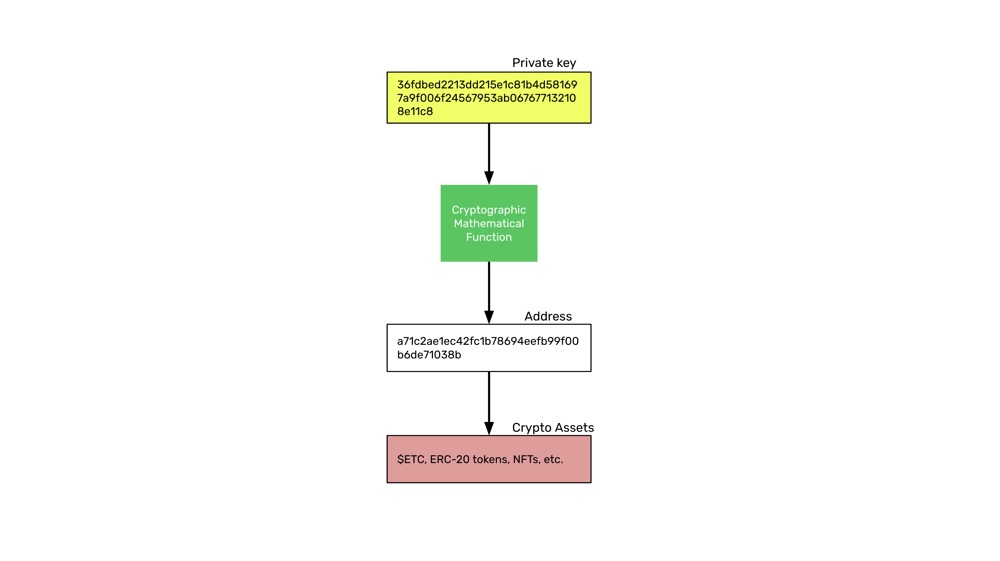
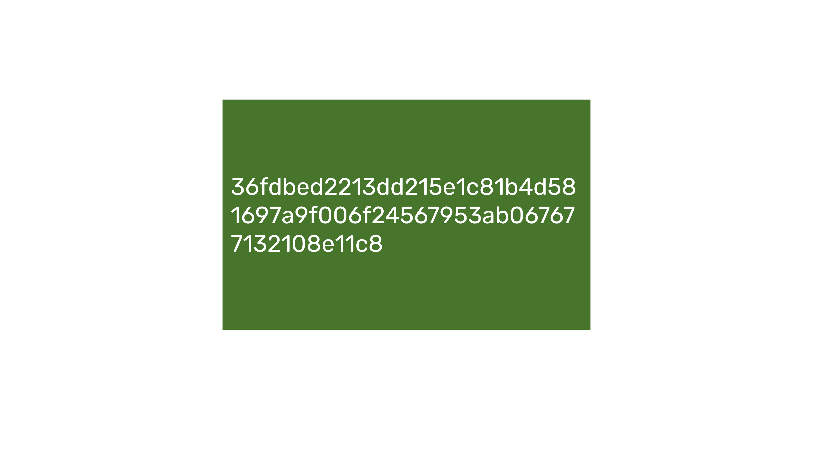
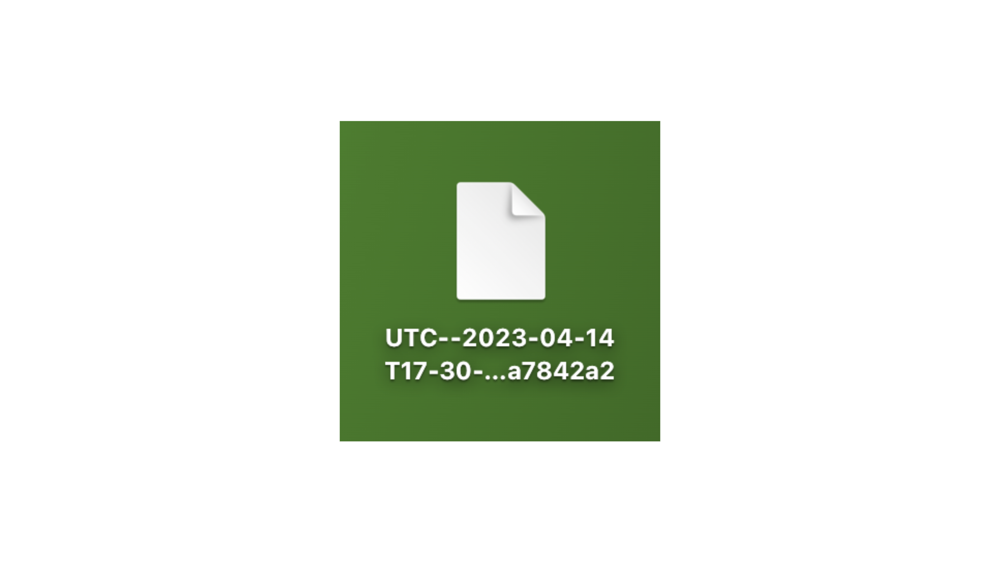
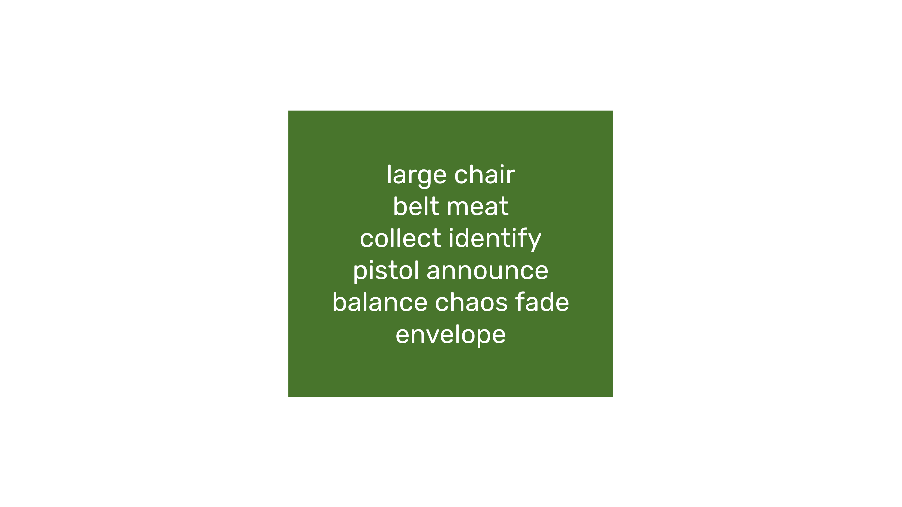
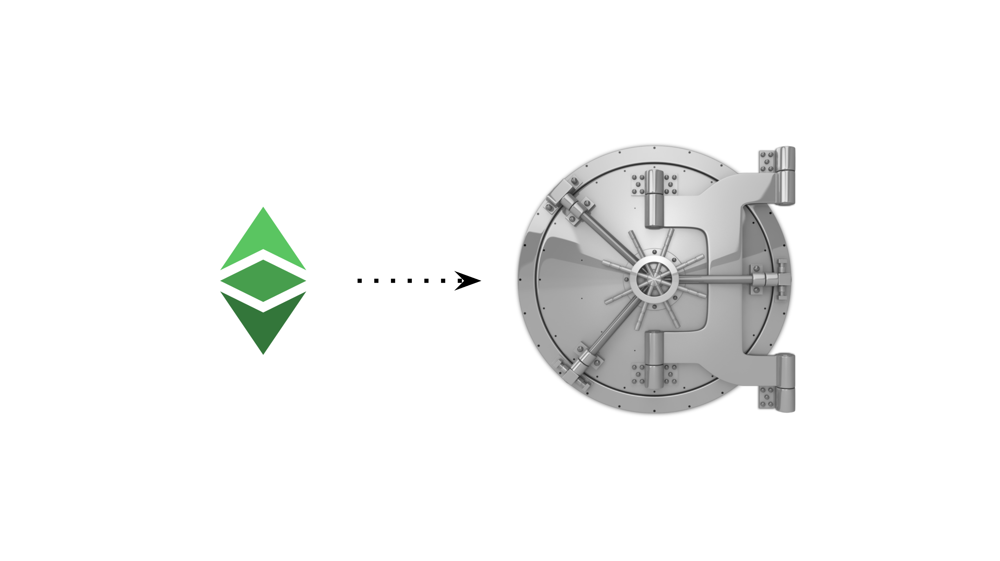
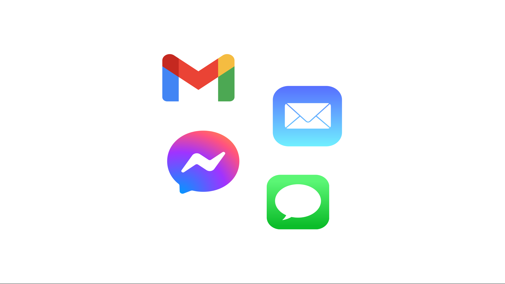

---
**您可以由此收听或观看本期内容**

<iframe width="560" height="315" src="https://www.youtube.com/embed/1zMg9FpxEyk" title="YouTube video player" frameborder="0" allow="accelerometer; autoplay; clipboard-write; encrypted-media; gyroscope; picture-in-picture; web-share" allowfullscreen></iframe>

---

在最近几节课中，我们讲解了私钥、公钥和地址（第17课），以及钱包和地址之间的区别（第18课）。

在本课中，我们将进一步了解如何存储私钥。我们将学习什么是原始私钥、私钥 JSON 文件和秘密口令（也称为助记词短语）。



系统的核心是私钥，如图所示。从私钥我们可以派生出公钥（也称为地址），我们的加密资产存放在公共区块链上的这个地址下。

同时，考虑如何保护私钥的安全也非常重要，我们将在这里讨论这个问题。

## 什么是原始私钥？



如前所述，原始私钥或私钥就像控制区块链上某个地址的秘密密码。您的 ETC 就存放在这个地址下，这个地址是公开的。

私钥看起来大致如下：

```
36fdbed2213dd215e1c81b4d581697a9f006f24567953ab067677132108e11c8
```

通过加密数学函数，私钥与您在以太坊经典上的地址相关联。地址是公开的，任何人都可以看到它，但是通过私钥是唯一的方式来签署交易、移动资产或与网络上的去中心化应用进行交互。

“原始”私钥基本上就是这个数字本身，没有额外的格式。

## 什么是私钥 JSON 文件?



这是以太坊经典和以太坊早期生成地址和私钥的一种流行方式。

JSON 是“JavaScript 对象表示法”的缩写，是一种用于机器之间通信的文件类型。

在此格式下，有一个标准用于在以太坊经典和其他区块链上生成单个地址和私钥。

通常，为了生成私钥 JSON 文件，需要输入密码，以便对私钥进行加密。

私钥 JSON 文件是一种更为复杂的格式，用于存储私钥。

## 什么是秘密短语?



近期使用秘密密码短语存储原始私钥可能是最流行的方法。

通常，秘密密码短语是由12到24个秘密单词组成的，通过密码学算法，您可以在区块链上生成您的地址和私钥。

秘密密码短语，也称为记忆短语，非常方便，因为使用12或24个单词集合，您可以在几个区块链上生成地址和其对应的私钥，并在其中保存所有资产。

## 如何保护您的私钥



在保护我们的私钥方面，从一开始就需要知道两件事：

-  如果我们将加密资产存放在受信任的第三方中心化交易所或其他金融机构中，那么他们会控制我们的资产，而不是我们自己。

-  如果我们将加密资产存储在区块链上的私钥下，那么我们将独占控制我们的资产，而没有其他人。

无论是通过原始私钥还是秘密密码短语控制区块链上的地址，它们都可以以数字或纸张形式存储。

业内普遍认为，存储私钥和秘密密码短语的最佳方式是将它们写在纸上或打印出来，制作两到三个副本，然后将这些纸张副本存放在安全的地方。

密钥存储JSON文件通常以数字形式存储，原始私钥和秘密密码短语也可以以数字形式存储。

在这些情况下，最佳的存储方式是在两到三个笔记本电脑、U盘（又名拇指驱动器、USB键、内存棒、磁盘驱动器等）中存储副本，并将它们放在一个安全的地方。

有时，一个好的设置是使用旧手机或电脑，并将这些数字副本存储在这些设备中。

所有这些数字副本设置中的重要事项，类似于硬件钱包的概念，是使您的私钥、秘密密码短语或密钥存储JSON文件与互联网断开连接，因此在网络上无法访问。

## 不要使用云服务


这是许多新手常犯的一个错误。

绝对不要将任何ETC私钥、秘密密码或keystore JSON文件存储在云服务中，比如Google Drive、iCloud、Microsoft OneDrive或Dropbox。

这是因为他们可以访问您的所有文件，即使它们已加密。

他们拥有解密您存储在他们那里的所有文件的私钥。

**以下是Dropbox文档的示例：**

*谁可以看到我的Dropbox账户中的东西？*

*像大多数主要在线服务一样，Dropbox的工作人员偶尔需要访问用户的文件内容(1)在法律要求这样做时；(2)在必要时，确保我们的系统和功能按设计方式工作(例如，调试性能问题，确保我们的搜索功能返回相关结果，开发图像搜索功能，改进内容建议等)；或者(3)执行我们的服务条款和可接受使用政策。对用户的文件内容的访问仅限于少数人。*

*链接: https://help.dropbox.com/security/file-access*

## 不要通过电子邮件或短信发送它们



正如上面所示，所有的科技公司，无论大小，都可以访问您的信息、邮件和消息，无论它们是否加密，因为在法律上，它们需要能够回应政府的查询，而且通常在服务条款中规定，为了安全和日常操作的原因，它们必须有访问权限。

将您的原始私钥、秘密密码或keystore JSON文件分发或传达给他人的唯一方法是通过传输您持有的纸质副本、制作新副本或将pendrives或设备直接和实际地转移到他们身上。

永远不要通过电子邮件或短信发送原始私钥、秘密密码或私钥JSON文件。也不要通过直接消息或社交媒体私信系统，例如推特私信或Facebook Messenger。

---

**感谢您阅读本期文章!**

了解更多ETC相关内容，请访问: https://ethereumclassic.org
