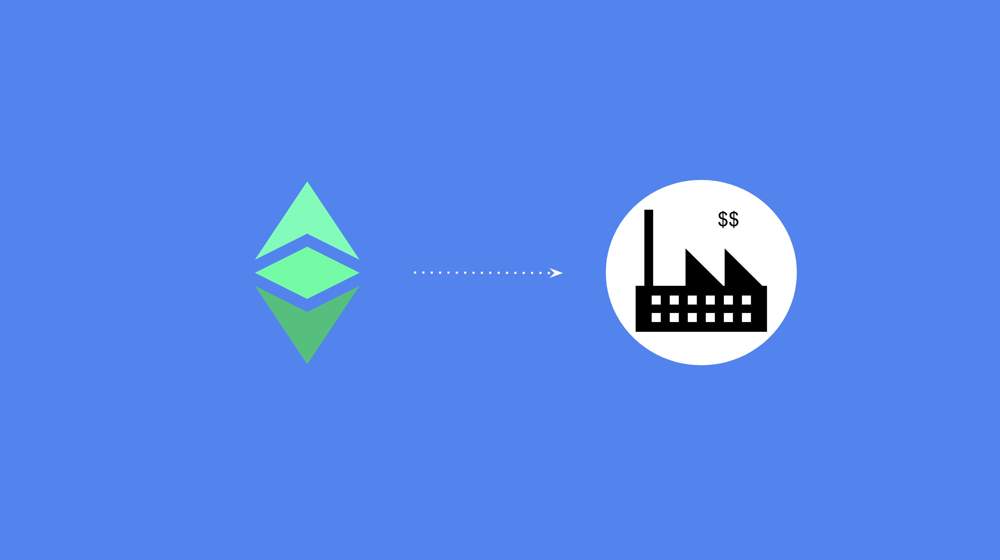

---
**You can listen to or watch this video here:**

<iframe width="560" height="315" src="https://www.youtube.com/embed/_gJoMDXS1h8" title="YouTube video player" frameborder="0" allow="accelerometer; autoplay; clipboard-write; encrypted-media; gyroscope; picture-in-picture; web-share" allowfullscreen></iframe>

---

This is a two part post that will provide ideas on how to start using Ethereum Classic (ETC) for business.

As blockchain technologies as ETC are still in their infancy, there are some use cases that are available for businesses today and others that will be a reality in the near future. 

In this post we will describe present and future use cases for ETC and explain how businesses of different kinds will be able to leverage these tools and technologies.

**Payments:** This is one of the first use cases of Ethereum Classic since its inception in 2015. Payment processors as [NOWpayments](https://nowpayments.io/supported-coins/ethereum-classic-payments) enable both merchants and charities to receive payments and donations respectively. ETC is optimal for this function because of its low transaction fees, its sound monetary policy, and because it settles quickly depending on the size of the payment as its block time is 13 seconds per block.

**International payments:** Within the payments category, international payments is an especially attractive use case for ETC because it is such a secure crossborder cryptocurrency, and it is programmable. Good use cases may be for payment of imports, collections of exports, and for salaries or contractor fees for international and remote employees or contractors.

**Treasury reserves:** Many businesses invest their cash reserves in securities to get a better return or to hedge against market uncertainty. For example, companies as Microstrategy and Tesla have invested billions of dollars in Bitcoin (BTC). Because ETC has the same monetary policy as BTC (and it is programmable through smart contracts) then it is a perfect store of value for corporate treasuries.

**Use dapps on ETC:** As businesses need to transform their ETC to other tokens or kinds of assets, use financial or non-financial services on-chain, then the use of decentralized applications may be a good idea. Currently, there are efficient exchange services, and some teams are developing other defi products as deposits and loans. In the near future there will be more sophisticated applications, such as payroll systems, insurance, property registries, supply chain management platforms, etc.

**Build or migrate existing apps to ETC:** As ETC and the blockchain industry become more mainstream, there will be a point where every business will need to have a presence on-chain. If companies have successful apps that their clients use, it would be a good idea to start planning on how those services, or at least some of their components, could be moved to blockchains as Ethereum Classic.

**Contracts:** Very soon, the whole complex network of contracts and agreements that businesses represent will be significantly migrated from traditional systems to highly secure blockchains as Ethereum Classic. The corporation itself will be a DAO on ETC, then shareholder ownership, voting, and dividend payments will be managed on the chain. In the same manner, provider contracts and payments will likely be automated on ETC, and sales agreements with clients will be smart contracts. In the future, each employee will have his or her employment smart contract on the blockchain with their terms and conditions agreed with their employers, and their salary payments will be automated on-chain as well.

**Chart of accounts:** One of the cool features of blockchains as ETC, especially for sole proprietorships and small businesses, is that many addresses may be held on-chain. This is useful because, many times, self employed or small operations actually use their accounts as a sort of accounting system where, for example, they may use a certain account for revenues, another for contractor payments, and another to accumulate the yearly or quarterly taxes. With the right wallet app, this kind of chart of account management on-chain may be of great value.

**Multi signature setups:** Many kinds of businesses and organizations use multisignature setups to move funds from banks or other financial services. The same restrictions, permissions, and conditions may be established using multisignature wallets on ETC. As in the traditional world typically several officers of a business need to sign for a wire transfer to be sent, the same exact conditions may be established but with a smart contract on-chain were the money in ETC may be deposited. The way it works is that each officer needs to have its private keys, and when they make a multisig payment, then they all sign the transaction and send it to the blockchain. If the required signatures are not present, then the smart contract will not make the payment.

--

In our next post we will provide examples of different types of businesses that may want to use ETC with the tools and features explained above.

---

**Thank you for reading this article!**

To learn more about ETC please go to: https://ethereumclassic.org
