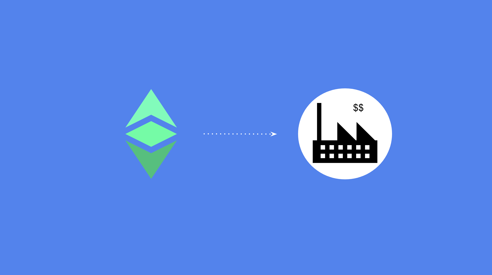

---
**您可以在此处收听或观看此视频:**

<iframe width="560" height="315" src="https://www.youtube.com/embed/_gJoMDXS1h8" title="YouTube video player" frameborder="0" allow="accelerometer; autoplay; clipboard-write; encrypted-media; gyroscope; picture-in-picture; web-share" allowfullscreen></iframe>

---

这是一个两部分的文章，将提供有关如何开始将以太坊经典用于业务的想法。

由于像ETC这样的区块链技术仍处于萌芽阶段，因此今天可以为企业提供某些用例，而其他用例则将在不久的将来成为现实。

在本文中，我们将描述ETC的现有和未来用例，并解释不同类型的企业将如何能够利用这些工具和技术。

**支付：** 自2015年以来，这是以太坊经典的首批用例之一。支付处理器，如NOWpayments，使商家和慈善机构都能够分别接收付款和捐款。 ETC非常适合这种功能，因为它的交易费用低，其货币政策稳健，因为它根据付款大小快速结算，其块时间为每个块13秒。

**国际支付：** 在支付类别中，国际支付是ETC一个特别有吸引力的应用场景，因为它是一种安全的跨境加密货币，并且可以编程。良好的应用场景可能是用于进口支付、出口收款以及向国际和远程员工或承包商支付薪酬或承包费用。

**财务储备：** 许多企业将其现金储备投资于证券以获得更好的回报或对冲市场不确定性。例如，Microstrategy和特斯拉等公司已经在比特币（BTC）上投资了数十亿美元。因为ETC与BTC具有相同的货币政策（并且可以通过智能合约编程），所以它是企业财务储备的理想价值存储工具。

**使用ETC上的DApp：** 由于企业需要将他们的ETC转换为其他代币或资产类型，并在链上使用金融或非金融服务，因此使用去中心化应用程序可能是一个好主意。目前，有高效的交易所服务，并且一些团队正在开发其他DeFi产品，如存款和贷款。在不久的将来，将会有更复杂的应用程序，例如薪资系统、保险、财产登记、供应链管理平台等。

**构建或迁移现有应用程序到ETC：** 随着ETC和区块链行业变得越来越主流，每个企业都需要在链上存在的时候就到来了。如果公司拥有客户使用的成功应用程序，那么开始计划如何将这些服务或至少其中的一些组件移动到以太坊经典等区块链上将是一个好主意。

**合同：** 非常快，企业所代表的整个合同和协议网络将从传统系统大幅迁移到高度安全的以太坊经典等区块链上。企业本身将成为以太坊经典上的DAO，因此股东所有权、投票和分红支付将在链上管理。同样地，供应商合同和支付很可能会在ETC上自动化进行，与客户的销售协议也将成为智能合约。未来，每个员工将在区块链上拥有自己的就业智能合约，其中包含与雇主达成的条款和条件，其薪资支付也将自动进行链上处理。

**账户表：** 区块链如以太坊经典的一个很酷的功能，尤其适用于个体经营企业和小企业，是可以在链上持有多个地址。这很有用，因为许多时候，自雇或小型企业实际上会将其账户用作某种会计系统，例如他们可能会使用一个账户来收入，另一个账户来支付承包商的款项，并将年度或季度税款累积到另一个账户。使用正确的钱包应用程序，这种链上账户管理的表格可能非常有价值。

**多重签名设置：** 许多类型的企业和组织使用多重签名设置从银行或其他金融服务机构转移资金。同样的限制、权限和条件可以使用以太坊经典上的多重签名钱包建立。通常情况下，与传统世界中类似，企业的几位主管需要签署电汇指令，才能将资金汇出。但在链上，智能合约会将资金以ETC的形式存入，每个主管需要拥有自己的私钥。当他们进行多重签名付款时，他们将所有签名的交易发送到区块链上。如果所需签名不存在，则智能合约将不会进行付款。

--

在我们的下一篇文章中，我们将提供不同类型的企业的例子，这些企业可能希望使用上述工具和功能的 ETC。

---

**感谢您阅读本期文章!**

了解更多有关ETC，请访问: https://ethereumclassic.org
