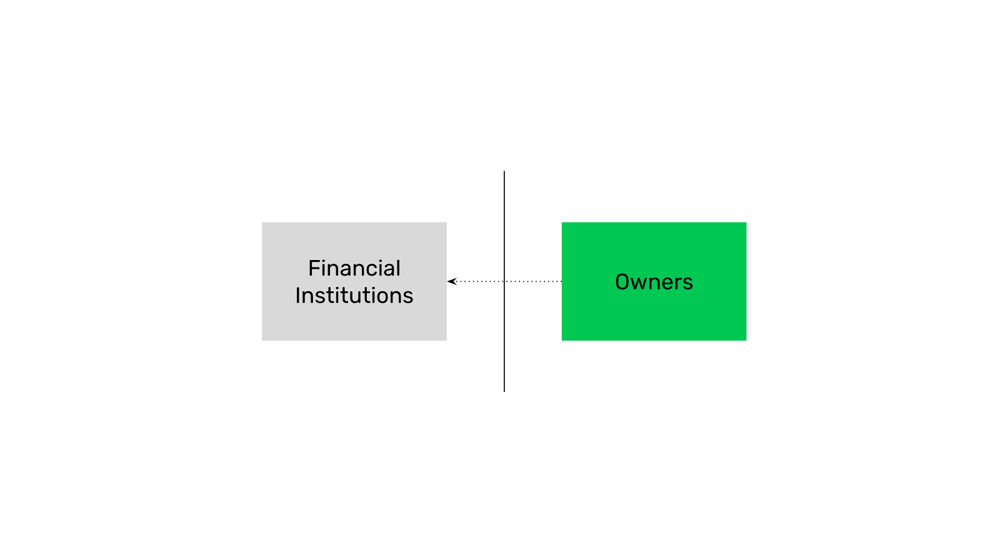
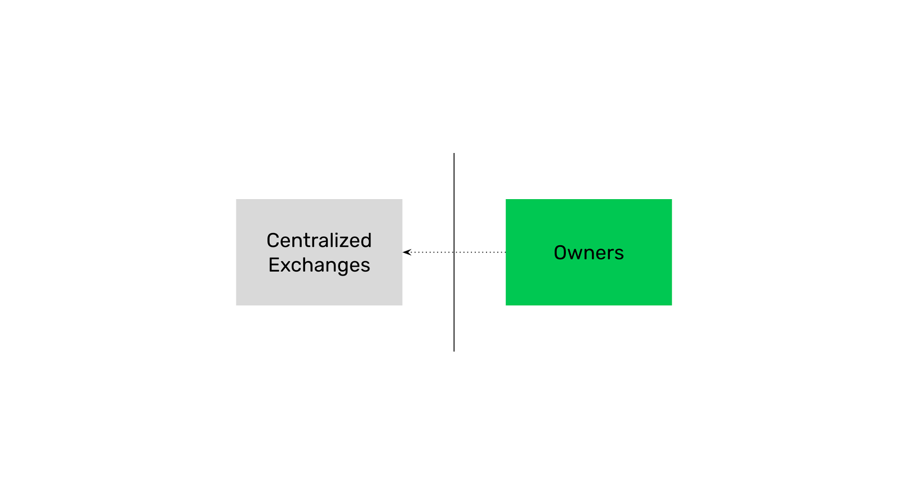
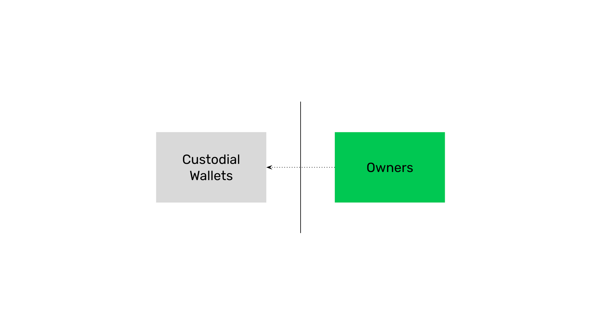
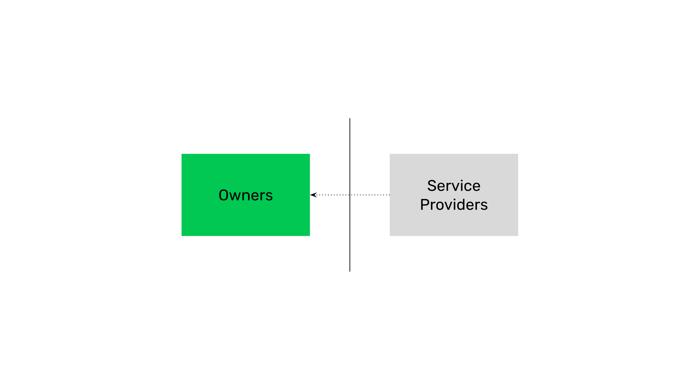

---
**You can listen to or watch this video here:**

<iframe width="560" height="315" src="https://www.youtube.com/embed/0V4UzW3g_xk" title="YouTube video player" frameborder="0" allow="accelerometer; autoplay; clipboard-write; encrypted-media; gyroscope; picture-in-picture; web-share" allowfullscreen></iframe>

---

The term custody means the protective care of something. In the context of the blockchain industry, it means the custody of cryptocurrencies, such as Ethereum Classic’s ETC, and other crypto assets.

As we have explained in previous classes, it is all about the private keys. 

Because cryptocurrencies and crypto assets are held under public addresses on the blockchain, then whoever has possession and control of the corresponding private keys has exclusive custody of anything under those addresses.

To explain the difference between custodial and non-custodial wallets, in the next few sections we will explain how this paradigm works in traditional systems, centralized exchanges, custodial wallets, and non-custodial wallets.

## Custody in Traditional Systems

When using financial institutions as banks or brokers, owners of assets deposit them with the providers, therefore the providers gain custody of them.

Today, this format is so prevalent that hardly any financial asset, whether currencies, stocks, bonds, mutual funds, commodities, or any other, are held by the owners but by financial providers.

Although we may think that we have free access and control of our financial wealth, this access is permissioned, meaning that financial providers have real possession and control of the assets and they just grant us permission to them under certain conditions.

This means that our financial assets are really liabilities of financial institutions, we do not have any control over them. This is what creates the risks of loss and persistent financial crises.

## Custody in Centralized Exchanges

One of the worst developments in the crypto industry has been the widely popular use of centralized exchanges where people use them as their crypto wallets.

In this case, although we may think that our assets are safe because we moved from fiat to crypto, the truth is that they are as unsafe as in the traditional system!

When we hold our cryptocurrencies and crypto assets inside centralized exchanges as Coinbase, Binance, Kraken and others, we only have a liability, or I.O.U., from those exchanges. 

We do not have possession and control of our assets. They do.

## Custody in Custodial Wallets

Many fall for the trick of custodial wallets. 

Brands such as BitGo and Blockchain.com are custodial wallets. 

This means they hold your cryptocurrencies and crypto assets for you on the blockchain. You do not actually have possession and control over them. This is because you don’t have the private keys to your addresses, but they do!

The fact that you have their app, a user ID, and a password, or that you used two-factor authentication or other “highly secure” methods to log in to your account with them does not mean you have the assets.

Custodial wallets have exactly the same risks as traditional financial institutions and centralized exchanges.

## Custody in Non-custodial Wallets

The real paradigm change is when you hold your cryptocurrencies and crypto assets under your own addresses that you control and you have backed up yourself. In this way you have true self custody. 

The wallet apps that let your generate your own private keys and store them in various forms are called non-custodial wallets.

Some of the most popular brands of non-custodial wallets are Metamask, Trust Wallet, Exodus, Ledger, and Trezor.

Within the non-custodial wallet paradigm, in the next two classes we will explain what are software and hardware wallets (class 21), and what are hot and cold wallets (class 22). 

---

**Thank you for reading this article!**

To learn more about ETC please go to: https://ethereumclassic.org
