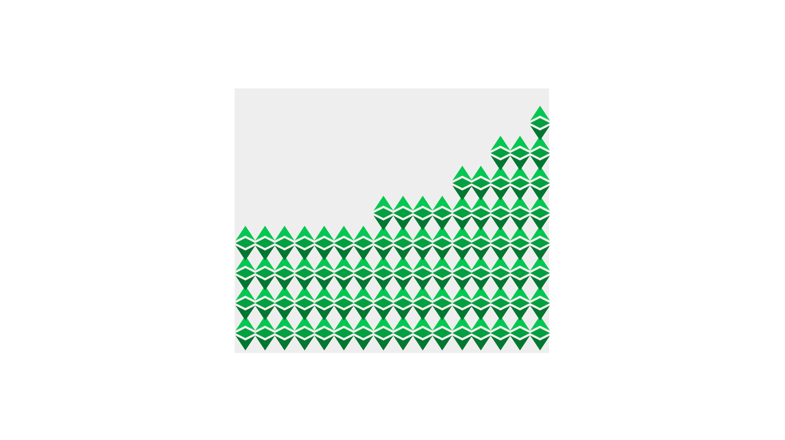

---
**您可以由此收听或观看本期内容:**

<iframe width="560" height="315" src="https://www.youtube.com/embed/0V4UzW3g_xk" title="YouTube video player" frameborder="0" allow="accelerometer; autoplay; clipboard-write; encrypted-media; gyroscope; picture-in-picture; web-share" allowfullscreen></iframe>

---

“托管”一词意味着对某物的保护性照顾。在区块链行业中，它指的是加密货币（如以太经典的ETC）和其他加密资产的托管。

正如我们在之前的课程中所解释的那样，这与私钥有关。

由于加密货币和加密资产存放在区块链上的公共地址下，因此谁拥有对应的私钥，谁就拥有该地址下的所有权和控制权。

为了解释托管钱包和非托管钱包之间的区别，在接下来的几个章节中，我们将解释传统系统、中心化交易所、托管钱包和非托管钱包中这一范式的工作原理。

## 传统系统中的托管

当使用银行或经纪商等金融机构时，资产的所有者将其存入提供者处，因此提供者获得了资产的托管权。

如今，这种格式是如此普遍，以至于几乎任何金融资产，无论是货币、股票、债券、共同基金、商品还是其他任何资产，都不是由所有者持有，而是由金融提供者持有。

尽管我们可能认为我们可以自由访问和控制我们的财富，但这种访问是有条件的，这意味着金融提供者实际拥有资产的所有权和控制权，只是根据特定条件授予我们许可权。

这意味着我们的金融资产实际上是金融机构的负债，我们对它们没有任何控制权。这就是导致损失和持续的金融危机风险的原因。

## 中心化交易所的托管

在这种情况下，尽管我们可能认为我们的资产是安全的，因为我们已经从法币转向了加密货币，但事实上它们和传统系统一样不安全！

当我们将我们的加密货币和加密资产保存在中心化交易所内，例如 Coinbase、Binance、Kraken 等等，我们只有来自这些交易所的负债或 I.O.U.。

我们没有资产的所有权和控制权。他们拥有。

## 托管钱包中的托管

许多人都会上当受骗使用托管钱包。

像 BitGo 和 Blockchain.com 这样的品牌就是托管钱包。

这意味着他们会在区块链上为您持有加密货币和加密资产。您实际上没有对它们拥有所有权和控制权。这是因为您没有自己地址的私钥，但他们有！

事实上，您拥有他们的应用程序、用户 ID 和密码，或者您使用了两步验证或其他“高度安全”的方法来登录您与他们的帐户，这并不意味着您拥有这些资产。
非托管钱包的托管方式

## 非托管钱包的托管方式

真正的范式转变是当您将自己的加密货币和加密资产保存在您自己控制并自行备份的地址下时。这样您就拥有了真正的自我托管。

允许您生成自己的私钥并以各种形式存储它们的钱包应用程序称为非托管钱包。

一些最受欢迎的非托管钱包品牌包括Metamask、Trust Wallet、Exodus、Ledger和Trezor。

在非托管钱包的范式下，在接下来的两个课程中，我们将解释什么是软件钱包和硬件钱包（第21课），以及什么是热钱包和冷钱包（第22课）。

---

**感谢您阅读本期内容!**

了解更多有关ETC，请访问: https://ethereumclassic.org
