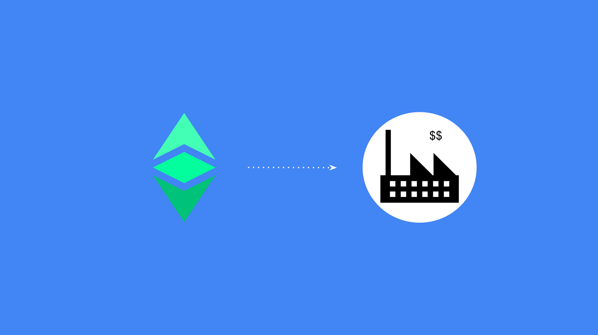

---
**您可以由此收听或观看本期内容:**

<iframe width="560" height="315" src="https://www.youtube.com/embed/yFpzH7UyijA" title="YouTube video player" frameborder="0" allow="accelerometer; autoplay; clipboard-write; encrypted-media; gyroscope; picture-in-picture; web-share" allowfullscreen></iframe>

---

[在我们之前的帖子中](https://ethereumclassic.org/blog/2023-05-03-using-ethereum-classic-for-business-part-i)，我们解释了以太坊经典上的哪些有趣的工具和功能可以用于商业。

在我们之前的帖子中，我们解释了以太坊经典上的哪些有趣的工具和功能可以用于商业。我们描述了其中的八个用例，包括使用提供商（[如NOWpayments](https://nowpayments.io/supported-coins/ethereum-classic-payments)）进行常规付款，由于ETC的安全跨境能力而进行的国际支付，将其用作财库储备，因为该加密货币的稳健性，它可以用于提供有用服务的DApp，企业可以将其现有的DApp迁移到ETC上，可以在其上创建各种合同，从公司到商业，以便为不同的目的使用不同的帐户，并且所有这些都可以使用多签名设置进行管理，以增强安全性。

在本文中，我们将给出一些可以使用上述工具和功能的ETC的企业类型的示例。

## 独资企业

独资企业和独立承包商可能会发现ETC非常有用，因为它们的组织类似于个人。

使用以太坊经典的一个优点是以ETC的形式获得付款。由于它是稳健的货币，将一部分收入以ETC的形式收到，并将其转换为业务资本或储蓄，从中期到长期可能是一笔不错的交易。

通过正确的钱包，独资企业可以在ETC上拥有多个地址，用于不同的账户计划或账户表分类。例如，他们可以为收入设置一个地址，为支出设置另一个地址，为累积未付税款设置另一个地址。他们甚至可以为每个客户和提供商使用一个地址，以便可以跟踪每个实体的现金流。

ETC的另一个用例是使用DApp。在不久的将来，去中心化金融很可能成为最常见的DApp类型，但在中期，从法律到物流等更多服务将可用于区块链上。

## 公司

可编程区块链领域最迷人的概念之一是创建去中心化自治组织（DAO）。公司首先要做的事情是使用ETC来转移和管理其法人实体。

所有者将拥有DAO的代币，这个DAO本身就是公司，与供应商、客户和雇员之间的合同将是在以太坊经典上这些各方之间的智能合约。

例如，如果这个业务是一家租车公司，那么车辆将是区块链上的NFT，租赁合同将是智能合约，客户将从一个ETC地址进行支付，保险将是另一个智能合约。所有这些都将是可组合的，并在区块链上无缝发生。

当然，公司也可以用ETC进行付款、国际付款、财库储备、dapps、迁移其dapps，以及使用与传统银行相同的规则和权限的多重签名设置。

## 国际远程工作者

今天有无数国际远程工作者。为了在这种劳动关系中使用ETC，国际远程工作者可以设置自己的非托管钱包来接收付款，然后在币安（美国之外）或Coinbase（美国境内）或其他交易所设置账户，将ETC换成他们当地的货币。他们想要节省下来的任何余额都可以留在他们的非托管钱包中。

这适用于数字营销人员、开发人员、工程师、支持代理、销售代理、平面设计师、法律和法律服务、作家和编辑、翻译、会计师和许多其他种类的远程工作者。

与独资企业主类似，远程工作者可能希望在ETC上使用不同的地址来处理其收入和支出的不同类别，如果他们为多个雇主工作，他们甚至可以在同一个钱包应用程序中为每个雇主使用一个地址。

## 雇用国际远程工作者的企业

另一方面，雇用国际远程工作者的企业将想要为其员工和承包商设置非托管钱包，帮助他们设置在币安、Coinbase或其他法定货币到加密货币的交易所的账户，并教他们如何将ETC转换为他们的本地货币。

通常，外国工人的税务责任归员工或承包商负责，因此他们可能想要使用额外的ETC地址来累计这些预估税款。

在不久的将来，企业将能够为其国际远程工作者和承包商提供更多福利和优惠，例如去中心化的费用管理、去中心化的养老金计划、去中心化的保险、去中心化的医疗计划等等。

所有这些关系和交易都将在ETC上无缝地组合和执行，很可能降低处理国际工资单和福利的摩擦成本。

## 慈善机构

如果一位乌克兰社会工作者希望创建一家慈善机构来帮助难民或逃难家庭，那么她可以在ETC上建立一个DAO，通过社交媒体宣传自己的事业，引导欧洲各地的捐助者通过向她的DAO发送ETC来支持她的高尚事业。同时，她可以发布帮助难民、他们的临时住所、他们的交通和他们的福祉的进展视频和图片。

如果一位秘鲁的海洋生物学家希望设立一个非营利机构来帮助她融资一个鱼类可追溯性系统，她可以在拉丁美洲各地的捐助者公布她的地址，并从巴西、阿根廷、哥伦比亚、墨西哥和牙买加的人们那里收到捐款。

上述示例旨在说明，无论捐助者或事业在何处，ETC都是一种国际、无需许可、跨境转移价值的中立和可靠的系统。

## 教会

和非营利组织类似，教堂必须依靠什一和奉献来为其工作提供资金，但这些资金主要来自当地。

为了接受信众的 ETC 捐款，教堂必须为教堂工作人员或教堂家庭的各个授权成员设置非托管钱包。

然后，他们必须为他们的信徒设置多签名地址，以便捐赠，使用 Binance（在美国之外）或 Coinbase（在美国内部）或其他法定货币兑换加密货币的交易所账户，能够在 ETC 和法定货币之间进行资金转移。

由于教堂可能会有长期储备金，他们也可能希望将部分 ETC 捐款积累到这些储备金中。

## 矿工

对于单独的矿工或矿业公司来说，最好的想法就是开始挖掘 ETC！

由于 ETC 的供应上限为 2.107 亿个 ETC，已发行数量大约为 1.4 亿个，那么还剩下大约 7070 万个未发行。以当前 ETC 价格约为 20 美元计算，这相当于约 14 亿美元的收入，其中仅在未来 10 年内就将支付 7.7 亿美元给矿工。

一旦矿工开始在 ETC 上工作，他们就可以在其运营中使用 ETC，积累资本储备金，支付其账单、员工、远程工作者、账户计划、dapps 和本文提到的所有其他好处。

## VPN服务

最后，隐私服务可能会发现ETC非常有用，以增强其为客户提供的服务。

如果VPN服务本身是私密的，但付款是使用不安全的易受攻击的支付机制进行的，则整个目的将被大大削弱。

但是，如果VPN服务使其用户能够从区块链上的其地址激活其连接并使用ETC支付，则可以提供真正的隐私。

---

**感谢您阅读本期文章!**

了解更多有关ETC内容，请访问: https://ethereumclassic.org
