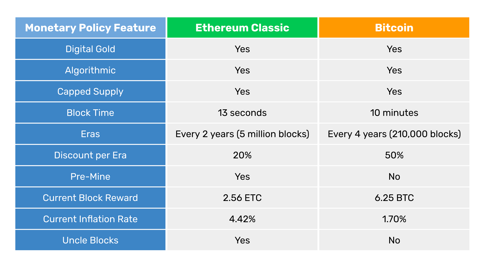

---
**You can listen to or watch this video here:**

<iframe width="560" height="315" src="https://www.youtube.com/embed/cSrFtGc0D8g" title="YouTube video player" frameborder="0" allow="accelerometer; autoplay; clipboard-write; encrypted-media; gyroscope; picture-in-picture; web-share" allowfullscreen></iframe>

---

In this post we will compare the Ethereum Classic (ETC) and Bitcoin (BTC) monetary policies.

Bitcoin was the first blockchain ever and currently has the same original monetary policy with no changes since genesis. Ethereum Classic was originally one chain with Ethereum, so it had that system’s monetary policy, which is basically to have none at all as the core developer team has changed it manually many times, and will likely continue doing so.

When Ethereum (ETH) forked away from ETC in 2016, the Ethereum Classic core developer team decided to establish a monetary policy as similar as possible to that of Bitcoin. 

In the table below we compare both blockchains’ monetary policies and in the following sections we will explain each feature in the table.

## Digital Gold

Both ETC and BTC are digital gold.

The reason for this is that both networks are proof of work blockchains and the purpose of that consensus mechanism is to make it as costly to create ETC and BTC as it is in the real world for gold.

The way they work is that miners on both blockchains create blocks of transactions and to stamp them cryptographically they need to do a lot of computational work, which uses a lot of electricity. Then, when the blocks are accepted by the rest of the network, the miners are credited newly issued coins by the algorithm.

The above system guarantees that both ETC and BTC will be sound money as gold was in the old days, hence the term “digital gold”.

## Algorithmic

Bitcoin’s monetary policy was “set in stone” since it was launched in 2009. This was done by establishing its whole future distribution in the software in the form of a supply algorithm. 

The supply algorithm is a set of mathematical rules that establish what number of coins will be paid to miners per block, the frequency of the payments, and a schedule that will decrease these payments as time passes by.

As said before, ETC started with no monetary policy other than a fixed payment per block. However, in 2017 it migrated to a schedule that is also “set in stone” as it establishes the whole future distribution in the software in the form of a supply algorithm very similar to that of Bitcoin.

## Capped Supply

Both ETC and BTC have a capped supply of their coins. This means that the total number of coins that will ever exist for each blockchain is known.

Given the frequency of payments to miners, the number of coins issued per block, and its discount schedule, Bitcoin will have a maximum supply of 21,000,000 BTC.

Given Ethereum Classic’s frequency of payments to miners, the number of coins it issues per block, and its discount schedule, there will be a maximum supply of ETC numbering 210,700,000.

Note that Ethereum Classic’s maximum supply is similar to Bitcoin’s but 10 times higher. This was done purposefully to associate both cryptocurrencies reputationally and to make it easy for the market to understand ETC’s schedule.

## Block Time

Ethereum Classic’s block time is 13 seconds per block and Bitcoin’s block time is 10 minutes per block.

This means that ETC miners create 6,646 blocks per day and BTC miners create 144 blocks in the same period.

The block time of a blockchain is important because it establishes how fast the coins will be created, thus regulates the supply. 

By modulating the block times and the number of coins created per block then a blockchain can control the monetary policy in time and supply levels. 

## Eras

Both Ethereum Classic and Bitcoin have eras measured in blocks in which the payments to miners, thus the issuance of coins, will be the same for each era.

Ethereum Classic’s eras last 5 million blocks which, at 13 seconds per block, turns out to be more or less 2 years per era.

Bitcoin’s eras last 210,000 blocks which, at 10 minutes per block, turns out to be more or less 4 years per era.

After each era both ETC and BTC change or discount the payment to miners.

## Discount Per Era

In the case of Ethereum Classic, the discount per era is 20%. This means that since genesis, ETC has paid miners 5 ETC in the first era, then 4 ETC, then 3.20, and now is paying 2.56 which is the current era.

Bitcoin’s discount per era is 50%. This means that since genesis, BTC has paid miners 50 BTC in the first era, then 25 BTC, then 12.50, and now is paying 6.25 which is the current era.

## Pre-Mine

Because Ethereum Classic and Ethereum were one single project since the beginning, and the project started with a crowd sale that resulted in an initial issuance, or what is called a “pre-mine”, then both ETC and ETH have a pre-mine stock of coins that were created at genesis block.

ETC’s premine stock is 72,000,000 ETC of the current 140,600,000 supply number.

Bitcoin did not have a pre-mine, so its supply was purely created by miners building blocks since the beginning.

However, because the founder of Bitcoin, Satoshi Nakamoto, was practically the only miner at the beginning, it is estimated that he holds more or less 1,000,000 bitcoins of the current 19,300,000 supply number.

## Current Block Rewards

The current era in ETC is era 4 which is between block 15,000,001 and 20,000,000. This means it is paying 2.56 ETC per block to miners as explained before.

The next payments will be discounted by 20% per era lowering them to 2.048 ETC, then 1.6384, 1.311072, and so on until it diminishes completely approximately by the year 2140.

The current era in BTC is also era 4 which is between block 630,001 and 840,000. This means it is paying 6.25 BTC per block to miners as explained before.

The next payments will be discounted by 50% per era lowering them to 3.125 BTC, then 1.5625, 0.78125, and so on until it diminishes completely approximately by the year 2130.

## Current Inflation Rate

If we calculate the number of blocks each blockchain produces per year and multiply that by the block reward payments, then we will get the total number of coins issued per year. If we divide that by the current supply of each coin, then we will know their current inflation rate.

Because ETC produces blocks every 13 seconds, this equals to 2,425,790 blocks per year. If we multiply that number by 2.56 ETC issued per block, we will get 6,210,022 ETC issued per year in the current era. If we divide this by the current supply of 140,600,000 ETC, then we get a current inflation rate of 4.42%.

Because BTC produces blocks every 10 minutes, this equals to 52,560 blocks per year. If we multiply that number by 6.25 BTC issued per block, we will get 328,500 BTC issued per year in the current era. If we divide this by the current supply of 19,300,000 BTC, then we get a current inflation rate of 1.70%.

## Uncle Blocks

Bitcoin does not have it, but Ethereum Classic has a feature called uncle blocks. This is that each time a block is created in the network, there may be up to two extra blocks that will get paid a minimal fee for the effort of building them. This was done because due to ETC’s mining algorithm, there is a probability that more than one block may be built by miners per round. To incentivise miners to participate, the uncle block reward was created.

However, the uncle block rate is around 5% per era in ETC, meaning that only in 5% of occurrences there are actually other blocks created in the network. In addition to this the payments to uncles is very low (it is currently 0.32 ETC for both uncles whenever they appear) and they are discounted by 20% per era as the other rewards, so the impact on the supply and inflation in ETC is minimal.

---

**Thank you for reading this article!**

To learn more about ETC please go to: https://ethereumclassic.org
