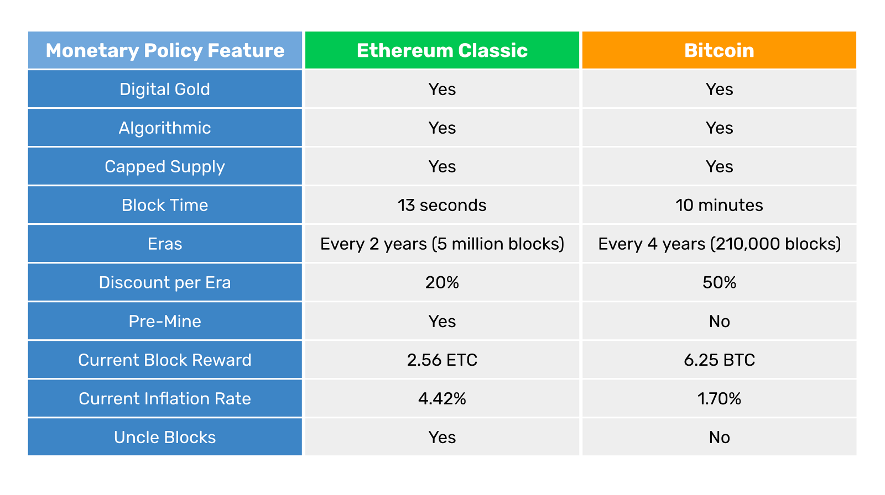

---
**您也可以由此收听或观看本期内容:**

<iframe width="560" height="315" src="https://www.youtube.com/embed/cSrFtGc0D8g" title="YouTube video player" frameborder="0" allow="accelerometer; autoplay; clipboard-write; encrypted-media; gyroscope; picture-in-picture; web-share" allowfullscreen></iframe>

---

在本篇文章中，我们将比较以太经典（ETC）和比特币（BTC）的货币政策。

比特币是第一个区块链，其创世时的货币政策至今未发生变化。以太经典最初与以太坊是同一条链，因此采用了以太坊的货币政策，即基本上没有政策，因为核心开发团队已多次手动更改，并且很可能会继续这样做。

当以太坊（ETH）在2016年从ETC分叉出去时，以太经典的核心开发团队决定建立尽可能与比特币相似的货币政策。

在下表中，我们将比较两个区块链的货币政策，并在以下部分中解释表中的每个特性。

## 数字黄金

ETC和BTC都是数字黄金。

原因是两个区块链都是工作量证明机制，而这种共识机制的目的是使得创建ETC和BTC的成本与黄金在现实世界中的成本相同。

它们的工作方式是，两个区块链上的矿工创建交易块，并为了进行密码学认证而进行大量计算工作，这需要大量电力。然后，当这些块被整个网络接受时，算法会向矿工发放新发行的数字货币。

上述系统保证了ETC和BTC都将成为与黄金一样可靠的货币，因此被称为“数字黄金”。

## 算法

自2009年推出以来，比特币的货币政策已经“定案”。这是通过在软件中建立其未来分配的供应算法来完成的。

供应算法是一组数学规则，用于确定每个块向矿工支付的货币数量、支付频率以及一份将随着时间推移而减少这些支付的时间表。

如前所述，ETC最初没有货币政策，只有每个块的固定支付。但是，在2017年，它采用了与比特币非常相似的一种“算法设定”的供应算法，并将其整个未来分配确定在软件中。

算法
自2009年推出以来，比特币的货币政策已经“定案”。这是通过在软件中建立其未来分配的供应算法来完成的。

供应算法是一组数学规则，用于确定每个块向矿工支付的货币数量、支付频率以及一份将随着时间推移而减少这些支付的时间表。

如前所述，ETC最初没有货币政策，只有每个块的固定支付。但是，在2017年，它采用了与比特币非常相似的一种“算法设定”的供应算法，并将其整个未来分配确定在软件中。

## 时代

以区块为单位，以太经典和比特币都有时代的概念，每个时代里对矿工的支付和货币的发行量是相同的。

以太经典的时代持续500万个区块，每个区块13秒，因此每个时代大约为2年。

比特币的时代持续21万个区块，每个区块10分钟，因此每个时代大约为4年。

在每个时代结束后，以太经典和比特币都会更改或折扣对矿工的支付。

## 每个时代的折扣

以太经典的每个时代折扣为20%。这意味着自起源以来，以太经典第一个时代向矿工支付了5个ETC，然后是4个ETC，接着是3.20个ETC，当前时代为2.56个ETC。

比特币的每个时代折扣为50%。这意味着自起源以来，比特币第一个时代向矿工支付了50个BTC，然后是25个BTC，接着是12.50个BTC，当前时代为6.25个BTC。

## 预挖矿

因为以太坊经典和以太坊从一开始就是一个单一的项目，项目启动时进行了众筹，结果导致了初始发行量，即所谓的“预挖”，因此ETC和ETH都有一个在创世区块时创建的预挖存货。

ETC的预挖存货是当前供应量为140,600,000的72,000,000个ETC。

比特币没有预挖，因此其供应量纯粹是由矿工从一开始建造块创建的。

然而，因为比特币的创始人中本聪实际上是一开始唯一的矿工，据估计他持有现有19,300,000比特币中的大约1,000,000个。

## 当前块奖励

ETC的当前时代是第4个时代，介于区块15,000,001和20,000,000之间。这意味着它每个区块向矿工支付2.56个ETC，如前所述。

下一次支付将在每个时代降低20％的折扣率下支付，降低到2.048 ETC，然后是1.6384，1.311072等，直到在大约2140年前完全降低为止。

BTC的当前时代也是第4个时代，介于区块630,001和840,000之间。这意味着它每个区块向矿工支付6.25个BTC，如前所述。

下一次支付将在每个时代降低50％的折扣率下支付，降低到3.125 BTC，然后是1.5625，0.78125等，直到在大约2130年前完全降低为止。

## 当前通货膨胀率

如果我们计算每个区块链每年产生的块数并将其乘以块奖励支付，那么我们将得到每年发行的硬币总数。如果我们将其除以每个币种的当前供应量，那么我们将知道它们的当前通货膨胀率。

因为 ETC 每 13 秒产生一个块，这相当于每年产生 2,425,790 个块。如果我们将这个数字乘以每个块发行的 2.56 ETC，我们将得到当前时代每年发行的 6,210,022 ETC。如果我们将其除以当前供应量 140,600,000 ETC，那么我们得到当前通货膨胀率为 4.42%。

因为 BTC 每 10 分钟产生一个块，这相当于每年产生 52,560 个块。如果我们将这个数字乘以每个块发行的 6.25 BTC，我们将得到当前时代每年发行的 328,500 BTC。如果我们将其除以当前供应量 19,300,000 BTC，那么我们得到当前通货膨胀率为 1.70%。

## 叔块

比特币没有叔块，但是以太坊经典有一个名为“叔块”的特性。这是指每当网络创建一个块时，最多可能有两个额外的块将获得微小的费用以支付它们构建的努力。之所以这样做是因为由于 ETC 的挖掘算法，挖矿者可能在每轮中建立多个块。为了激励挖矿者参与，叔块奖励被创建出来。

然而，ETC 的叔块率在每个时代约为 5%，这意味着实际上只有在 5% 的情况下，网络中才会创建其他块。除此之外，叔块的支付非常低（当前每个叔块都为 0.32 ETC），并且它们的奖励每个时代都会像其他奖励一样降价 20%，因此对 ETC 的供应和通货膨胀的影响很小。

---

**感谢您阅读本期文章!**

了解更多有关ETC内容，请访问: https://ethereumclassic.org
