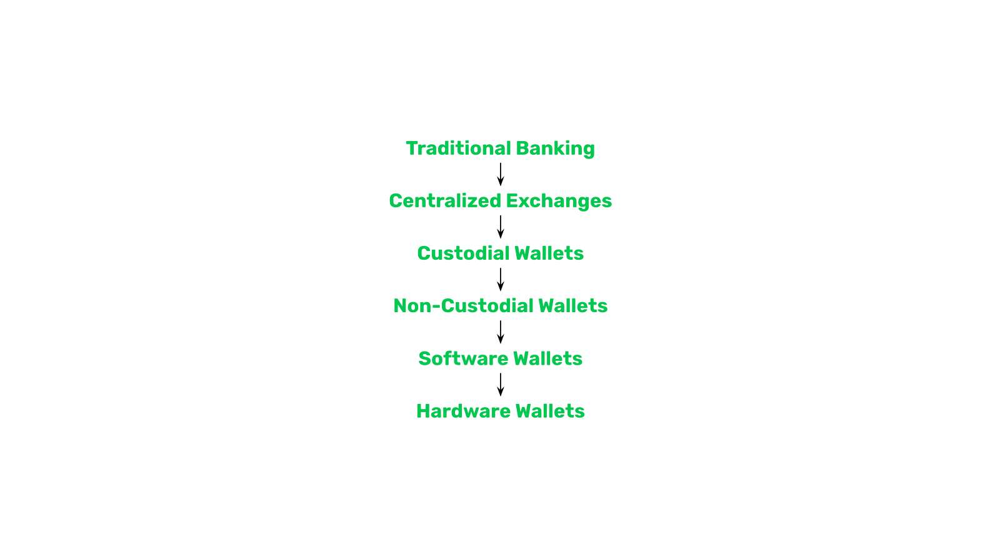
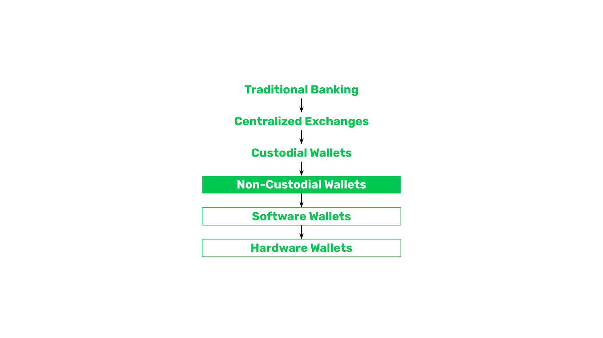
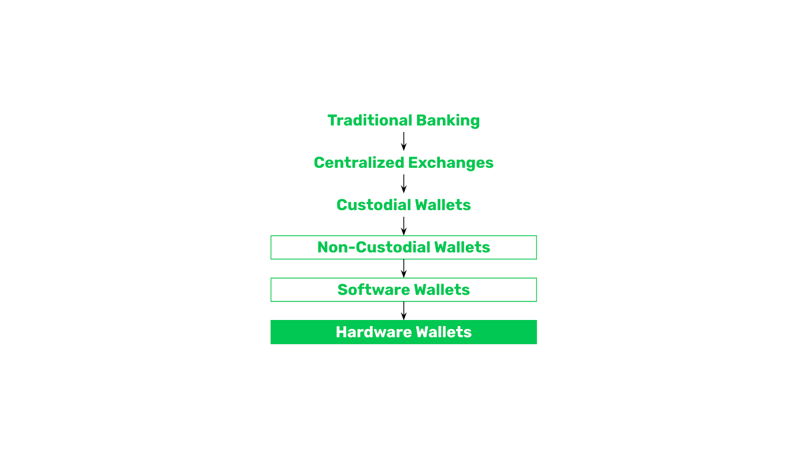
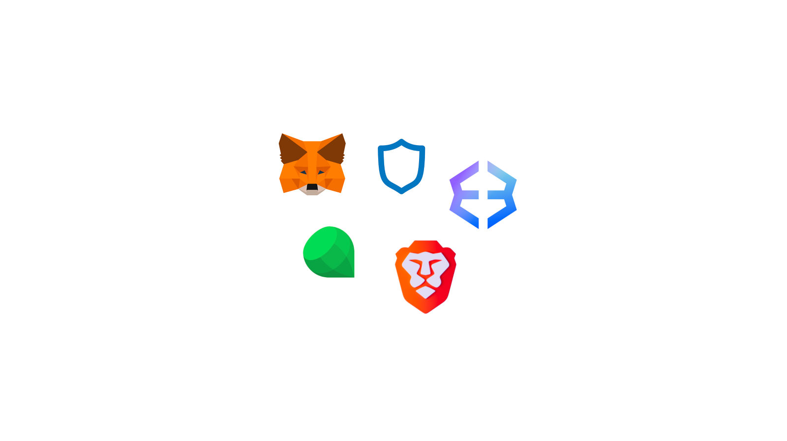

---
**You can listen to or watch this video here:**

<iframe width="560" height="315" src="https://www.youtube.com/embed/3xWJSPLf5Z0" title="YouTube video player" frameborder="0" allow="accelerometer; autoplay; clipboard-write; encrypted-media; gyroscope; picture-in-picture; web-share" allowfullscreen></iframe>

---

In the last few lessons we have explained what are the different formats of ownership of crypto assets. We provided comparisons from traditional centralized banking to how addresses, private keys, and wallets work on the blockchain.

The typical process by which new users go through when learning all these concepts is that they start with the traditional paradigm, then they buy cryptocurrencies as Ethereum Classic (ETC) or Bitcoin (BTC) for the first time and hold them in centralized exchanges, then they may migrate to custodial wallets, when they learn the security tradeoffs they move to non-custodial wallets, of these they usually start with software wallets, and, finally, when they learn the true responsibility and safety of the system, they migrate to hardware wallets.

To learn all these changes in paradigm and formats is difficult, but here we contribute to help you understand! In this post we will explain the difference between software and hardware wallets.

So, now that in the last class we learned the differences between custodial and non-custodial wallets, we can explain the two big categories of non-custodial wallets:

- Software wallets
- Hardware wallets

Both software wallets and hardware wallets are non-custodial wallets that may be used to manage addresses on the blockchain, the difference is where are the private keys are located and secured.

## Software Wallets

Software Wallets that you install on your phone or computer are typically non-custodial software wallets.

These apps usually give you 12 to 24 words as you secret passphrase so that you may store them in a secure place.

However, even if the secret passphrase may be secure, the encrypted private keys remain inside your phone or computer in what is sometimes called a “vault file”.

This means that if someone gains access to your devices or you lose them, then malicious actors or hackers may steal your crypto assets.

This is why many people actually hold small amounts of money in software wallets, but the tradeoff is that they are very convenient to use.

## Hardware Wallets

Hardware wallets are the next step in security. This is because, as their name suggests, hardware wallets are physical devices where your private keys are stored and they are separated from your day-to-day use devices such as your phone or computer.

The key to the security of hardware wallets is that they are disconnected from the internet at all times, so there is little chance that hackers may gain access to them. The other advantage is that if your phone or computer are lost or stolen, then malicious actors or hackers can’t access your crypto anyway because the private keys are not stored in them in any shape or form.

The way hardware wallets work is that you have an app on your phone or computer, and every time you need to send transactions, you connect your hardware wallet to sign them with your private keys.

## Software Wallet Brands

Popular software wallet brands that may be used with ETC are:

- MetaMask
- Trust Wallet
- Exodus
- Emerald Wallet
- Brave

## Hardware Wallet Brands

Popular hardware wallet brands that may be used with ETC are:

- Ledger Nano S Plus
- Ledger Nano X
- Ledger Stax
- Trezor Model T
- Trezor Model One

---

**Thank you for reading this article!**

To learn more about ETC please go to: https://ethereumclassic.org
