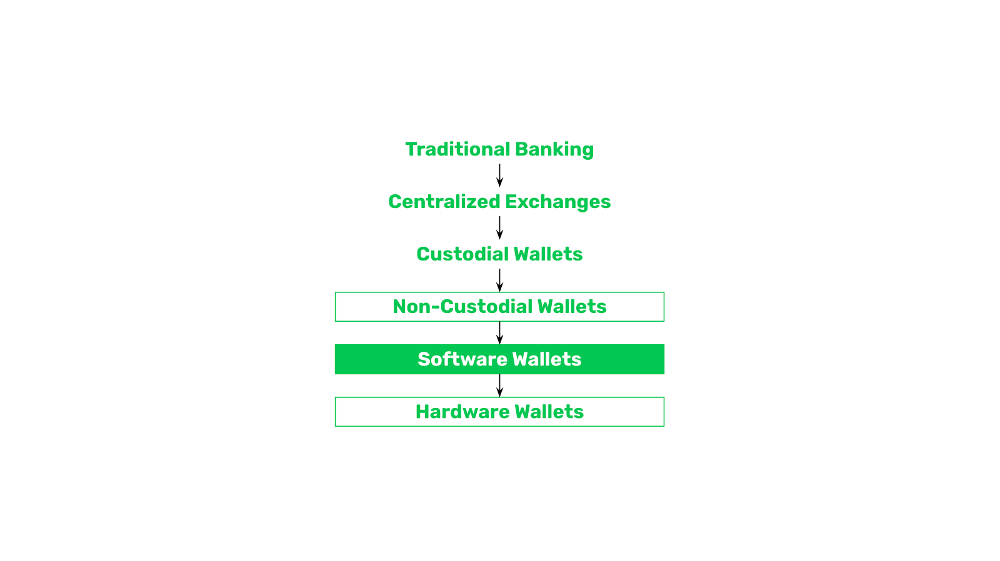

---
**您可以由此收听或观看本期内容:**

<iframe width="560" height="315" src="https://www.youtube.com/embed/3xWJSPLf5Z0" title="YouTube video player" frameborder="0" allow="accelerometer; autoplay; clipboard-write; encrypted-media; gyroscope; picture-in-picture; web-share" allowfullscreen></iframe>

---

在过去的几个课程中，我们解释了加密资产所有权的不同格式。我们将传统的中心化银行与区块链上的地址、私钥和钱包的工作方式进行了比较。

新用户学习所有这些概念的典型过程是，他们从传统的范式开始，然后第一次购买以太坊经典（ETC）或比特币（BTC）并将它们保管在中心化交易所，然后他们可能迁移到托管钱包，当他们了解到安全性权衡后，他们会转移到非托管钱包，通常是从软件钱包开始，最后当他们了解到系统的真正责任和安全性时，他们会迁移到硬件钱包。

学习所有这些范式和格式的变化很困难，但是我们在这里致力于帮助您理解！在本篇文章中，我们将解释软件钱包和硬件钱包之间的区别。

在上一节中，我们了解了托管和非托管钱包之间的区别，现在我们可以解释非托管钱包的两个主要类别：

- 软件钱包
  
- 硬件钱包

软件钱包和硬件钱包都是非托管钱包，可用于管理区块链上的地址，区别在于私钥的存储和安全性。

## 软件钱包

您在手机或计算机上安装的软件钱包通常是非托管软件钱包。

这些应用程序通常会为您提供 12 到 24 个单词作为秘密密码，以便您可以将它们存储在安全的地方。

然而，即使秘密密码可能很安全，加密私钥仍然保存在您的手机或计算机中，有时被称为“保险库文件”。

这意味着，如果有人获得您的设备或您丢失了它们，那么恶意行为者或黑客可能会窃取您的加密资产。

这就是为什么许多人实际上在软件钱包中持有少量资金的原因，但这是一种方便的使用方式，与之相对的是，它们也有很大的安全风险。

## 硬件钱包

硬件钱包是更高级别的安全措施。正如其名，硬件钱包是物理设备，存储着您的私钥，并与您日常使用的设备（如手机或电脑）分离。

硬件钱包的安全性关键在于它们在任何时候都与互联网断开连接，因此黑客获取其访问权限的可能性很小。另一个优点是，如果您的手机或电脑丢失或被盗，恶意行为者或黑客无法访问您的加密资产，因为私钥并没有以任何形式存储在这些设备中。

硬件钱包的工作方式是：您在手机或电脑上安装一个应用程序，每当您需要发送交易时，连接硬件钱包以使用私钥签名交易。

## 软件钱包品牌

常用与ETC一起使用的软件钱包品牌包括：

- MetaMask
- Trust Wallet
- Exodus
- Emerald Wallet
- Brave

## 硬件钱包品牌

常用与ETC一起使用的硬件钱包品牌包括：

- Ledger Nano S Plus
- Ledger Nano X
- Ledger Stax
- Trezor Model T
- Trezor Model One

---

**感谢您阅读本期文章!**

了解更多有关ETC，请访问: https://ethereumclassic.org
