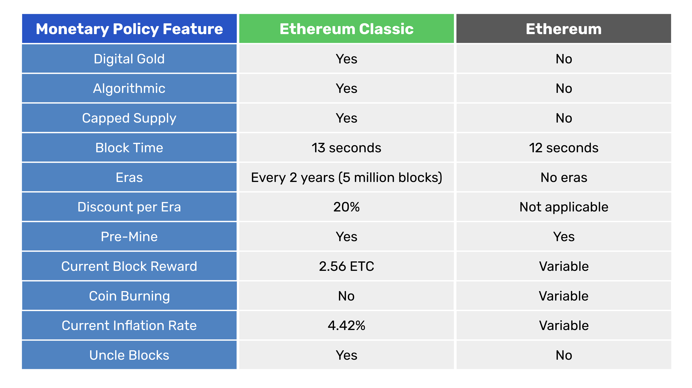

---
**You can listen to or watch this video here:**

<iframe width="560" height="315" src="https://www.youtube.com/embed/Hl1uKGW-40I" title="YouTube video player" frameborder="0" allow="accelerometer; autoplay; clipboard-write; encrypted-media; gyroscope; picture-in-picture; web-share" allowfullscreen></iframe>

---

In this post we will compare the Ethereum Classic (ETC) and Ethereum (ETH) monetary policies.

When Ethereum forked away from ETC in 2016, the Ethereum Classic core developer team decided to establish a monetary policy as similar as possible to that of Bitcoin. The change occurred in December 2017; since then it has remained and will remain the same forever.

Since the genesis block, Ethereum has had five monetary policies and will likely keep changing forever.

In the table below we compare both blockchains’ monetary policies and in the following sections we will explain each feature in the table.

## Ethereum’s Tendency to Centralization and Mega-Validators

Before delving into comparisons, it is important to note that Ethereum's system tends towards centralization, making it vulnerable to censorship and arbitrary manipulation. This is because proof of stake does not impose any cost for changing the ledger, lacks an objective focal point for entry and exit, and allows for highly efficient economies of scale for those staking. Additionally, the monetary policy of Ethereum compensates the staking industry with substantial amounts of money each year, leading to domination by a select few players while regular users who pay transaction fees effectively end up burning coins.

This means that the staking industrial complex will perpetually get richer, creating mega-validators, while the rest of the economy will be constantly starved of money to pay for fees.

While there will always be some coin to pay for fees, there exists a giant continuing wealth transfer from the economy at large to the exclusive staking cartel. These factors should be taken into consideration in any analysis of Ethereum.

## Digital Gold

ETC is digital gold and ETH is not.

ETC is digital gold because it is a proof of work blockchain and the purpose of that consensus mechanism is to make it as costly to create ETC as it is costly to produce gold in the real world.

The way it works is that miners in the blockchain create blocks of transactions and to stamp them cryptographically they need to do a lot of computational work, which uses a lot of electricity. Then, when the blocks are accepted by the rest of the network, the miners are credited newly issued coins by the algorithm.

The above system guarantees that ETC will be sound money as gold was in the old days, hence the term “digital gold”.

ETH is not digital gold because it is a proof of stake blockchain and validators do not have to do any work to produce blocks or earn rewards. They just receive transactions, package them into batches they call blocks to steal some lure from proof of work blockchains, and they vote on them to affirm their validity.

The above means that to produce the coin in Ethereum is practically costless, thus the currency cannot be compared to gold.

The best comparison that may be made for ETH is that it is very similar to fiat money. Fiat money is produced by central banks with no cost whatsoever, thus ETH may be called community fiat money as it is printed by a private community rather than a government. 

## Algorithmic

ETC’s monetary policy is algorithmic because in 2017 it migrated to a schedule that is set in stone as it establishes the whole future distribution in the software in the form of a supply algorithm.

The supply algorithm is a set of simple and transparent mathematical rules that establish what number of coins will be paid to miners per block, the frequency of the payments, and a schedule that will decrease these payments as time passes by.

ETH’s monetary policy is manual, not algorithmic, because it has been changed several times and will likely change many times more in the future given that proof of stake tends to centralization.

The fact that it has a software algorithm that determines payments to validators does not mean it is algorithmic as long as developers may change the rules whenever they please.

## Capped Supply

ETC has a capped supply of its coin. This means that it’s known what is the total amount of ETC that will ever exist.

Given Ethereum Classic’s frequency of payments to miners, the number of coins it issues per block, and its discount schedule, it will have a maximum supply of ETC of 210,700,000.

ETH does not have a capped supply, but has a two way system with an issuance schedule and a coin burning mechanism. These two combined sometimes produce a net issuance of coins and sometimes a net redemption of coins. It all depends on the amounts of staked ETH by validators and the levels of transaction fees.

However, whether Ethereum has a capped supply or not , or if they burn coins or not, is inconsequential in a centralized network with a manually managed monetary policy because they may change the rules at any time. 

## Block Time

Ethereum Classic’s block time is 13 seconds per block and Ethereum’s is 12 seconds per slot, and a slot is a space where a block fits.

This means that ETC miners create 6,646 blocks per day and ETH validators create 7,200 blocks in the same period.

The block time of a blockchain is important because it establishes how fast the coins will be created, thus regulates the supply (and the burn rate, in the case of ETH). 

By modulating the block times and the number of coins created (or burned) per block then a blockchain can control the monetary policy in time and supply levels. 

## Eras

Ethereum Classic has eras and Ethereum does not.

Eras in ETC are measured in blocks in which the payments to miners, thus the issuance of coins, will be the same for each era.

Ethereum Classic’s eras last 5 million blocks which, at 13 seconds per block, turns out to be more or less 2 years per era.

After each era ETC discounts the payment to miners.

## Discount Per Era

In Ethereum Classic, the discount per era is 20%. 
This means that since genesis, ETC has paid miners 5 ETC per block in the first era, then 4 ETC, then 3.20, and now is paying 2.56 which is the current era.

Ethereum never had eras, but has manually changed its monetary policy many times.

Since genesis, ETH has paid miners 5 ETH per block until October of 2017 when they reduced the payment to 3. In February of 2019 they reduced the miner payment to 2 ETH per block. In August of 2021 they implemented EIP-1559 which started the coin burn system in which part of the transaction fees are burned thus reducing supply. And, in September of 2022 they migrated from proof of work to proof of stake where they changed the payment rate to validators to a variable system.

## Pre-Mine

Because Ethereum Classic and Ethereum were one single project since the beginning, and the project started with a crowd sale that resulted in an initial issuance, or what is called a “pre-mine”, then both ETC and ETH have a pre-mine stock of coins that were created at genesis block.

This premine stock for both chains is 72,000,000 ETC and ETH of the current 140,600,000 and 120,300,000 supply numbers respectively.

## Current Block Rewards

The current era in ETC is era 4 which is between block 15,000,001 and 20,000,000. This means it is paying 2.56 ETC per block to miners as explained before.

The next payments will be discounted by 20% per era lowering them to 2.048 ETC, then 1.6384, 1.311072, and so on until it diminishes completely approximately by the year 2140.

Ethereum’s reward per block is variable as it depends on the amount of ETH staked at any given time and the amount of fees burned. This means it has no set or certain reward per block.

## Coin Burning

As said before, Ethereum has a coin burning mechanism and ETC does not.

In ETH, when people send transactions they have to enter two kinds of fees, the network fees and the tip for validators. When the network is congested, users may increase the tip to validators so their transactions are accepted earlier in the blockchain.

The network fee is set by a mechanism that raises the fee when there is a lot of traffic and lowers it when there is less. In any case network fees are burned and not actually paid to validators.

It is estimated that if the current monetary policy prevails overtime, that there will be significantly less ETH supply in the next few decades. 

## Current Inflation Rate

If we calculate the number of blocks ETC produces per year and multiply that by the block reward payments, then we will get the total number of coins issued per year. If we divide that by the current supply, then we will know the current inflation rate.

Because ETC produces blocks every 13 seconds, this equals to 2,425,790 blocks per year. If we multiply that number by 2.56 ETC issued per block, we will get 6,210,022 ETC issued per year in the current era. If we divide this by the current supply of 140,600,000 ETC, then we get a current inflation rate of 4.42%.

For the reasons explained before, Ethereum has a variable inflation rate. The last estimate by the Ethereum Foundation was 0.52% per year with the current monetary policy.

Source link: 

https://ethereum.org/en/roadmap/merge/issuance/

## Uncle Blocks

Ethereum does not have them anymore, but Ethereum Classic has a feature called uncle blocks. This is that each time a block is created in the network, there may be up to two extra blocks that will get paid a minimal fee for the effort of building them. This was done because due to ETC’s mining algorithm, there is a probability that more than one block may be built by miners per round. To incentivise miners to participate, the uncle block reward was created.

However, the uncle block rate is around 5% per era in ETC, meaning that only in 5% of occurrences there are actually other blocks created in the network. In addition to this the payments to uncles is very low (it is currently 0.32 ETC for both uncles whenever they appear) and they are discounted by 20% per era as the other rewards, so the impact on the supply and inflation in ETC is minimal.

---

**Thank you for reading this article!**

To learn more about ETC please go to: https://ethereumclassic.org
