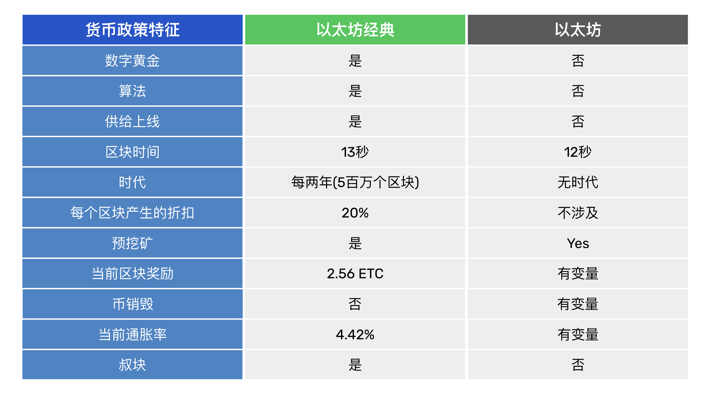

---
**欢迎由此收听或观看本期内容:**

<iframe width="560" height="315" src="https://www.youtube.com/embed/Hl1uKGW-40I" title="YouTube video player" frameborder="0" allow="accelerometer; autoplay; clipboard-write; encrypted-media; gyroscope; picture-in-picture; web-share" allowfullscreen></iframe>

---

在本文中，我们将比较以太经典（ETC）和以太坊（ETH）的货币政策。

当以太坊在2016年从ETC中分叉出去时，以太经典核心开发团队决定建立尽可能类似于比特币的货币政策。这个变化发生在2017年12月，自那时以来，它一直保持不变，将永远保持不变。

自创世以来，以太坊已经有了5个货币政策，并且它们很可能会不断变化。

在下表中，我们比较了两个区块链的货币政策，在接下来的章节中，我们将解释表中的每个特点。

## 以太坊的中心化趋势和大型验证器

在进行比较之前，需要注意的是，正如下一节所述，以太坊是一个趋向于中心化的系统，因此会发生审查和任意操纵，不仅因为权益证明不会对更改账本施加任何成本，而且进入和退出没有客观的焦点，而且质押具有非常有效的规模经济，而且还因为其货币政策向质押行业支付了大量的资金，而这个行业将被少数玩家所垄断，但与此同时，会烧掉付费的普通用户的代币。

这意味着质押产业复合体将永久地变得更加富裕，创建大型验证器，而经济的其余部分将不断缺乏支付费用的资金。

虽然总会有一些代币用于支付费用，但是经济体向质押卡特尔进行了巨大的持续财富转移。

## 数字黄金

ETC是数字黄金，而ETH不是。

ETC是数字黄金，因为它是一个工作量证明的区块链，该共识机制的目的是使创造ETC的成本与在现实世界中生产黄金的成本相同。

其工作原理是，区块链中的矿工创建交易块，并在进行密码签名时需要进行大量的计算工作，消耗了大量的电力。然后，当区块被网络的其余部分接受时，算法会向矿工发放新发行的代币。

上述系统保证了ETC将成为像古老时代的黄金一样的可靠货币，因此有了“数字黄金”一词。

ETH不是数字黄金，因为它是一个权益证明的区块链，验证者不需要做任何工作来生产区块或获得奖励。他们只需接收交易，将它们打包成所谓的块，以从工作量证明的区块链中窃取一些吸引力，然后对其进行投票以确认其有效性。

上述意味着在以太坊中生产代币实际上是没有成本的，因此该货币不能与黄金相比。

对于ETH最好的比较是它与法定货币非常相似。法定货币是由中央银行免费生产的，因此ETH可能被称为社区法定货币，因为它是由私人社区印刷的，而不是由政府印刷的。

## 算法

ETC的货币政策是算法的，因为在2017年它迁移到了一个固定的时间表，它通过供应算法以软件形式确定了整个未来分配。

供应算法是一组简单透明的数学规则，它确定每个区块支付给矿工的代币数量，支付的频率以及将这些支付随时间递减的时间表。

ETH的货币政策是手动的，而不是算法的，因为它已经多次更改，而且鉴于权益证明趋向于集中化，将来可能会多次更改。

虽然它有一个确定支付给验证者的软件算法，但只要开发人员随意更改规则，它就不是算法的。

## 有上限的供应量

ETC的加密货币有一个上限的供应量，这意味着它的总发行量是已知的。

考虑到以太经典的付款频率、每个区块发行的加密货币数量和折扣计划，它的最大供应量将是210,700,000个ETC。

ETH没有一个上限的供应量，但是有一个发行计划和一个销毁代币的机制。这两个机制结合在一起有时会产生净发行代币，有时会产生净赎回代币。这完全取决于验证者抵押的以太币数量和交易费用的水平。

然而，对于一个有人为管理的货币政策的集中化网络来说，无论以太币是否有一个上限的供应量，或者它是否销毁代币，都是无关紧要的，因为开发人员可以随时更改规则。

## 区块时间

以太经典的区块时间是每个区块13秒，以太坊是每个时间槽12秒，时间槽是一个区块适合的空间。

这意味着ETC矿工每天会创建6,646个区块，而在同一时期，ETH验证者会创建7,200个区块。

区块链的区块时间很重要，因为它决定了代币的发行速度，从而调节了供应（以及ETH的销毁速率）。

通过调节区块时间和每个区块创建（或销毁）的代币数量，一个区块链可以控制货币政策的时间和供应水平。

## 时代

以太经典有时代，以太坊没有。

在ETC中，时代是以区块为单位计算的，每个时代的付款给矿工和发行的加密货币数量都相同。

以太经典的时代持续5百万个区块，以每个区块13秒的速度计算，每个时代大约为2年。

在每个时代结束后，ETC会对矿工的付款进行折扣。

## 每个时代的折扣

在以太经典中，每个时代的折扣率为20%。这意味着自创世以来，以太经典每块支付5个ETC，然后是4个ETC，然后是3.20个ETC，现在支付2.56个ETC，即当前时代。

以太坊从未有过时代，但已经多次手动更改了其货币政策。

自创世以来，以太坊每块支付5个ETH，直到2017年10月将支付降至3个ETH。2019年2月，他们将矿工支付降至每块2个ETH。2021年8月，他们实施了EIP-1559，启动了币燃烧系统，其中部分交易费用被燃烧，从而减少了供应。2022年9月，他们从工作量证明转移到股权证明，将向验证器支付率更改为可变系统。

## 预挖矿

由于以太经典和以太坊自始至终是一个项目，并且项目始于一次众筹，结果产生了初始发行量或所谓的“预挖”，因此ETC和ETH都有一定数量的预挖硬币库存，这些硬币是在创世块创建的。

两个链的预挖库存分别为7,200万个ETC和7,200万个ETH，当前的供应量分别为140,600,000和120,300,000。

## 当前区块奖励

以太经典当前的时代是第4个时代，介于第15,000,001块和第20,000,000块之间。这意味着它支付给矿工的每个区块奖励为2.56个ETC，如前所述。

下一次支付将按每个时代降价20%，将它们降至2.048个ETC，然后是1.6384，1.311072等，直到它在大约2140年完全消失。

以太坊每个区块的奖励是可变的，因为它取决于任何给定时间抵押的ETH数量和燃烧的费用数量。这意味着它没有固定或确定的每个区块奖励。

## 代币销毁

如之前所述，以太坊具代币销毁机制，而以太经典则没有。

在以太坊中，当人们发送交易时，他们必须输入两种费用，网络费用和验证器的小费。当网络拥堵时，用户可以增加小费以使他们的交易尽早被区块链接受。

网络费用由一种机制设置，当流量较大时，会提高费用，当流量较小时，会降低费用。在任何情况下，网络费用都会被销毁，而不是实际支付给验证器。

如果当前的代币政策随时间保持不变，估计未来几十年以太坊供应量会显着减少。

## 当前通胀率

如果我们计算以太经典每年产生的区块数量，并将其乘以区块奖励支付，则我们将得到每年发行的硬币总数。如果我们将此除以当前供应量，则我们将知道当前通胀率。

由于以太经典每13秒产生一个区块，因此相当于每年产生2,425,790个区块。如果我们将该数字乘以每个块发放的2.56 ETC，则我们将得到当前时期每年发行的6,210,022个ETC。如果我们将其除以当前的供应量140,600,000个ETC，则得到当前通胀率为4.42％。

由于前面所述的原因，以太坊具有可变的通胀率。以太坊基金会的最新估计是当前货币政策下每年0.52％的通胀率。

来源链接：
https://ethereum.org/en/roadmap/merge/issuance/

## 叔块 

以太坊不再拥有叔块，但以太经典有一个叫做叔块的特性。每当网络创建一个区块时，最多可能有两个额外的区块会因构建它们而获得少量报酬。这是因为由于以太经典的挖矿算法，在每轮中可能会有多个区块被矿工构建。为了激励矿工参与，叔块奖励被创建出来。

然而，以太经典的叔块率在每个时代约为5％，这意味着只有在5％的情况下实际上会在网络中创建其他区块。除此之外，对叔块的支付非常低（当前为每个叔块0.32 ETC），并且像其他奖励一样，每个时代会以20％的折扣进行减少，因此对以太经典的供应和通货膨胀影响很小。

---

**感谢您阅读本期内容!**

了解更多有关ETC，请访问: https://ethereumclassic.org
