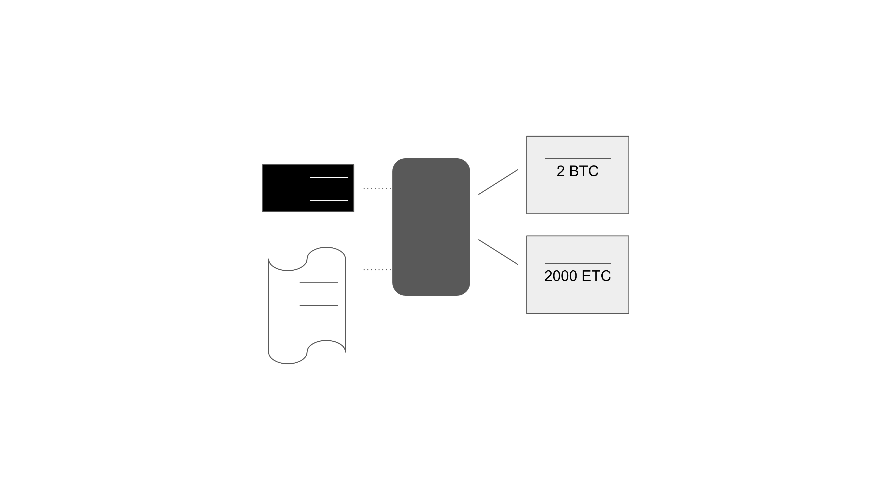
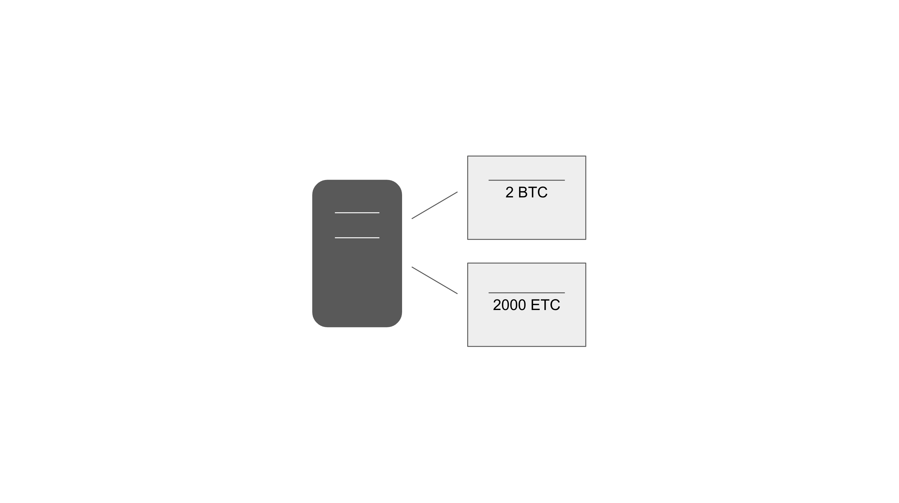
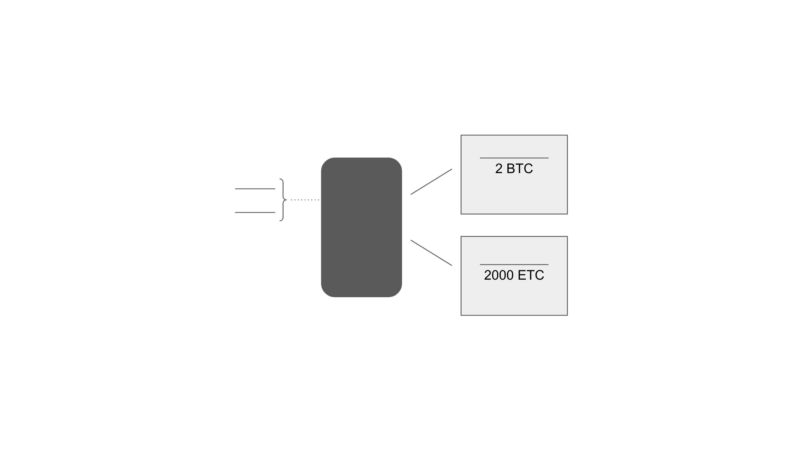
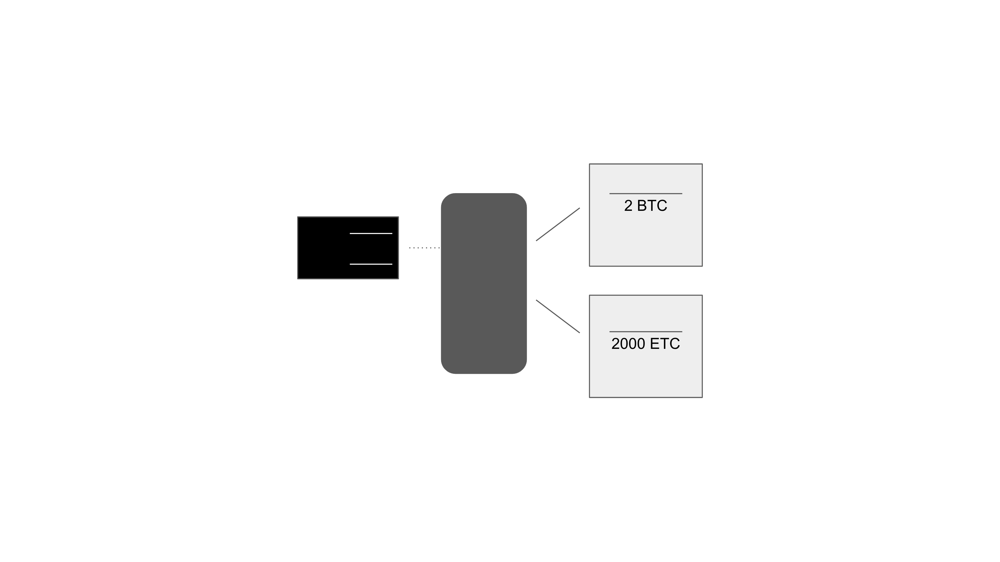
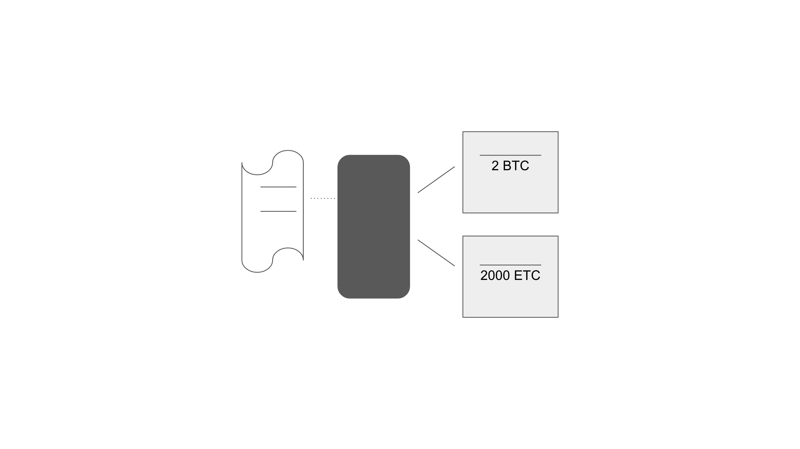
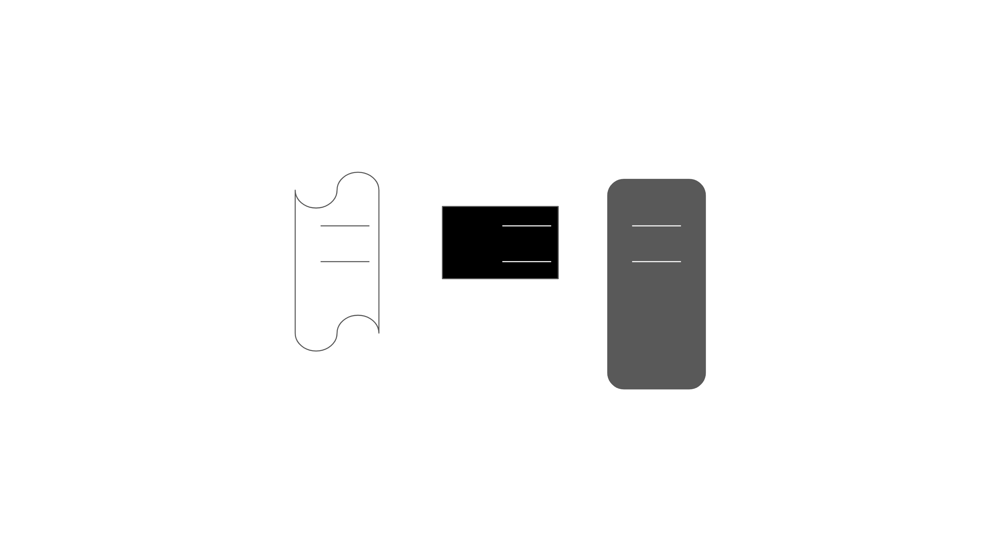

---
**You can listen to or watch this video here:**

<iframe width="560" height="315" src="https://www.youtube.com/embed/6pwLR-0H3Jw" title="YouTube video player" frameborder="0" allow="accelerometer; autoplay; clipboard-write; encrypted-media; gyroscope; picture-in-picture; web-share" allowfullscreen></iframe>

---

To learn how to manage our crypto assets, in the previous classes we learned what are private keys, public keys, and addresses (class 17), the difference between wallets and addresses (class 18), what are raw private keys, private key JSON files, and secret passphrases (class 19), and what are custodial and non-custodial wallets (class 20).

To close this segment in the Ethereum Classic course about crypto asset and private key management, we will explain the last important concept: hot vs cold wallets.

The previous classes dealt with the different formats available to keep our crypto assets secure, this class will be more about how to find a balance between security and convenience.

The whole point of the blockchain industry is for you to have control of your wealth, however self custody implies knowing the risks and implications of the hot and cold wallet setups.

## Hot Wallets

The definition of a hot wallet may be that it is a non-custodial wallet where the private keys are inside the app which is installed inside a phone or computer for daily use.

In other words, the hot wallet is in your phone or computer and you can open it and send transactions at will with no other steps or hurdles.

This is the most convenient way of holding your crypto because it is readily accessible and easy to use. However, the problem is that this easy access also makes it easier for hackers or malicious players who may steal your phone or computer or even use them while you are away from your desk or distracted to gain access and steal your crypto.

The typical hot wallet setup is to have all your ETC on a Metamask wallet on your phone, for example.

## Cold Wallets

The key of cold wallets, similar to but not exactly the same as hardware wallets, is to separate the private keys from the devices that we employ for daily use.

When you have a wallet app to see your crypto positions and prices, but you have the private keys segregated in another place, then it doesn’t matter whether you get hacked, lose your phone or computer, they are stolen, or if someone gains access while you are distracted. It is impossible to move ETC or any crypto asset if the private keys are not present to sign transactions.

The other key of cold wallets is that the private keys (or secret passphrases or private key JSON files) must be in places where they are never connected to the internet and they must never be used.

This means that a typical cold wallet is and address where you only received crypto and hardly ever send any.

The security guarantees of the above setup is that it will be impossible for hackers to gain access to your private keys over the internet and that no metadata of your transactions is ever transmitted to the blockchain.

## Hardware Wallets Are Not Necessarily Cold Wallets

We said before that a cold wallet is not exactly the same as a hardware wallet because if a hardware wallet is used all the time to receive and send ETC and other crypto assets, then it is constantly being exposed to risk, frequently connected to the internet, and sending transactions with their metadata all the time.

Hardware wallets are, indeed, excellent products to use as cold wallets because they are, by design, created to be disconnected from the internet, but if they become a tool for frequent use, for example at businesses, then they may easily fall under the definition of hot wallets.  

## Paper Wallets Are Not Necessarily Cold Wallets

The conventional wisdom in the blockchain industry is that the best way to keep private keys and secret passphrases secure is to print them on paper and to store them in safe places. This wisdom is correct and we recommend this setup for the majority of cases. 

However, the same problem may be true for paper wallets as for hardware wallets. If paper wallets end up being used, through QR codes, to frequently receive and send ETC and other crypto assets, then they may easily fall under the definition of hot wallets because they are frequently exposed to risk.

As with hardware wallets, the best way to use paper wallets is to receive crypto in them, to hardly ever send any, and to put them away in safe places for the long term.

## Cold and Hot Wallet Setups

We are all different and have different preferences and realities, so we may have different ways of setting up cold and hot wallets. It is all about the security vs convenience tradeoff. Following, we present four frequently used setup models.

**Cold Hard Wallet + Centralized Exchange**

Because the majority of people buy crypto in centralized exchanges, they have the convenience of having the connections to their bank accounts and may have other perks such as debit cards. 

In this case, what many do is that they have a hardware wallet where they send the majority of their investments in crypto, and leave a small portion in their centralized exchange accounts for daily use, payments, etc.

**Cold Hardware Wallet + Hot Software Wallet**

Another setup that many use is to have a hot wallet in their phone, such as MetaMask or Trust Wallet, or on their computer, such as Exodus or Emerald, and then move the majority of their crypto to a hardware wallet, such as Ledger or Trezor. In this way they may have some crypto for easy access and daily use, but the majority is safe in a cold hardware wallet.

**Cold Software Wallet on an Old Phone or Computer**

If you don’t wish to buy hardware wallets, you may get an old phone or computer that you seldom connect to the internet and install a software wallet app to use as a cold wallet. Then you may move the majority of your crypto there and keep the rest in a hot wallet.

**Paper Wallet + Software Wallet**

Finally, as with a cold hardware wallet, you may have a hot wallet in your phone, such as MetaMask or Trust Wallet, or on your computer, such as Exodus or Emerald, and then move the majority of your crypto to paper wallets. In this way you may have some crypto for easy access and daily use in the software wallet, but the majority is safe in cold paper wallets.

---

**Thank you for reading this article!**

To learn more about ETC please go to: https://ethereumclassic.org
