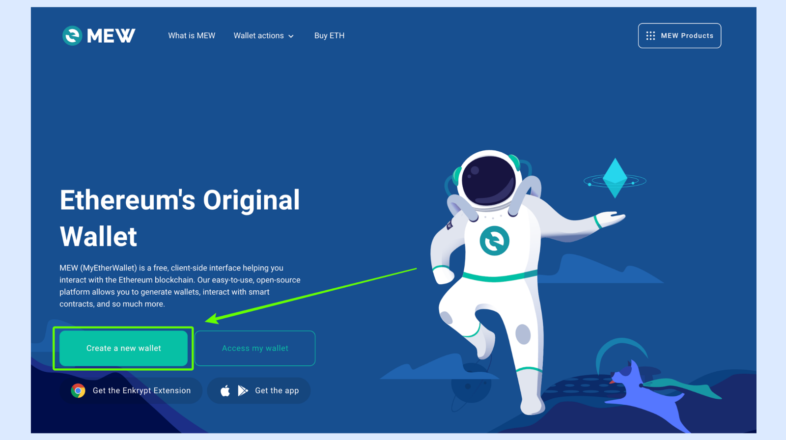
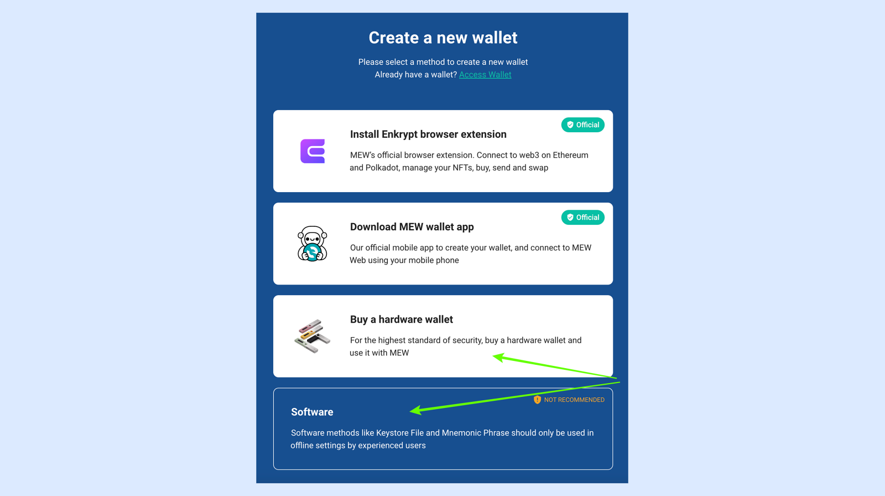
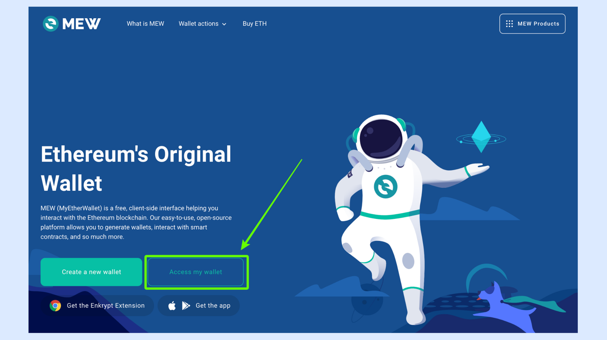
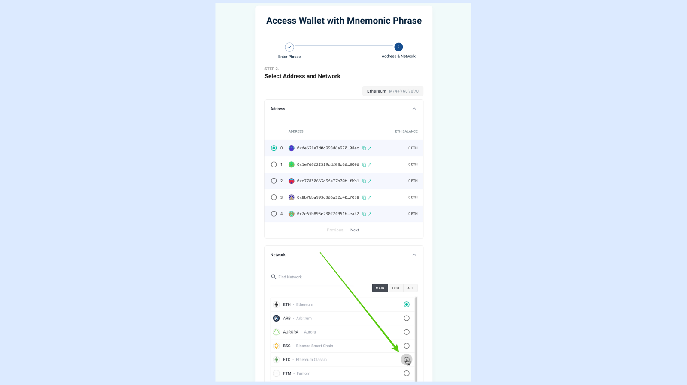
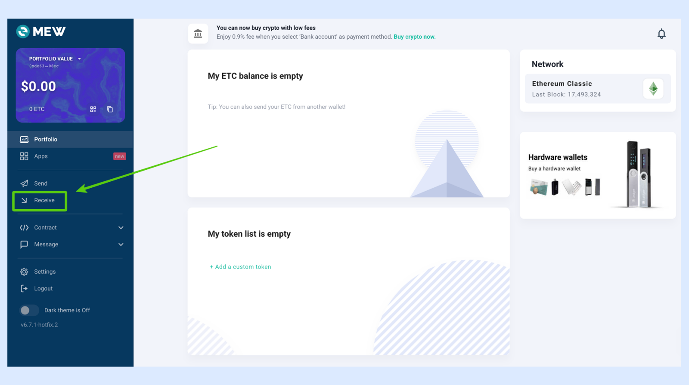
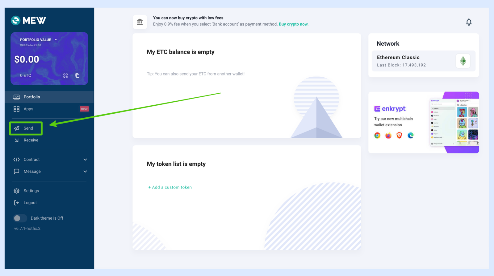
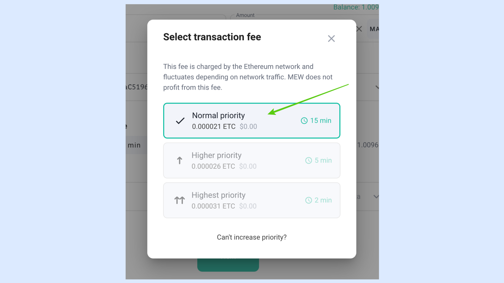
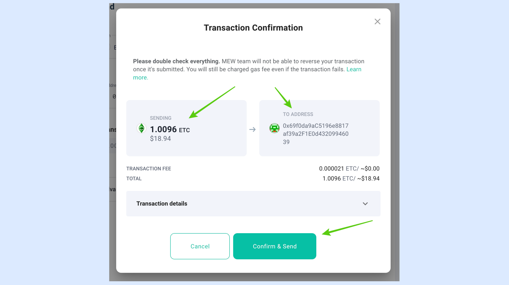
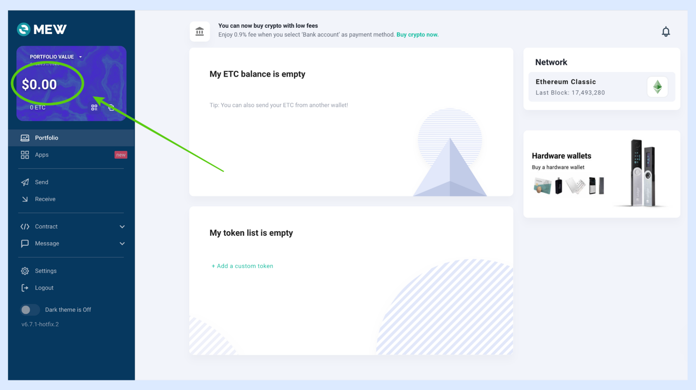
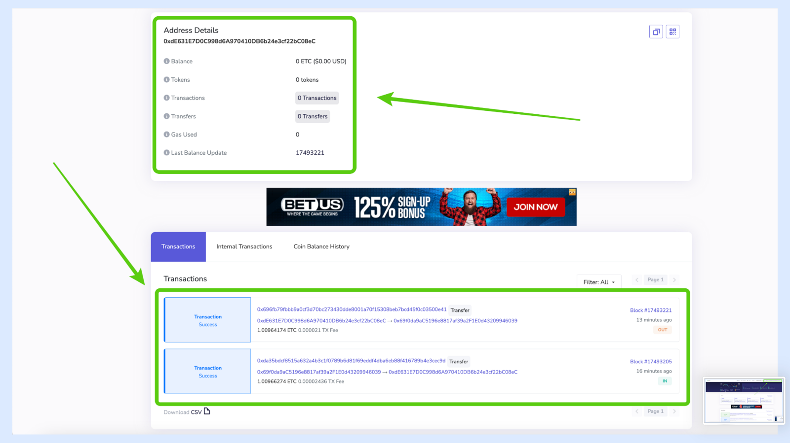

---
**您可以由此收听或观看本期视频:**

<iframe width="560" height="315" src="https://www.youtube.com/embed/Uv0oOHj23Gs" title="YouTube video player" frameborder="0" allow="accelerometer; autoplay; clipboard-write; encrypted-media; gyroscope; picture-in-picture; web-share" allowfullscreen></iframe>

---

MyEtherWallet（MEW）是一种特殊类型的钱包应用程序，因为它提供多种服务，甚至可以连接到其他钱包。在2015年以太坊区块链推出时，它是最早的以太坊钱包。

它最初的设计和成功之处在于，它允许用户生成和保留他们的私钥，同时仅使用网站来创建和发送交易。

现在MEW有几个产品，包括移动应用和浏览器扩展，但在本指南中，我们将解释如何使用Web应用程序。

我们将解释如何将MEW连接到以太经典（ETC）网络，创建和连接钱包，查看钱包地址并显示私钥，检查余额和交易，以及向其他地址发送和接收ETC。

## 1.在MyEtherWallet中创建ETC地址

在MyEtherWallet上，您可以连接现有钱包，例如浏览器扩展、移动钱包和硬件钱包，或者可以从头开始创建新的ETC地址。

要创建一个新地址，请点击“创建新钱包”按钮。

在下一个界面上，MEW会显示您可以创建新的ETC地址的所有方式。前两个选项是他们的产品Enkrypt，类似于MetaMask的浏览器扩展，以及他们的移动应用程序。我们在这里关注使用硬件钱包或使用助记词短语创建ETC地址的选项。

对于硬件钱包，您实际上是直接在硬件钱包上创建新的ETC地址，因此我们将不在此处介绍该过程。

在这个例子中，我们将继续创建一个新的助记词短语，然后从那里创建一个ETC地址。

在下一个页面上，MEW将向您显示两个选项，但我们不会使用Keystore JSON文件，因为那是一种较旧的创建地址的形式。如今，管理非托管钱包最常用的格式是使用12个或24个单词的秘密密码短语。

我们将点击“助记词短语”，然后将MEW提供的12个单词抄写在纸上。

免责声明：MEW正确地建议不要在助记词短语或Keystore文件上使用其Web应用程序，因为网络服务可能会被黑客拦截。我们只是按照这个过程来展示MEW的一般工作方式。您可以连接其他类型的钱包。生成助记词短语的最佳方法是使用手机或计算机上的应用程序或使用硬件钱包，而不是在Web或开放的互联网上进行。

## 2. 在MyEtherWallet上链接ETC钱包

现在，在上一步中我们复制了这12个单词，我们需要返回到主页，然后点击“访问我的钱包”按钮。

这将带我们进入访问各种类型钱包的选项。

在下一个界面上，MEW将向您展示所有可以连接到您的ETC地址的钱包类型。

前两个选项是他们的产品Enkrypt和移动应用程序。然后他们显示了使用浏览器扩展（如MetaMask）的可能性，接下来是移动应用、硬件钱包，最后是Keystore文件或助记词短语。

您可以使用您希望使用的选项，但在这个例子中，我们将使用助记词短语选项。

当您点击“软件”钱包时，在下一个界面上，您将看到MEW在不使用硬件钱包、钱包应用程序或扩展时检查地址的三个常规选项。

对于这个例子，我们将点击“助记词短语”。

在下一个界面上，我们将输入创建ETC新钱包时生成的12个单词。

然后，我们将点击“下一步”。

**重要提示：请勿在此示例中使用这12个单词的助记词短语。助记词短语必须保密，并且每个用户必须拥有自己的秘密密码短语。此示例中的助记词短语只是用于本指南的虚拟示例。
**

在下一个界面上，我们将看到为以太坊创建的许多地址（因为它是MEW上的默认区块链），但这些地址与ETC完全兼容，所以我们只需要选择一个即可。

然而，我们必须告诉MEW我们希望访问以太经典区块链，这将在下一步进行。

如果您在同一页上向下滚动，您会看到地址下面有一个名为“网络”的下拉菜单。点击它。

当您点击并显示下拉菜单时，您会看到许多网络，其中ETC是其中之一。点击ETC，使MEW切换到该区块链的网络。

在下一个界面上，MEW将带您进入您的新ETC钱包！

## 3. 在MyEtherWallet上选择以太经典区块链

如果您连接了任何类型的钱包，并且忘记将网络从以太坊切换到以太经典，您仍然可以在主地址页面上进行更改。

在图像中，您将看到与之前相同的地址位于以太坊网络上。

点击上面标有“以太坊”的框，屏幕上将弹出一个菜单。

在打开的菜单框中，选择ETC，MEW将自动更改网络。

## 4. 使用纸钱包显示地址和私钥

为了查看您的完整地址和私钥，MEW提供了一个功能，可以生成一个包含两个密钥的纸钱包，您可以打印出来。

要生成您的纸钱包，请转到屏幕左上角的卡片，并点击下拉菜单。

在菜单中选择“查看纸钱包”。

在下一步中，屏幕上将显示一个纸钱包。

上面的信息是ETC的公共地址，下方是与该地址对应的私钥。

这两个密钥是由您的12个单词的秘密密码短语生成的，使用该技术可以生成许多更多的密钥。

纸钱包上还有地址和私钥的二维码。

如果您打印它，请确保将其放在一个安全的地方。

## 5. 接收ETC

要在MEW上正在浏览的地址上接收ETC，请转到主地址页面，并点击左侧菜单中的“接收”按钮。

在下一步中，屏幕上将出现一个弹出框，显示您的地址和一个二维码，可以发送给他人或展示给他人扫描。

复制地址并提供给他人，以便他们可以向您发送ETC。

## 6. 发送ETC

要发送ETC，请再次转到地址主页，并点击左侧菜单中的“发送”按钮。

在下一个界面上，输入金额和收件人地址。

然后点击交易费用菜单。

在下一个界面上，MEW允许您从三个选项中选择费用级别：普通、较高优先级或最高优先级。

在这个例子中，我们将选择普通，并点击它。

一旦您选择了费用级别，弹出框将关闭，然后您可以点击“下一步”。

在下一步中，MEW将显示另一个弹出框，其中包含交易的数据，以供您验证。

如果一切正常，您可以继续点击“确认并发送”。

发送交易后，在地址主页的右上方，您将看到一个带有通知符号的铃铛。

如果您点击它，将显示一个带有交易状态的框。

## 7. 检查余额和交易记录

MEW有一个功能可以显示您的ETC地址余额，但它不支持任何区块链的交易历史记录。

这有点奇怪，但如果您检查左上角的卡片，您将看到最新的余额。在这个例子中，余额为零，因为我们刚刚在上一步中发送了全部余额。

在该卡片中，点击复制图标将地址复制到剪贴板。

要查看您的交易历史记录，您可以访问Blockscout，这是ETC最流行的区块浏览器。

链接是: https://blockscout.com/etc/mainnet/

一旦进入Blockscout，将从MEW复制的地址粘贴到页面右上方的字段中，然后按回车键。

在Blockscout的下一个屏幕上，您将看到地址余额和下方的交易记录。

在本例中，我们可以看到我为本指南执行的两笔交易。

---

**感谢您阅读本期文章!**

了解更多有关MyEtherWallet，请访问: https://myetherwallet.com 

了解更多有关ETC，请访问: https://ethereumclassic.org
