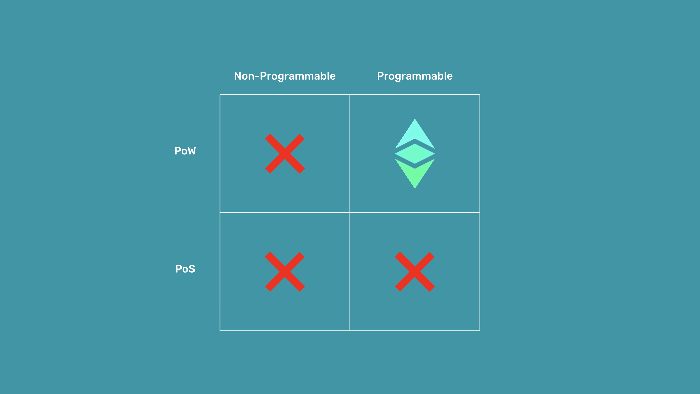

---
**You can listen to or watch this video here:**

<iframe width="560" height="315" src="https://www.youtube.com/embed/WhsWlFqEG3c" title="YouTube video player" frameborder="0" allow="accelerometer; autoplay; clipboard-write; encrypted-media; gyroscope; picture-in-picture; web-share" allowfullscreen></iframe>

---

## What Is Trust Minimization?

Trust is the belief that someone or something will be true, benevolent, and have our best interests at heart. However, it is good wisdom to understand that usually the best persons to have our best interests are ourselves. This applies to individuals, families, friends, communities, and nations. 

One of the premises of Cypherpunks, the group who worked for decades on the technologies that eventually led to the creation of Bitcoin, is that wherever trust is deposited, that trust will always be abused.

This is why the whole point of blockchain technology is to minimize trust in third parties. Third parties may be banks, governments, corporations, or tech companies. Because, in the course of human action, nearly every interaction is mediated by these trusted third parties, and they have systematically abused their trusted positions, then it has become imperative to reduce their role and influence. 

Trust minimization is the dilution of trust in these third parties by transferring and distributing their roles to decentralized technologies such as blockchains.

## Why Is Trust Minimization Necessary?

Trusted third parties, such as banks, governments, corporations, or tech companies, are security holes because they hold our money, wealth, property records, and personal data, manage everything on centralized servers, and they can be hacked or they can commit outright fraud.

Trust minimization technologies have existed for millennia. Ever since humans started to divide government, establishing voting systems, courts, and legislatures, they have been attempting to separate responsibilities in different persons or entities to minimize the possibility of arbitrary abuse.

Trust minimization is necessary because the more uncertainty and cost, both monetary and bureaucratic, of the role of trusted third parties, the less human activity may flourish.

## What Are Autonomous Agents?

Autonomous agents are software programs that may autonomously executed their code when individuals and businesses send them transactions.

A famous example given by Nick Szabo, the father of smart contracts, the technology that enables autonomous agents, was the vending machine. When someone goes to a vending machine, they have to put a specific amount of money into it, and when the machine confirms that it received the payment then it gives a soda or a snack to the purchaser.

The vending machine is not operated by humans and responds only to strictly objectives rules. It is also protected by a hard box that would be very costly to break relative to the value that any burglar would get from it. This is why they may be installed in many places and they may act autonomously and objectively to provide a service.

Software autonomous agents have the promise that they may be much more complex than vending machines and may replace the need of trusted third parties in many of our interactions in the course of business, social relationships, and human action in general.

## How Can Autonomous Agents Be in Ethereum Classic?

The solution to the problem of trust that blockchains such as Ethereum Classic (ETC) bring to the world is an extreme form of distributed computing that is practically impossible to manipulate by third parties.

Autonomous agents could not be fully trusted before ETC, even if they were software programs that contained objective rules, because they would run on government or corporate servers so trusted third parties would still have total control over them.

Ethereum Classic solves this because it is a decentralized blockchain system were developers may deploy smart contracts and these programs get immediately replicated among all participating machines in the network. 

This means that there is no trusted third party controlling these autonomous agents anymore.

## Why Are Autonomous Agents in ETC Truly Trust Minimized?

The level of general computing decentralization that ETC has achieved had never been possible in computer science, but now is possible in Ethereum Classic because it is a fully replicated, proof of work blockchain, has a fixed and algorithmic monetary policy, and is programmable.

Fully replicated, proof of work blockchain: Full replication is the distribution of the database of the system in all participating nodes. This means that all accounts, balances, and decentralized programs inside ETC are copied everywhere making it extremely difficult to tamper with them. Proof of work allows this replication by providing a reliable signaling system that all nodes in the network may follow to be in lockstep with each other in the same exact state of the database every 13 seconds.

Fixed and algorithmic monetary policy: As the miners that perform the proof of work get paid in the currency of the system, and the money in itself is sound, then they are incentivized to participante to earn ETC. The soundness of ETC is rooted in that it has a capped supply, a limited issuance rate, and that these rules are nearly impossible to manipulate by any third party.

Programmable: The programmability of ETC is what enables it to host software programs that may perfectly act as autonomous agents, thus replacing trusted third parties in the mediation of human action.

---

**Thank you for reading this article!**

To learn more about ETC please go to: https://ethereumclassic.org
