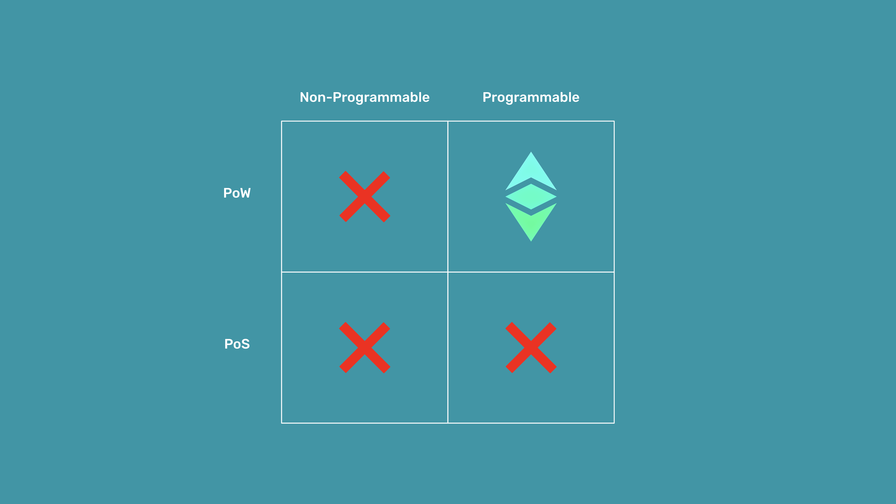

---
**您可以由此收听或观看本期内容:**

<iframe width="560" height="315" src="https://www.youtube.com/embed/WhsWlFqEG3c" title="YouTube video player" frameborder="0" allow="accelerometer; autoplay; clipboard-write; encrypted-media; gyroscope; picture-in-picture; web-share" allowfullscreen></iframe>

---

## 什么是信任最小化？

信任是对某人或某事物真实、善意和关心我们最佳利益的信念。然而，有明智的看法是 - 通常对我们带来利益最多的人往往是我们自己。这适用于个人、家庭、朋友、社区和国家。

密码朋克（Cypherpunks）是一个为了几十年的时间致力于最终导致比特币创建的技术的团体。他们的一个前提是，无论信任被寄托在哪里，这种信任总是会被滥用。

这就是为什么区块链技术的整个目的是最小化对第三方的信任。第三方可以是银行、政府、公司或科技公司。因为在人类行动过程中，几乎每一次互动都是通过这些受信任的第三方进行的，并且它们系统地滥用了它们的受信任地位，因此减少它们的角色和影响已经变得迫在眉睫。

信任最小化是通过将它们的角色转移和分散到诸如区块链等分散化技术中，从而减少对这些第三方的信任。

## 为什么信任最小化是必要的？

银行、政府、公司或科技公司等受信任的第三方是安全漏洞，因为它们持有我们的资金、财富、财产记录和个人数据，管理着集中式服务器上的一切，并且它们可能会被黑客攻击或者实施公然欺诈行为。

信任最小化技术已存在了几千年。自从人类开始分割政府、建立投票系统、法院和立法机构以来，人们一直试图将不同的责任分离给不同的人或实体，以最小化滥用的可能性。

信任最小化是必要的，因为对于受信任的第三方的角色，不确定性和成本（包括货币和官僚成本）越大，人类活动的发展空间就越小。

## 什么是自治代理？

自治代理是软件程序，当个人和企业向它们发送交易时，它们可以自主执行其代码。

尼克·萨博（Nick Szabo）是智能合约的创始人，智能合约是使自治代理成为可能的技术。他举了一个著名的例子，就是自动售货机。当有人去自动售货机时，他们必须投入一定金额的钱，当机器确认收到付款后，它会将饮料或零食提供给购买者。

自动售货机不由人类操作，只响应严格的客观规则。它还受到一个坚固的箱子的保护，相对于任何盗贼能够从中获得的价值来说，破坏它将非常昂贵。这就是为什么它们可以安装在许多地方，可以自主客观地提供服务。

软件自治代理有一个承诺，即它们可以比自动售货机更复杂，并且可以在商业、社交关系和人类行动的许多互动中取代对受信任的第三方的需求。

## 自主代理如何存在于以太坊经典（ETC）中？

像以太坊经典（ETC）这样的区块链解决方案为世界带来的信任问题是一种极端形式的分布式计算，几乎不可能被第三方操纵。

在ETC之前，即使是包含客观规则的软件程序也无法完全信任，因为它们在政府或企业服务器上运行，因此仍然由受信任的第三方完全控制。

以太坊经典通过成为一个去中心化的区块链系统来解决这个问题，开发者可以部署智能合约，并且这些程序会立即在网络中的所有参与机器之间进行复制。

这意味着不再有受信任的第三方控制这些自主代理。

## 为什么ETC中的自主代理真正实现了信任最小化？

ETC实现的计算分散化水平在计算机科学中以前是不可能的，但现在在以太经典中变成了可能，因为它是一个完全复制的工作量证明的区块链，具有固定且算法化的货币政策，并且可编程。

完全复制的工作量证明区块链：完全复制是将系统的数据库分发到所有参与的节点。这意味着ETC中的所有账户、余额和去中心化程序都在各处进行了复制，使得对其进行篡改变得极其困难。工作量证明通过提供可靠的信号系统，使得网络中的所有节点可以按照相同的数据库状态每13秒进行同步。

固定和算法化的货币政策：由于执行工作量证明的矿工会以系统的货币支付报酬，并且货币本身是稳定的，他们有动力参与并获得ETC。ETC的稳定性根源于其有限的供应量、有限的发行速度以及这些规则几乎不可能被任何第三方操纵。

可编程性：ETC的可编程性使其能够托管可完美充当自主代理的软件程序，从而取代了在人类行为中的信任第三方的中介作用。

---

**感谢您阅读本期文章!**

了解更多有关ETC，请访问: https://ethereumclassic.org
