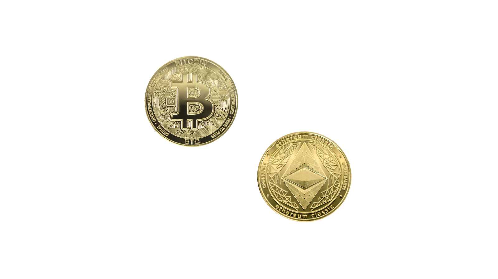

---
**You can listen to or watch this video here:**

<iframe width="560" height="315" src="https://www.youtube.com/embed/BJrSEcP1ccg" title="YouTube video player" frameborder="0" allow="accelerometer; autoplay; clipboard-write; encrypted-media; gyroscope; picture-in-picture; web-share" allowfullscreen></iframe>

---

In this segment of the Ethereum Classic (ETC) Course we will enter a study of the industry and its different segments and categories.

One way of classifying blockchains is by describing the use cases of their coins. In this class 23 we will explain what are the native cryptocurrencies, the original invention of the industry, and in the next seven classes will explain the other types as follows:

- Class 24: What Are Programmable Native Cryptocurrencies?
- Class 25: What Are ERC-20 Tokens?
- Class 26: What Are Convertible Stablecoins?
- Class 27: What Are Algorithmic Stablecoins?
- Class 28: What Are Privacy Coins?
- Class 29: What Are Decentralized Finance (DeFi) Coins?
- Class 30: What Are File Storage Coins?

## What Are Fiat Currencies and How Do they Gain Economic Value? 

The first forms of money were valuable personal decor and commodities such as rare sea shells, ostrich egg shells, beads, salt, black pepper, copper, silver, and gold.

The first attempt at state money was for kings and empires to mint coins using gold, silver, and copper to standardize their use with a credible stamp from the monarchic power.

The final stage of creation of money by decree, also known as fiat money, with no valuable substance or object to back it, was the official delinking of money from gold in 1971 by the US government where the fiat currency format became the norm globally.

The key to the economic value of fiat currencies since then has been that they are imposed by law as exclusive legal tender to cancel loans and pay taxes, and that the state promises not to print too much of them.

## What Are Blockchains?

However, because governments have generally not kept their promise, one of the main goals of Satoshi Nakamoto when creating Bitcoin (BTC) was to separate money from the state because of its long string of abuses.

For this he invented Bitcoin which is a peer to peer network of nodes which all hold the same exact copy of a ledger with accounts and balances. Users of the network may send transactions to move money from one account to another. When these transactions are sent to nodes they retransmit them to the rest of the network so they can be fully replicated. Then, a subgroup of the nodes do what is called proof of work mining to include those transactions into blocks, which are then sent to the rest of the network for inclusion in a chain of blocks stored in the system. Hence, the term “blockchain”.

The question is, why would many people all over the world put their computers to work in a peer-to-peer network on a ledger with a made up private coin?

## What Are Native Cryptocurrencies and How Do they Gain Economic Value?

The answer by Satoshi Nakamoto was to make sure that the Bitcoin cryptocurrency would be sound money by making it algorithmic, thus not managed by humans, with a capped supply, and a fair distribution by issuing it to miners to pay them for their work.

Both Bitcoin and Ethereum Classic work exactly the same way and they are called native cryptocurrencies because they are the money of the networks by protocol, issued exclusively to pay block rewards to miners, and for users to pay fees so that miners may include their transactions inside the blocks.

Similar to fiat currencies, BTC and ETC gain economic value because, by default, they have a use case from inception, which is to pay for the work that miners do and for transactions to be included.

## Why Are Proof of Work Cryptocurrencies Digital Gold?

Proof of work cryptocurrencies are digital gold because they mimic the production of gold in the real world.

Gold is very costly to produce by gold miners and this is why it is scarce and has a high value per unit. 

Similarly, proof of work coins such as BTC and ETC require miners to do enormous amounts of work, spending enormous amounts of electricity, to build blocks, and only then they issue coins to them. This means that BTC and ETC are also very costly to create, thus scarce and valuable per unit.

In contrast, proof of stake and proof of authority coins are also native cryptocurrencies, but do not have this quality of digital gold because their creation is cheap, trivial, and manipulable by humans, just like fiat currencies.

---

**Thank you for reading this article!**

To learn more about ETC please go to: https://ethereumclassic.org
