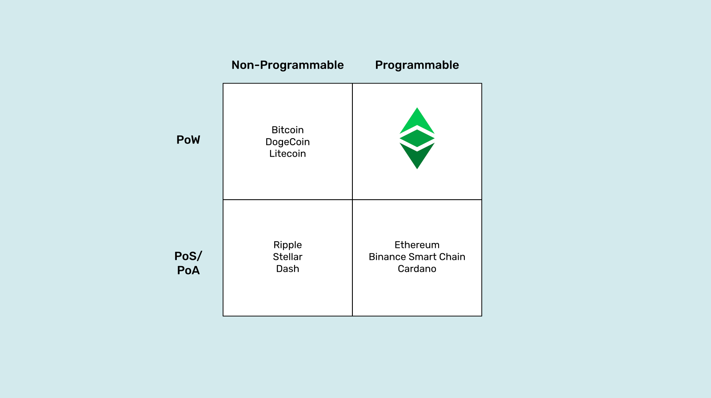
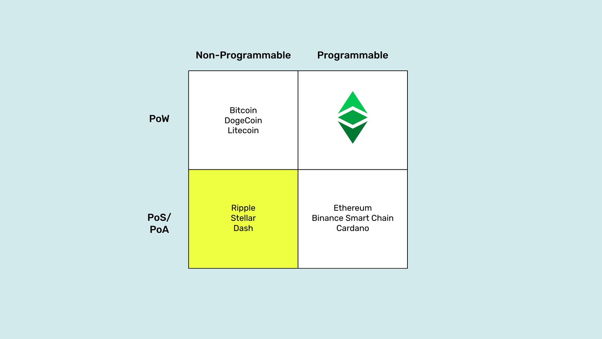
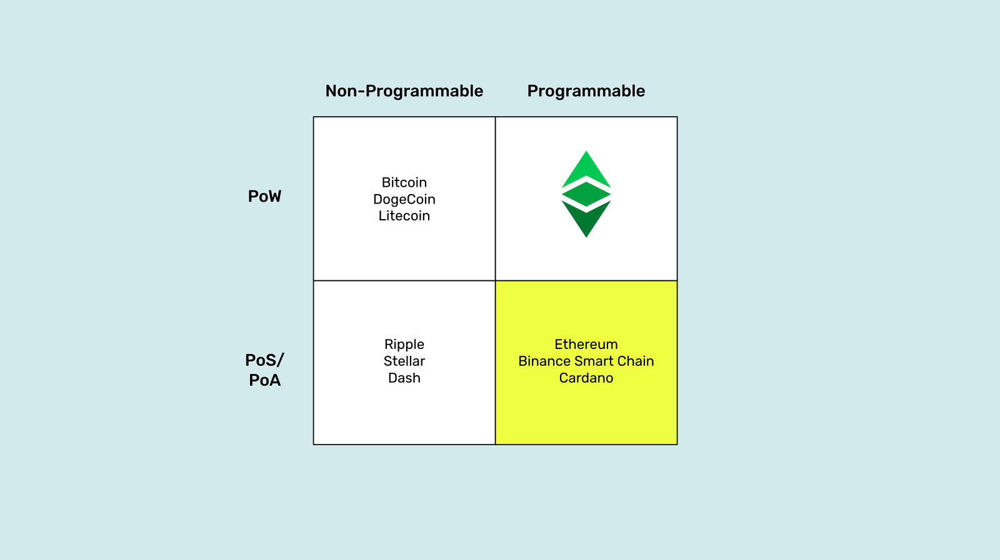
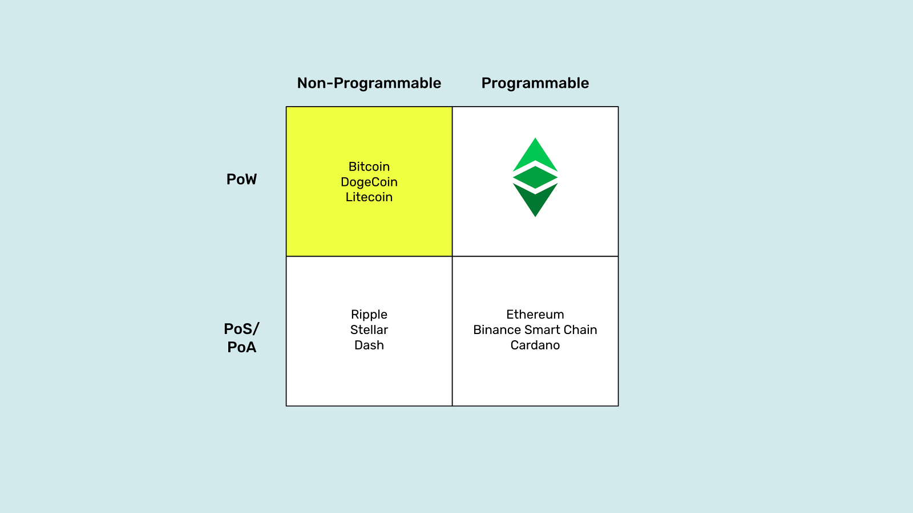
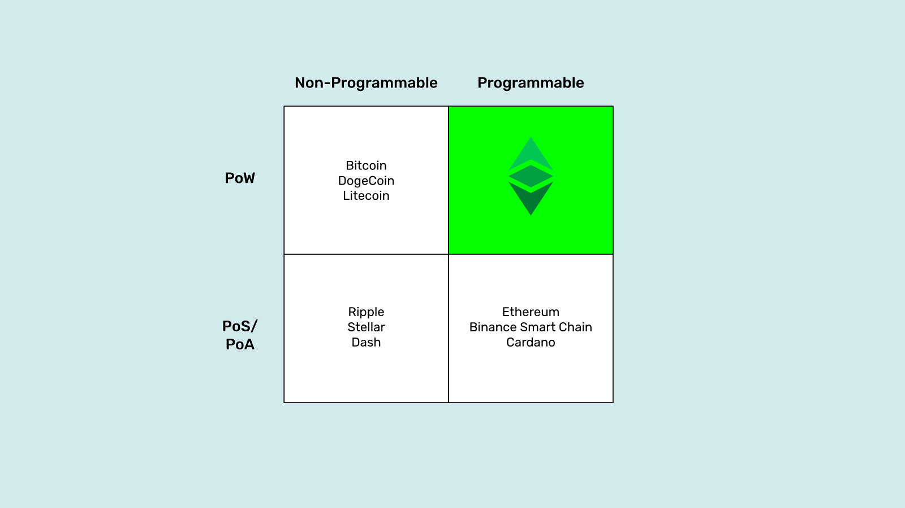

---
**You can listen to or watch this video here:**

<iframe width="560" height="315" src="https://www.youtube.com/embed/QkIDeNLZ3ic" title="YouTube video player" frameborder="0" allow="accelerometer; autoplay; clipboard-write; encrypted-media; gyroscope; picture-in-picture; web-share" allowfullscreen></iframe>

---

In [part I](https://deploy-preview-1210--ethereumclassic.netlify.app/blog/2023-05-24-why-programmability-makes-ethereum-classic-more-trust-minimized-part-I) of this two part series we explained why Ethereum Classic (ETC) can host truly trust minimized autonomous agents inside its secure environment.

The reasons we gave were three: 

**ETC is a fully replicated, proof of work blockchain:** Full replication is the distribution of the database of the system in all participating nodes. This means that all accounts, balances, and decentralized programs inside ETC are copied everywhere making it extremely difficult to tamper with them. Proof of work allows this replication by providing a reliable signaling system that all nodes in the network may follow to be in lockstep with each other in the same exact state of the database every 13 seconds.

**ETC has a fixed and algorithmic monetary policy:** As the miners that perform the proof of work get paid in the currency of the system, and the money in itself is sound, then they are incentivized to participante to earn ETC. The soundness of ETC is rooted in that it has a capped supply, a limited issuance rate, and that these rules are nearly impossible to manipulate by any third party.

**Smart contracts on ETC make it programmable:** The programmability of ETC is what enables it to host software programs that may perfectly act as autonomous agents, thus replacing trusted third parties in the mediation of human action inside the secure environment of the blockchain.

In this post we will describe the different quadrants in the diagram above and explain why the combination of proof of work plus programmability is the most trust minimized model for a blockchain.

## Proof of Stake, Non-Programmable Networks 

Note that I called the systems in this quadrant “networks” and not “blockchains”. This is because a blockchain is a system where miners group transactions into blocks of data, stamp them with a hash that cost them enormous amounts of work, energy, and money, and then send them to the rest of the network for verification and inclusion in the chain of blocks, or blockchain. Any system that doesn’t do this is not a blockchain, it is just a traditional system with very low security disguised as a blockchain.

For the same reason, that they do not use proof of work as their consensus mechanism, proof of stake or proof of authority networks, are wholly inadequate and insecure for holding accounts with balances of money, let alone running software agents that purport to disintermediate banks and other trusted third parties.

Indeed, networks like Ripple and Stellar, both proof of authority networks which is very similar to proof of stake, are controlled and managed by corporations or foundations and the node operators are financial institutions themselves, thus they comply with all national and banking regulations wherever they operate. This makes them fully trusted and vulnerable technologies, just like traditional systems. 

Dash, is a combined proof of work and proof of stake network, but as any other thing, its security is as good as its weakest link. Therefore, it is as insecure as any proof of stake system. On top of that, as a sign of how manipulable these systems may be, Dash has a built-in treasury where developers suck money from the system, a source of potential corruption and centralization, and a voting system called “governance” that enables “rule by the majority” which is totally contrary to blockchain security design.

## Proof of Stake and Programmable Networks 

Note that I refer to these systems as “networks” and not “blockchains” like in the previous section. They have the same problems, proof of stake is a traditional centralized system disguised as a blockchain. 

They are extremely complex technologies that even their creators find it difficult to understand because they have so many parts and tens of thousands of lines of code.

The fact that proof of stake networks may be programmable does not make them any better. These systems have the same flaw as traditional technologies: It doesn’t matter how well designed the autonomous agents (dapps) may be in them, and how objective and fair their protocols may be, they are still controlled by few participants that dominate the networks in which they are hosted, usually a foundation or corporation that sponsors the system, a few developers, and the large staking pools.

The above means that in networks such as Ethereum, Binance Smart Chain, and Cardano, you may have what they call “decentralized exchanges”, “NFT markets”, “Decentralized Autonomous Organizations”, property registries, lending dapps, insurance dapps, or whatever “DeFi” more, but they are all still under the constant threat of intervention and control by special interests.

## Proof of Work, Non-Programmable Blockchains 

Proof of work is indeed the truly secure consensus mechanism that enables any computer in the world join and leave the system without the possibility of censorship or prohibitions of any kind. This is proved by China that at the time of this writing still prohibits cryptocurrencies and mining in the mainland, but 22% of Bitcoin mining is still performed in that country! This is how secure and permissionless this paradigm is.

The problem is that if a blockchain is proof of work but not programmable, then it is extremely secure with regards to the accounts and balances that it holds inside its secure environment, but anything that is outside must necessarily be less secure.

For example, on Bitcoin, DogeCoin, and Litecoin we may have our accounts and balances, but if we want to use them with autonomous agents and dapps, then those must exist outside the highly secure environments of the blockchains.

This is the case with Wrapped BTC. It is used with dapps inside Ethereum, an insecure proof of stake system, and on top of that if anyone wishes to redeem their BTC, the actual coins are in another network, Bitcoin, held in trust by traditional trusted third parties!

Any connections between networks must be insecure. The only secure system that guarantees decentralization is proof of work, and that only works inside the peer-to-peer connections within a system.

An even worse situation would be if the “autonomous agents” are hosted in corporate cloud services.

## Proof of Work and Programmable Blockchains 

So, all that was explained above leaves us with the last option, and indeed this option is the sweet spot of security and autonomy of software agents.

Proof of work and programmable blockchains are the most trust minimized systems in the whole blockchain industry because not only the accounts and balances are inside the secure environment of the blockchain but also the autonomous agents are hosted in it.

This combination avoids the need to jump from the blockchain to corporate cloud services and back to get the services of apps, avoids the need to do complex and insecure cross-chain connections, and avoids the use of dapps in external insecure networks such as Ethereum, Binance Smart Chain, Cardano, and others.

In Ethereum Classic, not only the digital gold is hosted, but also the fully trust minimized autonomous agents, therefore the maximum level of trust minimization is achieved for users and businesses on a global scale.

ETC has the incredibly valuable position of being the largest proof of work, fixed monetary policy, programmable blockchain in the world, therefore it is poised for a large and dominant market share in the future.

---

**Thank you for reading this article!**

To learn more about ETC please go to: https://ethereumclassic.org
