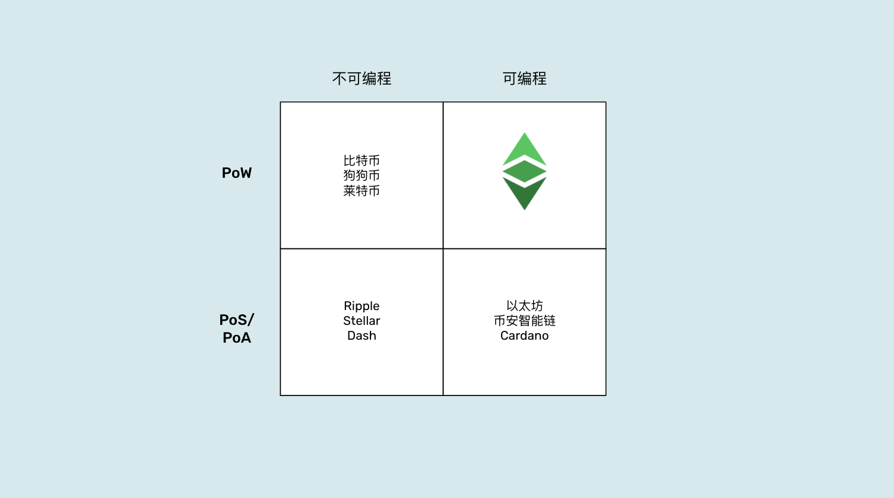
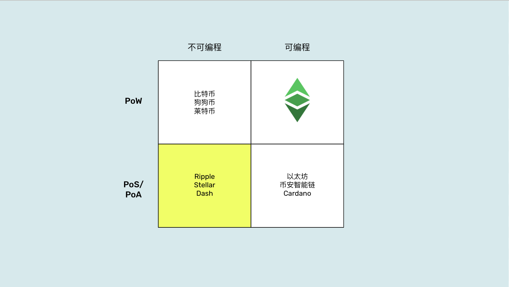
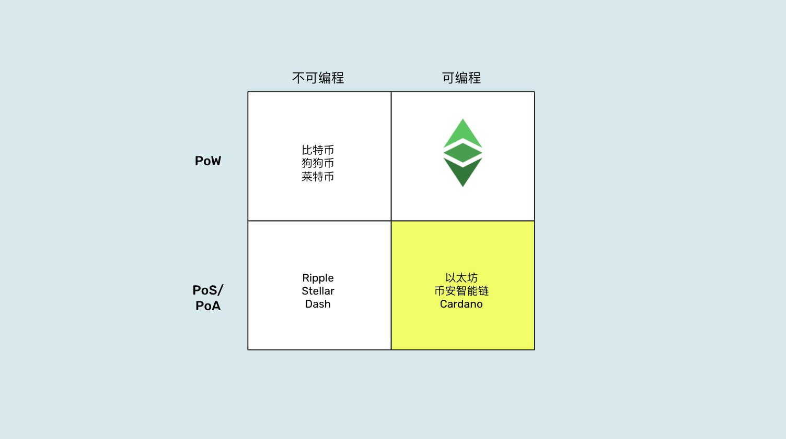
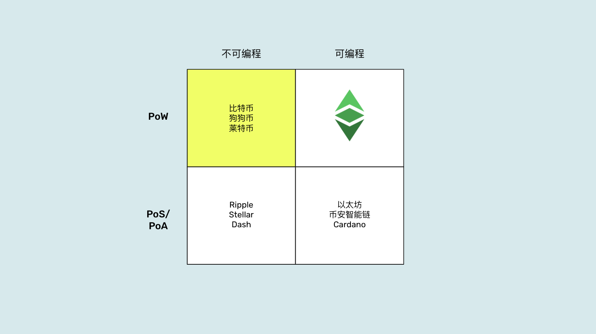
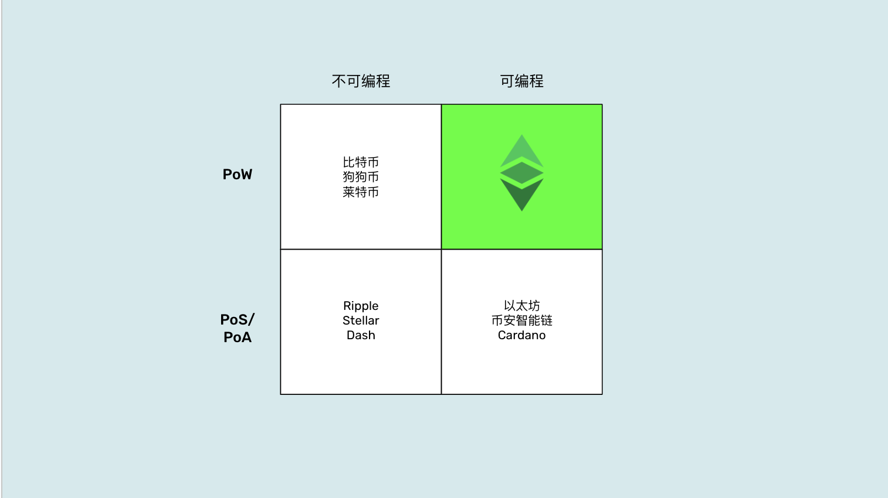

---
**您可以由此收听或观看本期内容:**

<iframe width="560" height="315" src="https://www.youtube.com/embed/QkIDeNLZ3ic" title="YouTube video player" frameborder="0" allow="accelerometer; autoplay; clipboard-write; encrypted-media; gyroscope; picture-in-picture; web-share" allowfullscreen></iframe>

---

在[第一部分中](https://deploy-preview-1210--ethereumclassic.netlify.app/blog/2023-05-24-why-programmability-makes-ethereum-classic-more-trust-minimized-part-I)，我们解释了为什么以太经典（ETC）可以在其安全环境中托管真正信任最小化的自治代理。

我们给出的原因有三个：

**ETC是一个完全复制的工作量证明区块链:**  全部复制是将系统的数据库在所有参与节点中分发。这意味着ETC内部的所有账户、余额和分布式程序都被复制到每个地方，使得篡改它们变得极为困难。工作量证明通过提供可靠的信号系统，使得网络中的所有节点可以在每13秒钟保持同步，处于完全相同的数据库状态。

**ETC具有固定和算法性的货币政策:** 由于执行工作量证明的矿工会以系统的货币支付报酬，而货币本身是可靠的，因此他们有动力参与并赚取ETC。ETC的可靠性源于其有限的供应量、有限的发行速度，以及这些规则几乎不可能被任何第三方操控。

**ETC上的智能合约使其具有可编程性:** ETC的可编程性使其能够托管可以完美充当自治代理的软件程序，从而在区块链的安全环境中取代了信任的第三方，用于人类行为的调解。

在本文中，我们将描述上图中的不同象限，并解释为什么工作量证明加上可编程性的组合是区块链中最信任最小化的模型。

## 权益证明、不可编程网络

请注意，我称这个象限中的系统为“网络”，而不是“区块链”。这是因为区块链是一个将交易分组为数据块、用大量的工作、能源和资金为其盖章的哈希，并将其发送给网络的其余部分进行验证和包含在块链中的系统。任何不执行这一过程的系统都不是区块链，而只是一个低安全性的传统系统，伪装成区块链。

出于相同的原因，不使用工作量证明作为共识机制的权益证明或授权证明网络，对于持有具有资金余额的账户，更不用说运行自称能够绕过银行和其他信任第三方的软件代理的系统，它们是完全不足和不安全的。

实际上，Ripple和Stellar等网络都是授权证明网络，非常类似于权益证明，它们由公司或基金会控制和管理，节点运营者本身就是金融机构，因此无论它们在哪里运作，都要遵守所有国家和银行的监管规定。这使它们成为完全可信且易受攻击的技术，就像传统系统一样。

Dash是一种结合了工作量证明和权益证明的网络，但与其他任何事物一样，它的安全性取决于它最薄弱的环节。因此，它与任何权益证明系统一样不安全。此外，作为这些系统可操纵性的一个迹象，Dash内置了一个从系统中吸取资金的财政部门，这是潜在腐败和中心化的来源，还有一个名为“治理”的投票系统，实现了“多数统治”，这完全违背了区块链安全设计的原则。

## 权益证明和可编程网络

请注意，我将这些系统称为“网络”，而不像前面一节中称之为“区块链”。它们具有相同的问题，权益证明是一个伪装成区块链的传统中心化系统。

它们是非常复杂的技术，即使是它们的创建者也很难理解，因为它们有很多部分和成千上万行的代码。

权益证明网络可能是可编程的，但这并不使它们变得更好。这些系统和传统技术有着相同的缺陷：无论这些自主代理（dapp）在设计上有多好，它们的协议有多客观和公正，它们仍然受到少数主导网络的参与者的控制，通常是一个支持该系统的基金会或公司、少数开发者和大型权益池。

上述意味着在像以太坊、币安智能链和卡尔达诺这样的网络中，你可能拥有所谓的“去中心化交易所”、“NFT市场”、“去中心化自治组织”、财产注册、借贷dapp、保险dapp或任何“去中心化金融”等等，但它们仍然面临着特殊利益干预和控制的不断威胁。

## 工作量证明, 不可编程区块链

工作量证明确实是一种真正安全的共识机制，它使得世界上的任何计算机都可以加入和离开系统，而没有任何形式的审查或禁止。这一点可以通过中国来证明，在本文撰写时，中国仍禁止加密货币和在境内进行挖矿，但中国仍承担着22%的比特币挖矿量！这就是这种范式的安全性和无需权限性。

问题在于，如果一个区块链是工作量证明的，但不可编程，那么它在持有账户和余额方面是极其安全的，但对于在其安全环境之外的任何事物，必然会较不安全。

例如，在比特币、狗狗币和莱特币上，我们可以拥有自己的账户和余额，但如果我们想与自主代理和dapp一起使用它们，那么这些必须存在于区块链的高度安全环境之外。

这就是包装的比特币（Wrapped BTC）的情况。它在以太坊这个不安全的权益证明系统中与dapp一起使用，而且如果任何人希望赎回他们的比特币，实际的比特币仍在另一个网络中（比特币网络），由传统可信赖的第三方机构托管！

网络之间的任何连接都必然是不安全的。唯一能保证去中心化的安全系统就是工作量证明，而且它只在系统内的点对点连接中有效。

更糟糕的情况是，“自主代理”被托管在企业云服务中。

## 工作量证明和可编程区块链

因此，以上所述的一切都留给我们最后的选择，而且实际上这个选择是软件代理的安全性和自治性的最佳平衡点。

工作量证明和可编程区块链是整个区块链行业中最大程度上减少信任的系统，因为不仅账户和余额位于区块链的安全环境内，自主代理也托管在其中。

这种组合避免了从区块链跳转到企业云服务再返回以获取应用程序的服务的需求，避免了进行复杂且不安全的跨链连接，并避免了在以太坊、币安智能链、Cardano等外部不安全网络中使用dapp的需求。

在以太经典中，托管的不仅是数字黄金，还有完全减少信任的自主代理，因此在全球范围内为用户和企业实现了最大程度的信任减少。

ETC在全球范围内拥有工作量证明、固定货币政策和可编程区块链这一非常有价值的地位，因此它在未来有望占据巨大且主导性的市场份额。

---

**感谢您阅读本期文章!**

了解更多有关ETC，欢迎访问: https://ethereumclassic.org
