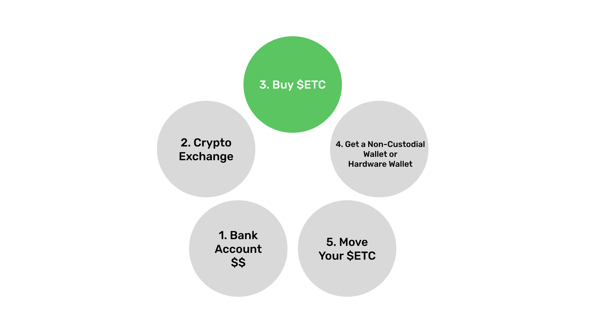
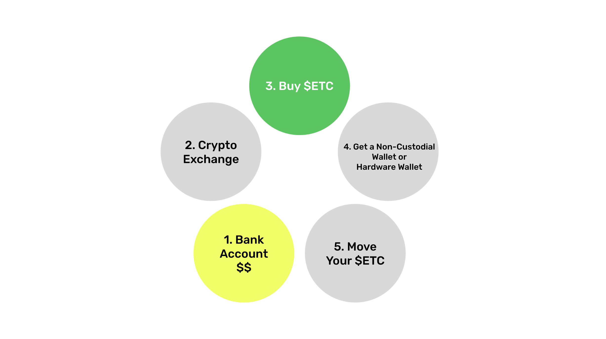
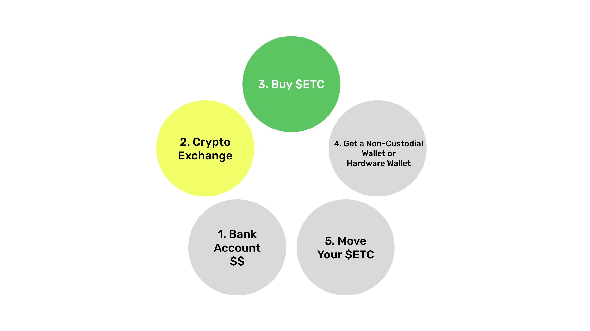
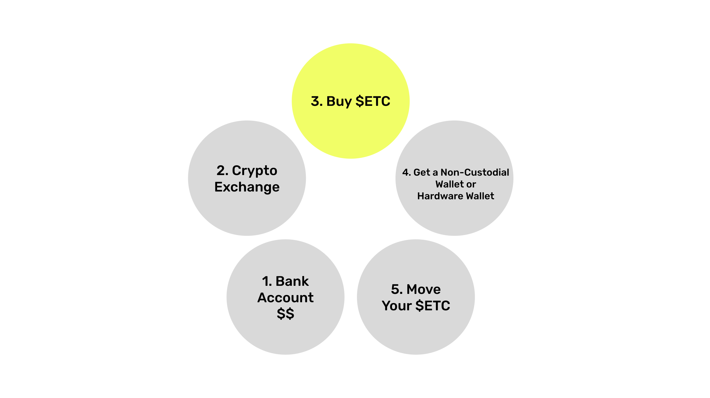
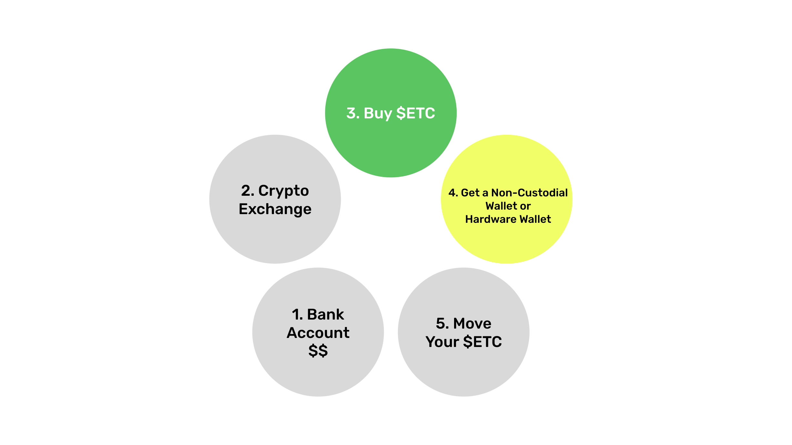
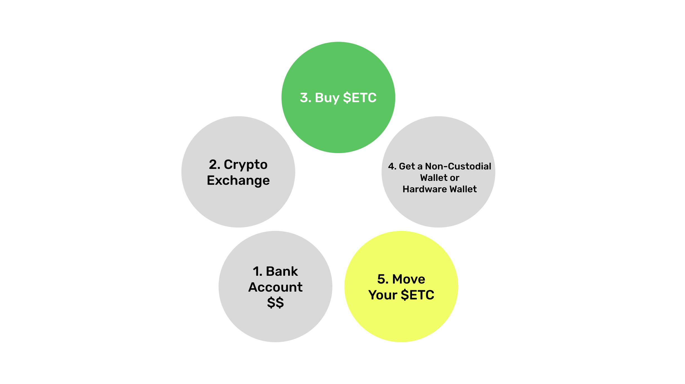

---
**You can listen to or watch this video here:**

<iframe width="560" height="315" src="https://www.youtube.com/embed/lbWdvzyA9lg" title="YouTube video player" frameborder="0" allow="accelerometer; autoplay; clipboard-write; encrypted-media; gyroscope; picture-in-picture; web-share" allowfullscreen></iframe>

---

As many new entrants ask how to buy Ethereum Classic (ETC) for the first time, this post will answer how the process works from scratch.

We are all used to the traditional banking system, so we understand bank accounts, payments, moving fiat money, using credit cards, getting paid, doing wire transfers, using apps, writing checks, and all the usual stuff. The problem is that crypto is very different.

The steps to buy ETC from scratch start with your bank account where you have your fiat money, then selecting a crypto exchange, buying ETC in the exchange, getting a non-custodial wallet or hardware wallet, and finally moving your ETC away from the centralized exchange.

In the following sections we will explain each step.

## Bank Account With Fiat Money

The first step to buy crypto is to have a bank account that you may connect to a crypto exchange to move your fiat money there. This is the best method to start buying ETC. 

It is also possible to wire the money or use other local money transfer methods in your country. Exchanges such as Coinbase, Kraken, and Binance have worked very well to establish rails to move your fiat money easily to them. 

Some may even use Paypal (international), credit cards (international), Mercado Pago (Latin America), SEPA (Europe), or other methods available to you locally.

In some regions it is important to have your money in a larger bank. For example, smaller regional banks in the US do not connect to Coinbase, so users had to open accounts at the larger banks such as Chase, Wells Fargo, Citi, or Bank of America.

If you have your fiat money set up and available to transfer, then the next step is to select a crypto exchange. 

## Select a Crypto Exchange

To keep it easy, it is advisable to use the most widely used crypto exchanges. This does not mean that they are secure and solvent. To the contrary, in this post we will explain how to escape them as soon as you buy your ETC! 

However, to use exchanges such as Coinbase (US and international), Kraken (US and international), and Binance (international) is the best way to start and they all support ETC.

If you select any of these exchanges, the steps to open the accounts are pretty standardized: You need to provide documentation to identify yourself, when they approve you they open your account, then you need to connect your bank account or use any other available transfer system, and then you move your cash to your account at the exchange.

Bear in mind that using crypto exchanges is exactly the same as using banks, they are centralized institutions with all the same risks or even higher than banks because they are not guaranteed by governments.

Once you moved your cash, the next step is to buy ETC.

## Buy $ETC

The official symbol of ETC as a cryptocurrency is $ETC, but when you have your account at Coinbase, Kraken, or Binance, they all show the ETC markets in pairs of currencies. 

The format is to put first ETC, the cryptocurrency you are buying, and second the fiat currency that you are using to purchase it. For example, if you are buying ETC with US dollars, then you need to find the market for the pair “ETC/USD”.

At Coinbase, Kraken, or Binance you will find all these pairs and many more:

ETC/USD (United States)
ETC/EUR (European Union)
ETC/GBP (United Kingdom)
ETC/JPY (Japan)
ETC/ARS (Argentina)
ETC/CNY (China)
ETC/INR (India)
ETC/BRL (Brazil)

When you find the pair for your fiat currency, then press the “Buy” button and purchase ETC. Then, it will appear in your account.

## Get a Non-Custodial Wallet or Hardware Wallet

Once you bought your ETC and they appear in your account, there may be a waiting period until they are free for you to move them away from the exchange. This period is the time that it takes for you fiat money to actually move from your bank to your account at the exchange. This may be seconds if you are using an instant service, or 2 or 3 days if your are using older traditional systems such as ACH in the US or wire transfers.

In the meantime you need to get a non-custodial or hardware wallet so you can move your ETC out of the exchange. As mentioned before, exchanges are as risky or more than banks, so if you keep your coins there you lose all the benefits of decentralization and self custody of truly secure proof of work blockchains such as Ethereum Classic.

The most widely used wallets for ETC and in general are either software wallets or hardware wallets. Some popular brands are the following:

Software wallets: MetaMask, Trust Wallet, or Exodus.

Hardware wallets: Ledger or Trezor.

## Move Your $ETC

When you select your wallet, make sure you went through the whole process of writing down your 12 or 24 word secret passphrase and stored it in a safe place. 

When using software or hardware non-custodial wallets you are your own bank. This means that you, and only you are responsible for your ETC because you are holding your private keys. 

Nevertheless, this is the most important thing to learn: That only by moving your ETC away from centralized services is how you will get the benefits of decentralization, censorship resistance, and permissionlessness. But this comes with great responsibility because if you lose your secret passphrase, private keys, or you get hacked, you may lose your ETC.

Once you set up your non-custodial wallet, then press “Receive” in the ETC asset in your wallet app and it will show you an address to receive your coins. Copy it.

Then, go to your crypto exchange and press the “Send” button from your account, paste the ETC address, make sure that it is correct, and then press send. It will take several seconds or a few minutes to see your ETC on your wallet address.

Congratulation! Now you have bought and safely stored your ETC.

---

**Thank you for reading this article!**

To learn more about ETC please go to: https://ethereumclassic.org
