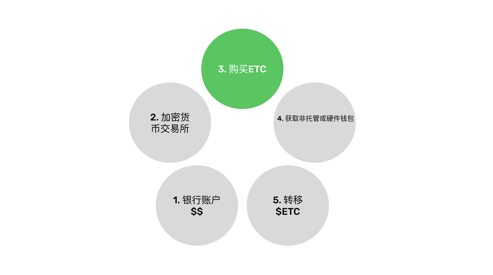
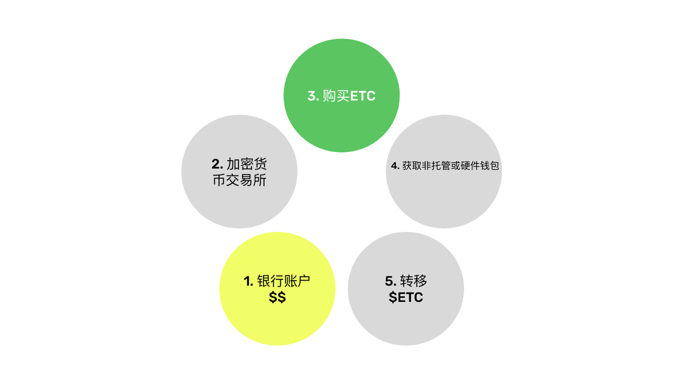
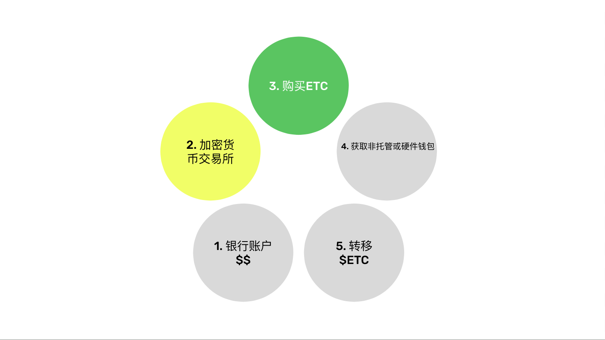
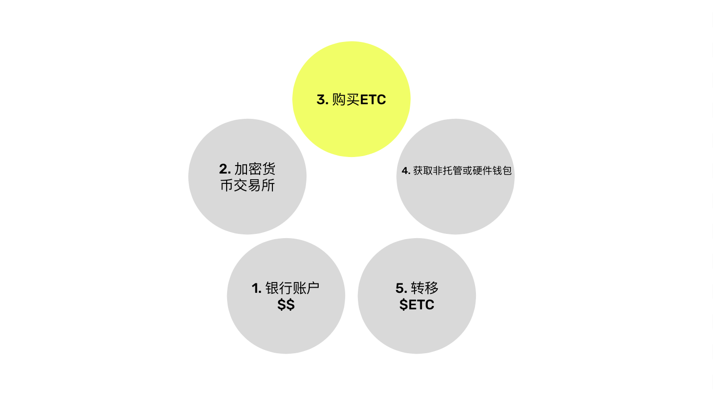
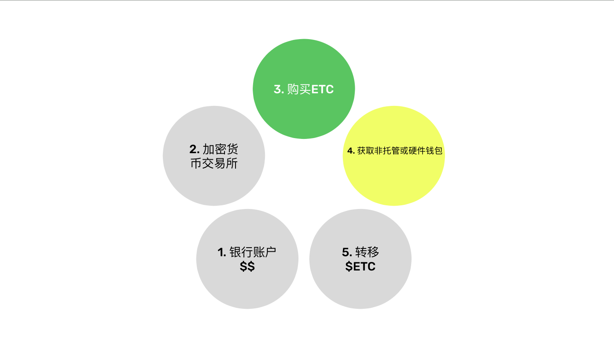
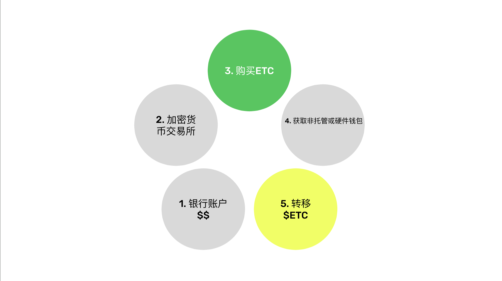

---
**您可以由此收听或观看本期内容:**

<iframe width="560" height="315" src="https://www.youtube.com/embed/PnDydbdpKCU" title="YouTube video player" frameborder="0" allow="accelerometer; autoplay; clipboard-write; encrypted-media; gyroscope; picture-in-picture; web-share" allowfullscreen></iframe>

---

对于许多首次购买以太经典（ETC）的新进入者，本文将解答从零开始的购买过程。

我们都习惯了传统的银行系统，因此我们了解银行账户、支付、转移法定货币、使用信用卡、收到付款、进行电汇、使用应用程序、写支票以及其他常规操作。问题是，加密货币与这些非常不同。

从零开始购买ETC的步骤从您的银行账户开始，您在其中拥有法定货币，然后选择一个加密货币交易所，在交易所购买ETC，获取一个非托管钱包或硬件钱包，最后将您的ETC从集中式交易所转移走。

接下来的几节中，我们将解释每个步骤。

## 法币的银行账户

购买加密货币的第一步是拥有一个银行账户，您可以将其连接到加密货币交易所以便将法定货币转移至该交易所。这是购买ETC的最佳方法。

您也可以通过电汇或使用您所在国家的其他本地货币转账方式。Coinbase、Kraken和Binance等交易所已经非常成功地建立了通道，使您能够轻松将法定货币转移到它们那里。

有些人甚至可以使用PayPal（美国和国际）、信用卡（美国和国际）、Mercado Pago（拉丁美洲）、SEPA（欧洲）或其他您当地可用的方法。

在某些地区，将您的资金放在较大的银行中很重要。例如，在一些美国州份，较小的地区银行无法连接到Coinbase，因此用户不得不在美国银行、JP摩根大通、富国银行、花旗银行或美国银行等较大的银行开设账户。

如果您已经设置好并可以转移的法定货币，那么下一步是选择一个加密货币交易所。

## 选择一个加密货币交易所

为了简化操作，建议使用最广泛使用的加密货币交易所。这并不意味着它们是安全和有偿付能力的。相反，在本文中，我们将解释如何在购买ETC后尽快避免使用它们！

然而，使用Coinbase（美国和国际）、Kraken（美国和国际）和Binance（国际）等交易所是开始的最佳方式，它们都支持ETC。

如果您选择使用这些交易所之一，开设账户的步骤相当标准化：您需要提供身份验证文件，他们审核通过后会为您开设账户，然后您需要连接您的银行账户或使用其他可用的转账系统，最后将资金转移到交易所的账户上。

请记住，使用加密货币交易所与使用银行完全相同，它们是集中化的机构，具有与银行相同甚至更高的风险，因为它们不受政府保障。

一旦您转移了资金，下一步就是购买ETC。

## 购买$ETC

作为加密货币，ETC的官方符号是$ETC，但是当您在Coinbase、Kraken或Binance上开设账户时，它们都会以货币对的形式显示ETC的市场。

格式是将首先放置您要购买的加密货币ETC，然后是您用于购买的法定货币。例如，如果您用美元购买ETC，则需要找到“ETC/USD”货币对的市场。

在Coinbase、Kraken或Binance上，您会找到所有这些货币对以及更多：

- ETC/USD（美元）
- ETC/EUR（欧元）
- ETC/GBP（英镑）
- ETC/JPY（日元）
- ETC/ARS（阿根廷比索）
- ETC/CNY（人民币）
- ETC/INR（印度卢比）
- ETC/BRL（巴西雷亚尔）

当您找到与您的法定货币对应的货币对时，点击“购买”按钮购买ETC。然后，它将出现在您的账户中。

## 获取非托管钱包或硬件钱包

一旦您购买了ETC并在您的账户中显示出来，可能需要等待一段时间，直到它们可以自由地从交易所中转移出来。这段时间是您的法定货币实际从银行转移到交易所账户的时间。如果您使用即时服务，这可能只需几秒钟，但如果您使用较旧的传统系统（如美国的ACH或电汇），可能需要2至3天的时间。

在此期间，您需要获取一个非托管钱包或硬件钱包，以便能够将您的ETC从交易所中转移出来。如前所述，交易所的风险与银行相当甚至更高，因此如果您将您的代币保留在那里，您将失去去中心化和自我保管真正安全的工作量证明区块链（如以太经典）的所有优势。

最常用的ETC和一般钱包类型通常为软件钱包或硬件钱包。以下是一些知名品牌：

软件钱包: [MetaMask](https://metamask.io), [Trust Wallet](https://trustwallet.com)或[Exodus](https://exodus.com).

硬件钱包: [Ledger](https://ledger.com)或[Trezor](https://trezor.io).

*免责声明：我们不对本文中列出的交易所或钱包品牌背书，也不从中获得佣金，我们只是为您的便利而列出它们。请自行进行研究。*

## 转移您的ETC

当您选择钱包时，请确保完成了整个过程，包括记录下您的12或24个单词的秘密密码，并将其存放在安全的地方。

当使用非托管的软件或硬件钱包时，您就是自己的银行。这意味着您，只有您一个人对您的ETC负责，因为您掌握着您的私钥。

然而，这是最重要的事情要学会的：只有通过将您的ETC移出集中式服务，您才能获得去中心化、抗审查和无需许可的好处。但这也意味着您要承担巨大的责任，因为如果您丢失了秘密密码、私钥或者被黑客攻击，您可能会丢失您的ETC。

设置完非托管钱包后，在您的钱包应用程序中点击ETC资产的“接收”按钮，它会显示一个接收您代币的地址。复制它。

然后，转到您的加密货币交易所，在您的账户中点击“发送”按钮，粘贴ETC地址，确保地址是正确的，然后点击发送。您需要等待几秒钟或几分钟才能在您的钱包地址上看到您的ETC。

恭喜！现在您已经购买并安全存储了您的ETC。

---

**感谢您阅读本期文章!**

了解更多有关ETC，请访问: https://ethereumclassic.org
