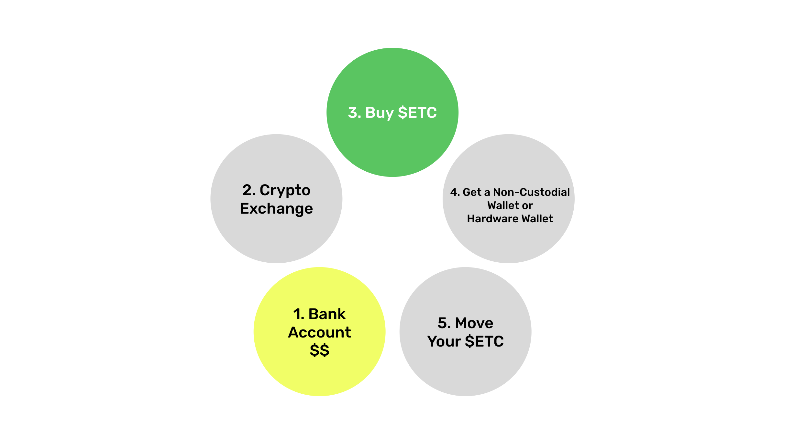
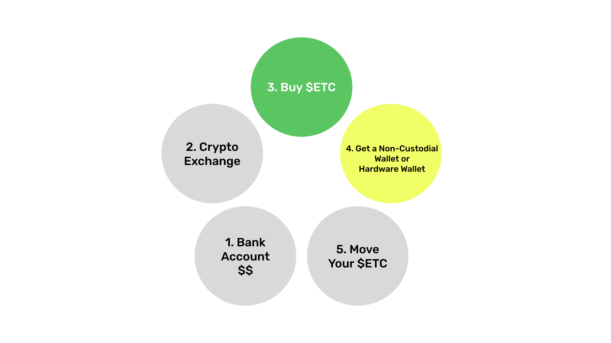

---
**您可以由此收听或观看本期内容:**

---
title: "How to Start Using ETC From Scratch"
date: 2023-05-31
author: Donald McIntyre
contributors: ["DonaldMcIntyre"]
tags: ["education"]
linkImage: ./banner.png
---

---
**您可以由此收听或观看本期内容:**

<iframe width="560" height="315" src="https://www.youtube.com/embed/PnDydbdpKCU" title="YouTube video player" frameborder="0" allow="accelerometer; autoplay; clipboard-write; encrypted-media; gyroscope; picture-in-picture; web-share" allowfullscreen></iframe>

---

对于许多首次购买以太经典（ETC）的新进入者，本文将解答从零开始的购买过程。

我们都习惯了传统的银行系统，因此我们了解银行账户、支付、转移法定货币、使用信用卡、收到付款、进行电汇、使用应用程序、写支票以及其他常规操作。问题是，加密货币与这些非常不同。

从零开始购买ETC的步骤从您的银行账户开始，您在其中拥有法定货币，然后选择一个加密货币交易所，在交易所购买ETC，获取一个非托管钱包或硬件钱包，最后将您的ETC从集中式交易所转移走。

接下来的几节中，我们将解释每个步骤。

## 法币的银行账户

购买加密货币的第一步是拥有一个银行账户，您可以将其连接到加密货币交易所以便将法定货币转移至该交易所。这是购买ETC的最佳方法。

您也可以通过电汇或使用您所在国家的其他本地货币转账方式。Coinbase、Kraken和Binance等交易所已经非常成功地建立了通道，使您能够轻松将法定货币转移到它们那里。

有些人甚至可以使用PayPal（美国和国际）、信用卡（美国和国际）、Mercado Pago（拉丁美洲）、SEPA（欧洲）或其他您当地可用的方法。

在某些地区，将您的资金放在较大的银行中很重要。例如，在一些美国州份，较小的地区银行无法连接到Coinbase，因此用户不得不在美国银行、JP摩根大通、富国银行、花旗银行或美国银行等较大的银行开设账户。

如果您已经设置好并可以转移的法定货币，那么下一步是选择一个加密货币交易所。

## 选择一个加密货币交易所

为了简化操作，建议使用最广泛使用的加密货币交易所。这并不意味着它们是安全和有偿付能力的。相反，在本文中，我们将解释如何在购买ETC后尽快避免使用它们！

然而，使用Coinbase（美国和国际）、Kraken（美国和国际）和Binance（国际）等交易所是开始的最佳方式，它们都支持ETC。

如果您选择使用这些交易所之一，开设账户的步骤相当标准化：您需要提供身份验证文件，他们审核通过后会为您开设账户，然后您需要连接您的银行账户或使用其他可用的转账系统，最后将资金转移到交易所的账户上。

请记住，使用加密货币交易所与使用银行完全相同，它们是集中化的机构，具有与银行相同甚至更高的风险，因为它们不受政府保障。

一旦您转移了资金，下一步就是购买ETC。

## 购买$ETC

作为加密货币，ETC的官方符号是$ETC，但是当您在Coinbase、Kraken或Binance上开设账户时，它们都会以货币对的形式显示ETC的市场。

格式是将首先放置您要购买的加密货币ETC，然后是您用于购买的法定货币。例如，如果您用美元购买ETC，则需要找到“ETC/USD”货币对的市场。

在Coinbase、Kraken或Binance上，您会找到所有这些货币对以及更多：

- ETC/USD（美元）
- ETC/EUR（欧元）
- ETC/GBP（英镑）
- ETC/JPY（日元）
- ETC/ARS（阿根廷比索）
- ETC/CNY（人民币）
- ETC/INR（印度卢比）
- ETC/BRL（巴西雷亚尔）

当您找到与您的法定货币对应的货币对时，点击“购买”按钮购买ETC。然后，它将出现在您的账户中。

## Get a Non-Custodial Wallet or Hardware Wallet

Once you bought your ETC and they appear in your account, there may be a waiting period until they are free for you to move them away from the exchange. This period is the time that it takes for you fiat money to actually move from your bank to your account at the exchange. This may be seconds if you are using an instant service, or 2 or 3 days if you are using older traditional systems such as ACH in the US or wire transfers.

In the meantime you need to get a non-custodial or hardware wallet so you can move your ETC out of the exchange. As mentioned before, exchanges are as risky or more than banks, so if you keep your coins there you lose all the benefits of decentralization and self custody of truly secure proof of work blockchains such as Ethereum Classic.

The most widely used wallets for ETC and in general are either software wallets or hardware wallets. Some popular brands are the following:

Software wallets: [MetaMask](https://metamask.io), [Trust Wallet](https://trustwallet.com), or [Exodus](https://exodus.com).

Hardware wallets: [Ledger](https://ledger.com) or [Trezor](https://trezor.io).

*Disclaimer: We do not endorse nor earn commissions from the exchange or wallet brands listed in this post, we just list them here for your convenience. Do your own research.*

## Move Your $ETC

When you select your wallet, make sure you went through the whole process of writing down your 12 or 24 word secret passphrase and stored it in a safe place. 

When using software or hardware non-custodial wallets you are your own bank. This means that you, and only you are responsible for your ETC because you are holding your private keys. 

Nevertheless, this is the most important thing to learn: That only by moving your ETC away from centralized services is how you will get the benefits of decentralization, censorship resistance, and permissionlessness. But this comes with great responsibility because if you lose your secret passphrase, private keys, or you get hacked, you may lose your ETC.

Once you set up your non-custodial wallet, then press “Receive” in the ETC asset in your wallet app and it will show you an address to receive your coins. Copy it.

Then, go to your crypto exchange and press the “Send” button from your account, paste the ETC address, make sure that it is correct, and then press send. It will take several seconds or a few minutes to see your ETC on your wallet address.

Congratulations! Now you have bought and safely stored your ETC.

---

**Thank you for reading this article!**

To learn more about ETC please go to: https://ethereumclassic.org

---

As many new entrants ask how to buy Ethereum Classic (ETC) for the first time, this post will answer how the process works from scratch.

We are all used to the traditional banking system, so we understand bank accounts, payments, moving fiat money, using credit cards, getting paid, doing wire transfers, using apps, writing checks, and all the usual stuff. The problem is that crypto is very different.

The steps to buy ETC from scratch start with your bank account where you have your fiat money, then selecting a crypto exchange, buying ETC in the exchange, getting a non-custodial wallet or hardware wallet, and finally moving your ETC away from the centralized exchange.

In the following sections we will explain each step.

## Bank Account With Fiat Money

The first step to buy crypto is to have a bank account that you may connect to a crypto exchange to move your fiat money there. This is the best method to start buying ETC. 

It is also possible to wire the money or use other local money transfer methods in your country. Exchanges such as [Coinbase](https://coinbase.com), [Kraken](https://kraken.com), and [Binance](https://binance.com) have worked very well to establish rails to move your fiat money easily to them. 

Some may even use Paypal (international), credit cards (international), Mercado Pago (Latin America), SEPA (Europe), or other methods available to you locally.

In some regions it is important to have your money in a larger bank. For example, smaller regional banks in the US do not connect to Coinbase, so users had to open accounts at the larger banks such as Chase, Wells Fargo, Citi, or Bank of America.

If you have your fiat money set up and available to transfer, then the next step is to select a crypto exchange. 

## Select a Crypto Exchange

To keep it easy, it is advisable to use the most widely used crypto exchanges. This does not mean that they are secure and solvent. To the contrary, in this post we will explain how to escape them as soon as you buy your ETC! 

However, to use exchanges such as Coinbase (US and international), Kraken (US and international), and Binance (international) is the best way to start and they all support ETC.

If you select any of these exchanges, the steps to open the accounts are pretty standardized: You need to provide documentation to identify yourself, when they approve you they open your account, then you need to connect your bank account or use any other available transfer system, and then you move your cash to your account at the exchange.

Bear in mind that using crypto exchanges is exactly the same as using banks, they are centralized institutions with all the same risks or even higher than banks because they are not guaranteed by governments.

Once you moved your cash, the next step is to buy ETC.

## Buy $ETC

The official symbol of ETC as a cryptocurrency is $ETC, but when you have your account at Coinbase, Kraken, or Binance, they all show the ETC markets in pairs of currencies. 

The format is to put first ETC, the cryptocurrency you are buying, and second the fiat currency that you are using to purchase it. For example, if you are buying ETC with US dollars, then you need to find the market for the pair “ETC/USD”.

At Coinbase, Kraken, or Binance you will find all these pairs and many more:

ETC/USD (United States)
ETC/EUR (European Union)
ETC/GBP (United Kingdom)
ETC/JPY (Japan)
ETC/ARS (Argentina)
ETC/CNY (China)
ETC/INR (India)
ETC/BRL (Brazil)

When you find the pair for your fiat currency, then press the “Buy” button and purchase ETC. Then, it will appear in your account.

## Get a Non-Custodial Wallet or Hardware Wallet

Once you bought your ETC and they appear in your account, there may be a waiting period until they are free for you to move them away from the exchange. This period is the time that it takes for you fiat money to actually move from your bank to your account at the exchange. This may be seconds if you are using an instant service, or 2 or 3 days if your are using older traditional systems such as ACH in the US or wire transfers.

In the meantime you need to get a non-custodial or hardware wallet so you can move your ETC out of the exchange. As mentioned before, exchanges are as risky or more than banks, so if you keep your coins there you lose all the benefits of decentralization and self custody of truly secure proof of work blockchains such as Ethereum Classic.

The most widely used wallets for ETC and in general are either software wallets or hardware wallets. Some popular brands are the following:

Software wallets: [MetaMask](https://metamask.io), [Trust Wallet](https://trustwallet.com), or [Exodus](https://exodus.com).

Hardware wallets: [Ledger](https://ledger.com) or [Trezor](https://trezor.io).

*Disclaimer: We do not endorse nor earn commissions from the exchange or wallet brands listed in this post, we just list them here for your convenience. Do your own research.*

## Move Your $ETC

When you select your wallet, make sure you went through the whole process of writing down your 12 or 24 word secret passphrase and stored it in a safe place. 

When using software or hardware non-custodial wallets you are your own bank. This means that you, and only you are responsible for your ETC because you are holding your private keys. 

Nevertheless, this is the most important thing to learn: That only by moving your ETC away from centralized services is how you will get the benefits of decentralization, censorship resistance, and permissionlessness. But this comes with great responsibility because if you lose your secret passphrase, private keys, or you get hacked, you may lose your ETC.

Once you set up your non-custodial wallet, then press “Receive” in the ETC asset in your wallet app and it will show you an address to receive your coins. Copy it.

Then, go to your crypto exchange and press the “Send” button from your account, paste the ETC address, make sure that it is correct, and then press send. It will take several seconds or a few minutes to see your ETC on your wallet address.

Congratulation! Now you have bought and safely stored your ETC.

---

**Thank you for reading this article!**

To learn more about ETC please go to: https://ethereumclassic.org
