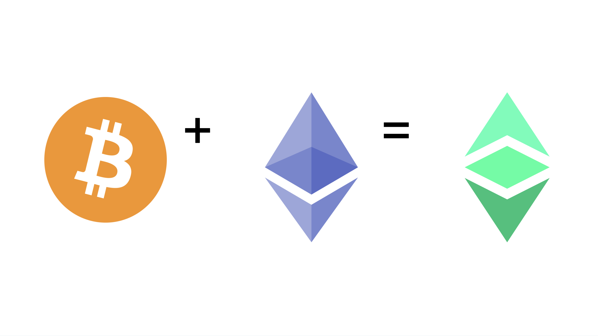

---
**You can listen to or watch this video here:**

<iframe width="560" height="315" src="https://www.youtube.com/embed/WvGttc5lAGI" title="YouTube video player" frameborder="0" allow="accelerometer; autoplay; clipboard-write; encrypted-media; gyroscope; picture-in-picture; web-share" allowfullscreen></iframe>

---

In the previous class of the Ethereum Classic (ETC) course we explained what are the native cryptocurrencies, the original invention of the industry, how they gain economic value, and why the proof of work versions of them are digital gold.

In this class we will explain what are programmable digital cryptocurrencies, why ETC is called programmable digital gold, and why it has an enhanced level of trust minimization as compared to non-programmable digital gold.

In the next few classes we will cover these other topics:

Class 25: What Are ERC-20 Tokens?
Class 26: What Are Convertible Stablecoins?
Class 27: What Are Algorithmic Stablecoins?
Class 28: What Are Privacy Coins?
Class 29: What Are Decentralized Finance (DeFi) Coins?
Class 30: What Are File Storage Coins?

## What Are Non-Programmable Native Cryptocurrencies?

As we explained in the previous class, native cryptocurrencies are the coins that are issued to pay for miner rewards and for fees to have transactions included in blocks. They are designed into the base protocol of a blockchain network and have economic value because of their default use cases.

Of all the native cryptocurrencies some are non-programmable and others are programmable. 

Bitcoin, for example, is merely a ledger with accounts and balances and people can only move coins from one account to the other in that system. This is a model of a non-programmable coin because inside Bitcoin it is impossible to host decentralized software programs.

Other non-programmable coins are Litecoin, Monero, and DogeCoin. 

## What Are Programmable Native Cryptocurrencies?

On the other hand, Ethereum Classic is an example of a programmable coin. ETC is the same as Bitcoin in that it is a ledger with accounts and balances, but it also has space in its ledger to store decentralized software programs.

These decentralized software programs can have their own ETC addresses, hold ETC, move ETC when called, and do all these things with complex rules and conditions. This is what makes the ETC coin a programmable native cryptocurrency.

Inside ETC it is possible to have smart contracts with all sorts of programmability and functions, from banking, to insurance, to decentralized exchanges, property registries, NFTs, decentralized auctions, bonds and stock issuance, DAOs, and many more kinds of use cases.

## What Is Programmable Digital Gold?

The quality of digital gold is something that both Bitcoin and ETC enjoy because both coins are issued only after enormous amounts of computational work is done by miners, thus making them scarce and valuable, just like gold is in the real world.

Although Bitcoin is the largest digital gold asset, ETC is the largest programmable digital gold asset in the world. This is because the native coin of Ethereum Classic is programmable with smart contracts at the same time as being digital gold.

As Ethereum is an insecure proof of stake system, its coin is not digital gold, therefore, even if it supports smart contracts, it is not programmable digital gold.

The best description for ETC is that it is Bitcoin’s philosophy with Ethereum’s technology.

ETC has the incredibly valuable position of being the largest proof of work (decentralized), fixed monetary policy (digital gold), and smart contracts (programmable) blockchain in the world, therefore it is poised for a large and dominant market share in the future.

## Why Is Ethereum Classic More Trust Minimized?

As ETC’s native cryptocurrency is proof of work and programmable it is the most trust minimized system in the whole blockchain industry because not only the accounts and balances are inside the secure environment of the blockchain, but also the autonomous agents, which are smart contracts or dapps, are hosted in it.

Autonomous agents replace trusted third parties in the real world because they can fulfill all their duties but in a totally decentralized way, and in ETC they are inside the highly secure environment of its proof of work network.

This combination, proof of work plus programmability, avoids insecure setups like the need to jump from the blockchain to corporate cloud services and back to get the services of apps, avoids the need to do complex and insecure cross-chain connections, and avoids the use of dapps in external insecure proof of stake networks such as Ethereum, Binance Smart Chain, Cardano, and others.

In Ethereum Classic, not only the digital gold is hosted, but also the fully trust minimized autonomous agents, therefore a maximum level of trust minimization is achieved for users and businesses on a global scale.

---

**Thank you for reading this article!**

To learn more about ETC please go to: https://ethereumclassic.org
