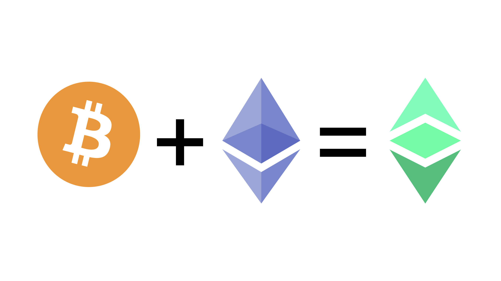

---
**您可以由此收听或观看本期内容:**

<iframe width="560" height="315" src="https://www.youtube.com/embed/WvGttc5lAGI" title="YouTube video player" frameborder="0" allow="accelerometer; autoplay; clipboard-write; encrypted-media; gyroscope; picture-in-picture; web-share" allowfullscreen></iframe>

---

在以太坊经典（ETC）课程的上一堂课中，我们解释了什么是本地加密货币，它们是行业的原始创新，如何获得经济价值，以及为什么它们的工作证明版本被称为数字黄金。

在本课中，我们将解释什么是可编程数字加密货币，为什么ETC被称为可编程数字黄金，并且与不可编程数字黄金相比，它为最小化信任提供了更高水平的增强。

在接下来的几节课中，我们将涵盖以下其他主题：

- 第25课：什么是ERC-20代币？
- 第26课：什么是可转换稳定币？
- 第27课：什么是算法稳定币？
- 第28课：什么是隐私币？
- 第29课：什么是去中心化金融（DeFi）币？
- 第30课：什么是文件存储币？

## 什么是非可编程本地加密货币？

正如我们在之前的课程中解释的那样，本地加密货币是用于支付矿工奖励和交易手续费的硬币，用于将交易包括在区块中。它们被设计成区块链网络的基本协议，并且由于其默认用途而具有经济价值。

在所有的本地加密货币中，有些是非可编程的，而其他一些是可编程的。

比特币，例如，仅仅是一个带有账户和余额的分类账，人们只能在该系统中将硬币从一个账户转移到另一个账户。这是非可编程币的模型，因为在比特币内部无法托管去中心化软件程序。

其他非可编程币包括莱特币、门罗币和狗狗币。

## 什么是可编程本地加密货币？

另一方面，以太经典是可编程币的一个例子。ETC与比特币相同，它是一个带有账户和余额的分类账，但它还有空间来存储去中心化软件程序。

这些去中心化软件程序可以拥有自己的ETC地址，持有ETC，在调用时移动ETC，并以复杂的规则和条件执行所有这些操作。这就是使ETC成为可编程本地加密货币的原因。

在ETC内部，可以拥有各种可编程性和功能的智能合约，从银行业务、保险业务到去中心化交易所、财产登记、非同质化代币（NFT）、去中心化拍卖、债券和股票发行、DAO等各种用例。

## 什么是可编程数字黄金？

数字黄金的特质是比特币和以太经典都享有的，因为这两种加密货币只有在矿工进行了大量计算工作之后才会发行，从而使它们变得稀缺和有价值，就像现实世界中的黄金一样。

尽管比特币是最大的数字黄金资产，但以太经典是全球最大的可编程数字黄金资产。这是因为以太坊经典的本地币可以在成为数字黄金的同时与智能合约一起可编程。

由于以太坊是一个不安全的权益证明系统，它的币不是数字黄金，因此，即使它支持智能合约，也不是可编程数字黄金。

对于以太经典最好的描述是，它拥有比特币的理念和以太坊的技术。

以太经典具有非常宝贵的地位，它是全球最大的工作量证明（去中心化）、固定货币政策（数字黄金）和智能合约（可编程）的区块链，因此它在未来有望占据大部分市场份额并具有主导地位。

## 为什么以太经典具有更小的信任度？

由于以太经典的本地加密货币是工作量证明且可编程的，它是整个区块链行业中最小信任度的系统，因为不仅账户和余额位于区块链的安全环境内，而且自治代理（智能合约或dapp）也托管在其中。

自治代理在现实世界中取代了受信任的第三方，因为它们可以以完全去中心化的方式履行所有职责，而在以太经典中，它们位于其工作量证明网络的高度安全环境内。

这种工作量证明加可编程性的组合避免了不安全的设置，例如需要从区块链跳转到企业云服务，再返回以获取应用程序的服务；避免了进行复杂且不安全的跨链连接的需求；避免了在外部不安全的权益证明网络（如以太坊、币安智能链、Cardano等）中使用去中心化应用程序（dapp）。

在以太经典中，不仅托管了数字黄金，而且完全信任最小化的自治代理，因此在全球范围内实现了用户和企业的最大程度信任最小化。

---

**感谢您阅读本期文章!**

了解更多有关ETC，请访问: https://ethereumclassic.org
