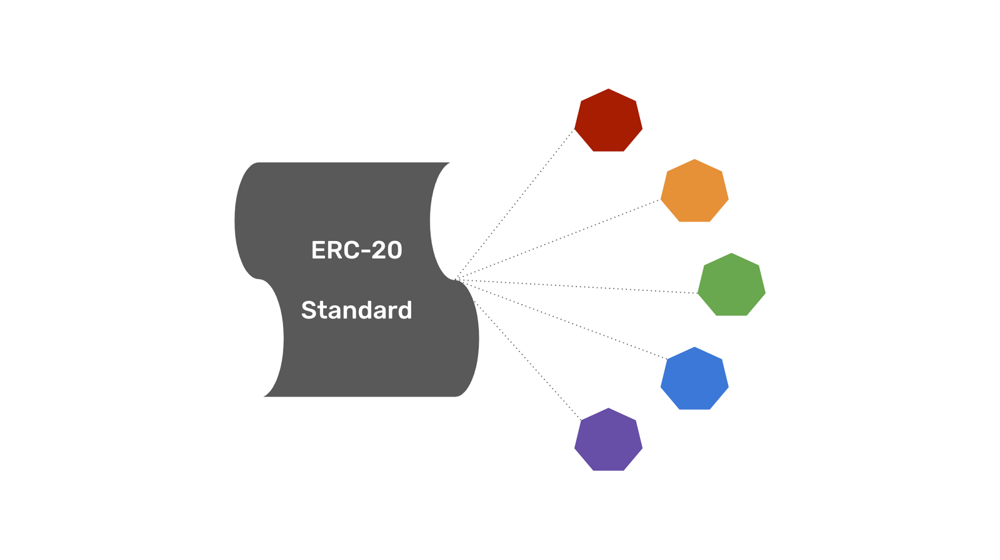

---
**You can listen to or watch this video here:**

<iframe width="560" height="315" src="https://www.youtube.com/embed/x3k7csDrpsw" title="YouTube video player" frameborder="0" allow="accelerometer; autoplay; clipboard-write; encrypted-media; gyroscope; picture-in-picture; web-share" allowfullscreen></iframe>

---

In the previous class of the Ethereum Classic (ETC) course we explained what are programmable native cryptocurrencies, the second most important invention of the blockchain industry, how they gain economic value, and why the proof of work versions of them are programmable digital gold.

In this class we will explain what are ERC-20 tokens by explaining first what are units of value, then going over the concepts of native and programmable native cryptocurrencies, explaining what are non-native tokens, and, finally, what is the ERC-20 standard and what are ERC-20 tokens used for.

In the next few classes we will cover these other topics:

- Class 26: What Are Convertible Stablecoins?
- Class 27: What Are Algorithmic Stablecoins?
- Class 28: What Are Privacy Coins?
- Class 29: What Are Decentralized Finance (DeFi) Coins?
- Class 30: What Are File Storage Coins?

## What Are Units of Value or Tokens?

A unit of value or token is like a placeholder to mark a point or the presence of an object, or a mapping of the presence of an object. Units of value may be used for many things, but one of the most popular use cases is money.

When money was backed, these units of value, tokens, or currencies, were mapped to the presence of a precious metal in a vault somewhere. Now, with the introduction of fiat money, tokens are issued and transferred with nothing backing them. Nevertheless, they are still units of value, however abused, because they have a role in helping organize economic activities such as trade.  

Tokens that are used as currency or other financial applications have the feature that they are fungible, which means that any unit of the same type is interchangeable with any other, and all have exactly the same value.

## What Are Native and Programmable Native Cryptocurrencies?

As explained in previous classes blockchain protocols have embedded by design cryptocurrencies in them that are issued to pay for miner rewards and transaction fees. 

This default economic use case gives them value as miners perform a lot of work and spend capital in electricity to produce blocks and include transactions in those blocks based on the incentive they have to earn the tokens of the system.

They are described as “native” because they are issued by the base protocol and are a fundamental component of the ruleset.

The addition of smart contracts in some blockchains have made their native cryptocurrencies programmable because they may now be moved around according to rules and conditions set by these software programmes.

## What Are Non-Native Tokens or Cryptocurrencies?

Because programmable blockchains such as Ethereum Classic host smart contracts or decentralized software programmes, new units of value, cryptocurrencies, or tokens, may be created in them.

These are non-native tokens or crypto currencies because they are not part of the base protocols of these networks and they have no economic use case at the protocol layer.

Any number of smart contracts may be deployed on ETC to issue non-native tokens.

## What Are ERC-20 Tokens?

The Ethereum Request for Comment (ERC) number 20, thus “ERC-20”, document in the Ethereum network established a standard for how to issue non-native tokens inside Ethereum.

The standard created generic methods for certain actions. For example, for the transfer of tokens from one account to another, to get the current token balance of an account, get the total supply of the token available on the network, and approve whether an amount of a token from an account can be spent by a third-party account.

This standard is used by the majority of Ethereum compatible blockchains including Ethereum Classic.

All the tokens created in Ethereum and Ethereum Classic using this standard are called “ERC-20 tokens”.

## What Are ERC-20 Tokens Used for?

As generic placeholder objects or units of value, ERC-20 tokens may be used for many things.

A list of some use cases may be as follows:

- Reputation points in online platforms
- Skills of characters in games
- Lottery tickets
- Financial assets
- Derivatives
- Fiat currencies
- Units representing precious metals
- Wrapped tokens (the representation of other tokens)

Another popular use case that has developed in the industry is to issue tokens for Decentralized Autonomous Organizations (DAOs) so that these token holders may vote on protocol upgrades and changes, distribution of capital, or changes to the rules of their underlying decentralized applications.

---

**Thank you for reading this article!**

To learn more about ETC please go to: https://ethereumclassic.org
