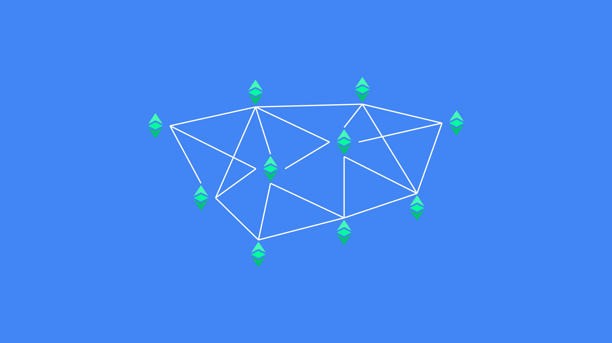
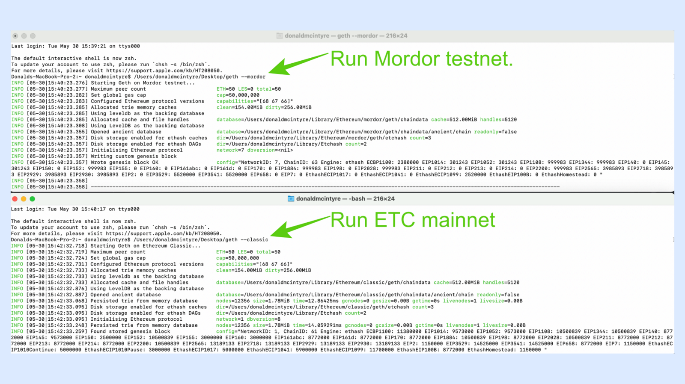
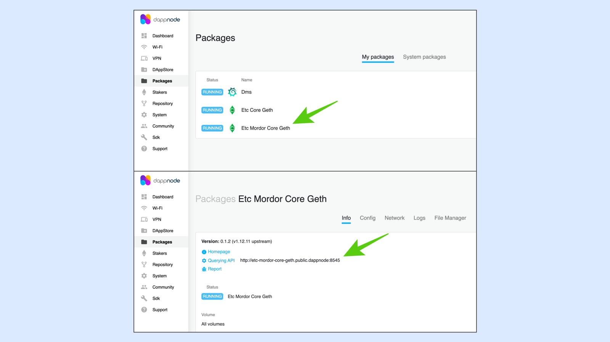

---
**You can listen to or watch this video here:**

<iframe width="560" height="315" src="https://www.youtube.com/embed/0hutSdb-dV8" title="YouTube video player" frameborder="0" allow="accelerometer; autoplay; clipboard-write; encrypted-media; gyroscope; picture-in-picture; web-share" allowfullscreen></iframe>

---



A blockchain is a network with many nodes and miners around the world working on the system, processing transactions and building blocks.

Core developers work constantly on improving the node software clients, integrating protocol upgrades, and fixing bugs.

Dapp developers build new dapps or upgrade existing ones all the time, and businesses deploy smart contracts to enforce agreements with counterparties.

All of the above may happen live using real money and contracts on the main network (mainnet) and all the components are usually as battle tested as possible to minimize errors.

But, where are all these systems, upgrades, and components ran and tried before deployment in the real world?

## What Are Testnets?

To ensure that all the things mentioned in the previous section may be tried and checked prior to being deployed in the real world, blockchain communities maintain what are called testnets.

Testnets are basically clones of the mainnets so their role is to provide an as identical as possible environment to be able to test all new systems and components.

Testnets work the same way as the main networks so they have a cryptocurrency, a ledger with accounts and balances, smart contracts and an EVM, in the case of programmable blockchains, and are fully replicated.

Some testnets are Proof of Work, and others may be Proof of Stake or Proof of Authority. 

## How Are Testnets Used?

Testnets are used by core developers, dapp developers, people, and businesses for the following cases:

**To test upgrades:** Every time there are protocol changes or upgrades to the Ethereum Virtual Machine (EVM), blockchain core developers test all these changes in the corresponding testnets. The testnets go through rehearsal runs, implementing upgrades at specific block numbers, just as it would eventually occur on the mainnet.

**To test bug fixes:** In the same way as with upgrades, bug fixes of the protocol or the software clients are also tested previously on testnets to ensure that they provide the desired solutions.

**To test smart contracts:** When people or businesses wish to test smart contacts before deployment on the mainnet, they may use testnets to try and run all the features to check that they work correctly.

**To test dapps:** Dapp developers test their applications, features, and functions on testnets before sending them to full production on the mainnet.

## The ETC Mordor Testnet

The Ethereum Classic (ETC) Mordor testnet is the parallel clone network of ETC that is used as the environment to try and test upgrades, bug fixes, smart contracts, and dapps before they are implemented and used in the real world.

As a testnet, Mordor is not meant to be immutable like the ETC mainnet. It is actually made to be changed, broken fixed, and restarted whenever necessary. This is the value of the testnet as a playground to run all the risks before deployment to the real world.

Whereas the ETC network has the chain ID 61, Mordor uses the chain ID 63, and the genesis block of Mordor is not the same as the ETC network, so node peers check all these different parameters before joining.

Mordor is a proof of work blockchain as ETC and is just another network in the cluster of EVM networks in the blockchain industry.

## How Is Mordor Used?

The cryptocurrency of the Mordor testnet is mETC and is very cheap. Actually it is passed around and donated by volunteers in what are called “faucets” for everyone to use.

This makes Mordor a very inexpensive environment to test upgrades, smart contracts, and dapps. The node operators of the Mordor testnet may also mine mETC, creating blocks, which is key to recreate the environment of the ETC mainnet.

All participants in the network are volunteers with the interest of having a good environment to test things for ETC.

Developers may deploy dapps on Mordor before going to full production, the block times of the testnet are the same as ETC which are 13 seconds per block.

## Running a Mordor Node Using the Core Geth Client



A way to run a Mordor node is by downloading the Core Geth software client, the same as for the mainnet, but instead of initializing it with the command “--classic” it must be initialized with the string “--mordor”.

The following is the link to get Core Geth:

https://github.com/etclabscore/core-geth/releases/

To send transactions, or deploy dapps, or smart contracts on the Mordor testnet, the local port to use is:

http://localhost:8545

## Running a Mordor Node Using DappNode



For developers and users who are running ETC nodes on DappNode, they need to download the package “Etc Mordor Core Geth” and wait until it synchronizes.

To send transactions, or deploy dapps, or smart contracts to Mordor, the local port on DappNode to use is the following:

http://etc-mordor-core-geth.public.dappnode:8545

## Connecting to Mordor using Public Endpoints

If developers or users want to test things before deployment, but don’t wish to run a full ETC Mordor testnet node, then they can use public endpoints to send transactions, dapps, and smart contracts.

The list of all endpoints for the ETC ecosystem is in the following link:

https://ethereumclassic.org/network/endpoints

The most commonly used endpoint to access Mordor is provided by the ETC Cooperative and it is the following:

https://www.ethercluster.com/mordor

## Getting Mordor Coins for Testing and Paying Transaction Fees

As mentioned before, the Mordor testnet for testing things for Ethereum Classic use a coin called mETC.

This coin may be mined or received as a donation for testing from what are called “faucets”, which are provided by volunteers.

A very popular faucet is run by the Hebe Block team and the link is the following:

https://easy.hebeswap.com/#/faucet

## Mining on the Mordor Testnet

The easiest way to start mining on the Mordor testnet is to run a Core Geth node software client and activate it for mining.

For this the string that needs to be entered in the command line is “--mordor --mine”.

If an ETC address is not setup to mine, then an “etherbase”, which is analogous to the “coinbase” in Bitcoin, must be entered to start mining. An etherbase is the address in which miners wish to receive their block rewards.

To set up an etherbase, the command that must be entered is “--miner.etherbase [your address]”. For example:

```
--miner.etherbase 0xdf7d7e053933b5cc24372f878c90e62dadad5d42
```

The full instructions for mining on Mordor are in the following link:

https://etclabscore.github.io/core-geth/JSON-RPC-API/modules/miner/

---

**Thank you for reading this article!**

To learn more about ETC please go to: https://ethereumclassic.org
