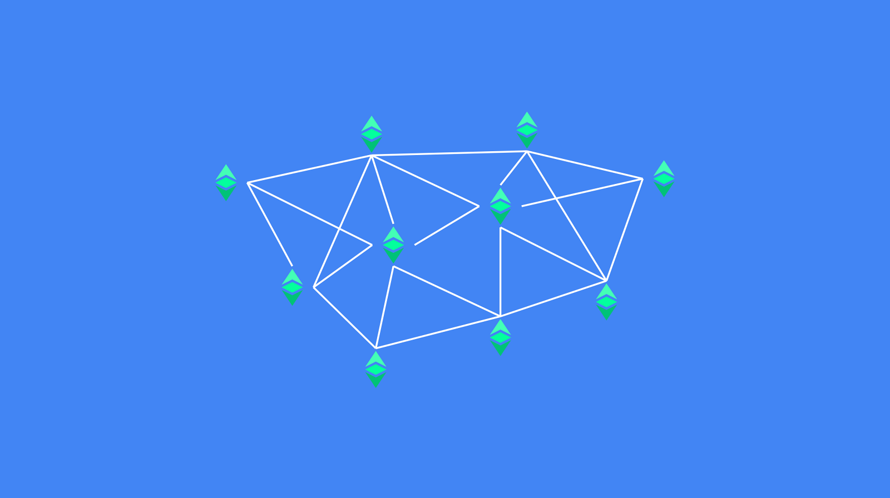
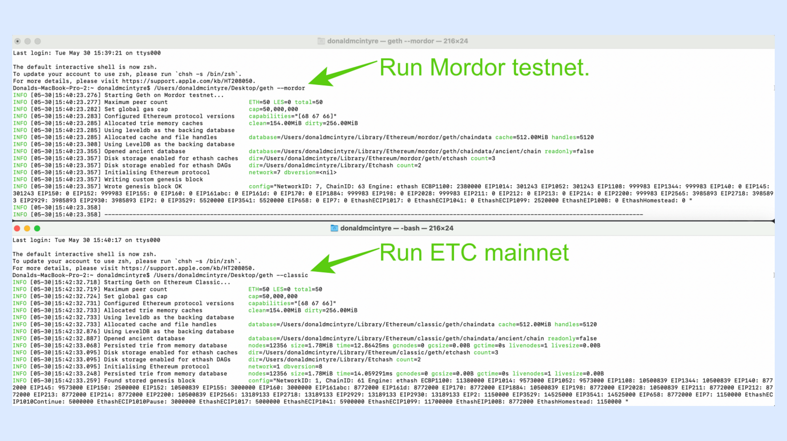
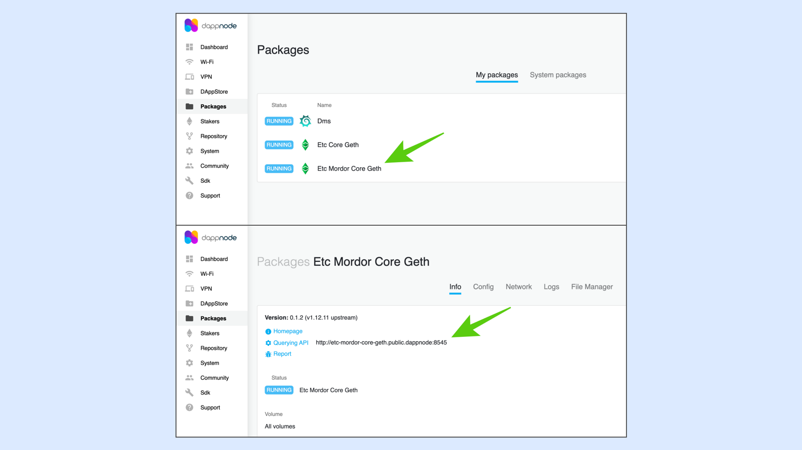

---
**您可以由此收听或观看本期内容:**

<iframe width="560" height="315" src="https://www.youtube.com/embed/0hutSdb-dV8" title="YouTube video player" frameborder="0" allow="accelerometer; autoplay; clipboard-write; encrypted-media; gyroscope; picture-in-picture; web-share" allowfullscreen></iframe>

---



区块链是一个由全球众多节点和矿工组成的网络，他们共同参与系统运作，处理交易并构建区块。

核心开发人员不断努力改进节点软件客户端，整合协议升级并修复错误。

Dapp开发人员始终在构建新的Dapp或升级现有Dapp，企业则部署智能合约以执行与交易对手的协议。

所有这些活动都可以在主网络（mainnet）上使用真实货币和合约实时进行，并且通常尽可能经过充分的测试，以最小化错误。

然而，在这些系统、升级和组件投入实际应用之前，它们在哪里运行和尝试？

## 什么是测试网络？

为了确保前面提到的所有内容在投入实际应用之前可以进行尝试和检查，区块链社区维护了所谓的测试网络。

测试网络基本上是主网络的克隆版本，它们的作用是提供尽可能相同的环境，以便测试所有新的系统和组件。

测试网络的工作方式与主网络相同，因此它们拥有一种加密货币、带有账户和余额的账本、智能合约和（在可编程区块链的情况下）EVM，并且完全复制主网络。

一些测试网络采用工作量证明机制，而其他测试网络可能采用权益证明或授权证明机制

## 测试网络的使用方式

核心开发人员、Dapp开发人员、个人和企业使用测试网络进行以下操作：

**测试升级:** 每当有协议变更或以太坊虚拟机（EVM）的升级时，区块链核心开发人员会在相应的测试网络上测试所有这些变更。测试网络会进行排练运行，按照特定的区块号实施升级，就像最终在主网络上进行的那样。

**测试错误修复:** 与升级类似，协议或软件客户端的错误修复也会在测试网络上进行预先测试，以确保它们提供所需的解决方案。

**测试智能合约:** 当个人或企业希望在主网络上部署智能合约之前对其进行测试时，他们可以使用测试网络来尝试运行所有功能，以检查其是否正常工作。

**测试dapps:** Dapp开发人员会在测试网络上测试他们的应用程序、特色和功能，然后再将其发送到主网络上的完整生产环境中。

## 以太坊经典Mordor测试网络

以太坊经典（ETC）Mordor测试网络是ETC的并行克隆网络，用作在实际世界中实施和使用之前尝试和测试升级、错误修复、智能合约和Dapp的环境。

作为测试网络，Mordor并不像ETC主网络一样不可变。实际上，它是可以根据需要进行更改、损坏、修复和重新启动的。这是测试网络的价值所在，它提供了一个在部署到实际世界之前运行所有风险的试验场。

虽然ETC网络的链ID为61，但Mordor使用链ID 63，并且Mordor的创世块与ETC网络不同，因此节点对这些不同的参数进行检查后才加入。

Mordor是一个工作量证明的区块链，与ETC一样，它只是区块链行业中以太坊虚拟机网络群集中的另一个网络。

## Mordor的使用方式

Mordor测试网络的加密货币是mETC，并且价格非常便宜。实际上，这些mETC会通过“水龙头”由志愿者传递和捐赠，供所有人使用。

这使得Mordor成为一个非常廉价的环境，用于测试升级、智能合约和Dapp。Mordor测试网络的节点操作者也可以挖掘mETC，创建区块，这是重现ETC主网络环境的关键。

网络中的所有参与者都是自愿者，他们希望有一个良好的环境来测试ETC相关的事物。

开发人员可以在Mordor上部署Dapp，然后再进行全面生产，测试网络的区块时间与ETC相同，每个区块13秒。

## 使用Core Geth客户端运行Mordor节点



运行Mordor节点的一种方式是下载Core Geth软件客户端，与主网络相同，但初始化时不使用“--classic”命令，而是使用“--mordor”字符串进行初始化。

以下是获取Core Geth的链接：

https://github.com/etclabscore/core-geth/releases/

要在Mordor测试网络上发送交易、部署Dapp或智能合约，要使用的本地端口是：

http://localhost:8545

## 使用DappNode运行Mordor节点



对于在DappNode上运行ETC节点的开发人员和用户，他们需要下载“Etc Mordor Core Geth”软件包，并等待同步完成。

要将交易、Dapp或智能合约发送到Mordor，DappNode上要使用的本地端口是：

http://etc-mordor-core-geth.public.dappnode:8545

## 使用公共端点连接到Mordor

如果开发人员或用户希望在部署之前测试一些内容，但不希望运行完整的ETC Mordor测试网络节点，那么他们可以使用公共端点发送交易、Dapp和智能合约。

ETC生态系统的所有端点列表可以在以下链接中找到：

https://ethereumclassic.org/network/endpoints

访问Mordor最常用的端点由ETC合作社提供，如下所示：

https://www.ethercluster.com/mordor

## 获取Mordor币进行测试和支付交易手续费

如前所述，用于以太坊经典测试的Mordor测试网络使用一种称为mETC的代币。

这种代币可以通过挖矿或从所谓的“水龙头”获得，水龙头是由志愿者提供的，用于测试目的。

一个非常受欢迎的水龙头由Hebe Block团队运营，链接如下：

https://easy.hebeswap.com/#/faucet

## 在Mordor测试网络上进行挖矿

在Mordor测试网络上开始挖矿的最简单方法是运行Core Geth节点软件客户端并激活挖矿功能。

为此，在命令行中需要输入的字符串是“--mordor --mine”。

如果没有设置以太经典（ETC）地址来进行挖矿，则需要输入“etherbase”，类似于比特币中的“coinbase”，以开始挖矿。Etherbase是矿工希望接收其区块奖励的地址。

要设置一个etherbase，需要输入以下命令：“--miner.etherbase [你的地址]”。例如：

```
--miner.etherbase 0xdf7d7e053933b5cc24372f878c90e62dadad5d42
```

有关在Mordor上进行挖矿的完整说明，请参阅以下链接：

https://etclabscore.github.io/core-geth/JSON-RPC-API/modules/miner/

---

**感谢您阅读本期文章!**

了解更多有关ETC，请访问: https://ethereumclassic.org
