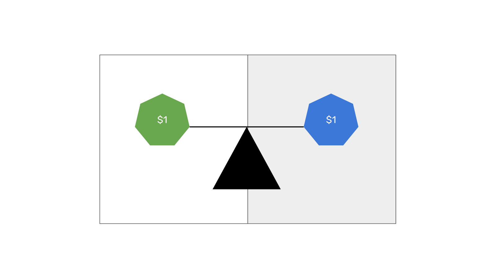

---
**You can listen to or watch this video here:**

<iframe width="560" height="315" src="https://www.youtube.com/embed/PbRULweED5o" title="YouTube video player" frameborder="0" allow="accelerometer; autoplay; clipboard-write; encrypted-media; gyroscope; picture-in-picture; web-share" allowfullscreen></iframe>

---

In the previous class of the Ethereum Classic (ETC) course we explained what are ERC-20 tokens by explaining what are units of value or tokens in the first place, native and programmable native cryptocurrencies, what is the ERC-20 standard, and what are the tokens that are created using that standard.

In this class we will explain what are convertible stablecoins, starting with a description of what are stablecoins in general, the two categories that exist, what are convertible stablecoins in particular, showing how they work, and, finally, their risks.

In the next few classes we will cover these other topics:

- Class 27: What Are Algorithmic Stablecoins?
- Class 28: What Are Privacy Coins?
- Class 29: What Are Decentralized Finance (DeFi) Coins?
- Class 30: What Are File Storage Coins?

## What Are Stablecoins?

Stablecoins are cryptocurrencies that seek to have a stable value, usually mimicking the value of a fiat currency like the US dollar, that are pegged or collateralized by assets that may be the same fiat currencies they seek to mimic or other cryptocurrencies that serve as guarantee reserves to back their value.

The most popular stable coins are:

- USDT - Issued by Tether Limited Inc.
- USDC - Issued by Center, a consortium formed by Circle and Coinbase.
- BUSD - Issued by Binance.
- DAI - Issued by Maker DAO.

Stablecoins are either convertible or algorithmic. In this class we will explain the former and in the next one the latter.

## What Are Convertible Stablecoins?

Convertible stablecoins are one of the two general categories of stablecoins. Examples of these are USDT, USDC, and BUSD.

These cryptocurrencies maintain a peg of one-to-one with a fiat currency that they seek to mimic.

Convertible stablecoins are sponsored by traditional companies that hold traditional bank accounts where they store the fiat currencies that back their stablecoins.

The stablecoins themselves inside blockchains such as ETC are ERC-20 tokens.

Because these ERC-20 tokens are convertible at any time for the fiat currency that backs them at the request of users, then they maintain a stable value against those fiat currencies that they represent.  

## How do Convertible Stablecoins Work?

1. Individuals or businesses open accounts, provided they go through the KYC process, at the stablecoin sponsor company and send fiat currency to their bank account.

2. When the company receives the fiat currency it issues the stablecoin ERC-20 tokens, worth 1 to 1 to the fiat currency, and sends them to the blockchain address of its customers.

3. As the issued stablecoin tokens are the ERC-20 standard tokens in blockchains such as ETC, they can be used to make payments, transfers, and to trade other tokens or NFTs.

4. Any blockchain user, provided they go through the KYC process, may open an account at the stablecoin sponsor company and redeem the stablecoin by sending them to their address on the blockchain.

5. When the sponsor company receives the tokens, they destroy them from circulation and send the equivalent amount of fiat money to their customer’s bank account.

## What Are the Risks of Convertible Stablecoins?

Although they have been an incredible solution for on-chain use cases, that convertible stablecoin ERC-20 tokens may be considered cryptocurrencies, and that they exist inside blockchains, does not mean that this type of asset is decentralized and secure. 

Indeed, stablecoins import to the blockchain all the risks and vices of traditional central banking. As more fiat currency is printed and loses value with inflation, so does the stablecoin that represents it on the blockchain.

Not only this, but convertible stablecoins are “stable” so long as the fiat currency backing them is there to convert them back. This means that if the company that sponsors the stablecoin goes broke or commits fraud, then the corresponding “stable” ERC-20 tokens on the blockchain will be at risk of losing value.

Similarly, if there is a banking crisis and the banks where the fiat currencies are stored are liquidated, then end users of the convertible stablecoins on the blockchain may lose their money as well.

---

**Thank you for reading this article!**

To learn more about ETC please go to: https://ethereumclassic.org
