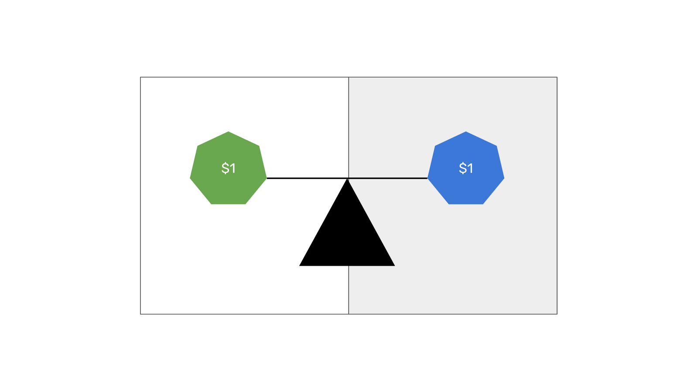

---
**您可以由此收听或观看本期视频:**

<iframe width="560" height="315" src="https://www.youtube.com/embed/PbRULweED5o" title="YouTube video player" frameborder="0" allow="accelerometer; autoplay; clipboard-write; encrypted-media; gyroscope; picture-in-picture; web-share" allowfullscreen></iframe>

---

在前面的以太经典（ETC）课程中，我们通过解释什么是价值单位或代币，本地和可编程本地加密货币，以及什么是ERC-20标准和使用该标准创建的代币，来解释了什么是ERC-20代币。

在本节课中，我们将解释什么是可兑换稳定币，首先描述了稳定币的一般性质，介绍了存在的两种类别，然后详细说明了可兑换稳定币的工作原理，最后讨论了其风险。

在接下来的几节课中，我们将涵盖以下其他主题：

第27课：什么是算法稳定币？
第28课：什么是隐私币？
第29课：什么是去中心化金融（DeFi）币？
第30课：什么是文件存储币？

## 什么是稳定币?

稳定币是一种追求稳定价值的加密货币，通常模仿像美元这样的法定货币的价值，并以同样的法定货币作为锚定或抵押物，或者以其他加密货币作为担保储备来支持其价值。

最流行的稳定币包括：

USDT - 由Tether Limited Inc.发行。
USDC - 由Center发行，Center是由Circle和Coinbase组成的联盟。
BUSD - 由Binance发行。
DAI - 由Maker DAO发行。

稳定币可以分为可转换型和算法型两种。在本课中，我们将解释可转换型稳定币，而在下一课中将解释算法型稳定币。

## 什么是可转换型稳定币？

可转换型稳定币是稳定币的两个常见类别之一。例如，USDT、USDC和BUSD都属于这一类别。

这些加密货币与它们试图模仿的法定货币保持一比一的锚定。

可转换型稳定币由传统公司赞助，这些公司拥有传统银行账户，用于存储支持其稳定币的法定货币。

这些稳定币本身是在区块链（如ETC）中的ERC-20代币。

由于这些ERC-20代币可以随时按用户的要求兑换为支持它们的法定货币，因此它们与所代表的法定货币之间保持稳定的价值。  

## 可转换型稳定币如何运作？

1. 个人或企业在稳定币赞助公司开设账户，并通过KYC（了解您的客户）流程。他们将法定货币发送到公司的银行账户。

2. 当公司收到法定货币后，它会发行价值与法定货币一比一的稳定币ERC-20代币，并将它们发送到其客户在区块链上的地址。

3. 由于发行的稳定币代币属于区块链（如ETC）中的ERC-20标准代币，因此它们可用于进行支付、转账以及交易其他代币或非同质化代币（NFT）。

4. 任何区块链用户，只要他们经过KYC流程，都可以在稳定币赞助公司开设账户，并通过将稳定币发送到他们在区块链上的地址来兑换稳定币。

5. 当赞助公司收到代币后，它们会将代币从流通中销毁，并向客户的银行账户发送相应金额的法定货币。

## 可转换型稳定币的风险是什么？

尽管可转换型稳定币ERC-20代币在链上应用中提供了出色的解决方案，并且它们被认为是加密货币并存在于区块链中，但这并不意味着这种资产是分散化和安全的。

事实上，稳定币将传统中央银行的所有风险和弊端引入了区块链。随着越来越多的法定货币被印制并随着通货膨胀而贬值，代表它们的稳定币在区块链上的价值也会下降。

不仅如此，只有在有法定货币支持的情况下，可转换型稳定币才能保持“稳定”。这意味着，如果赞助稳定币的公司破产或者涉嫌欺诈，那么区块链上相应的“稳定”ERC-20代币将面临价值下降的风险。

同样，如果发生银行危机并导致存放法定货币的银行破产清算，那么区块链上的可转换型稳定币的最终用户也可能会损失资金。

---

**感谢您阅读本期文章!**

了解更多有关ETC，请访问: https://ethereumclassic.org
