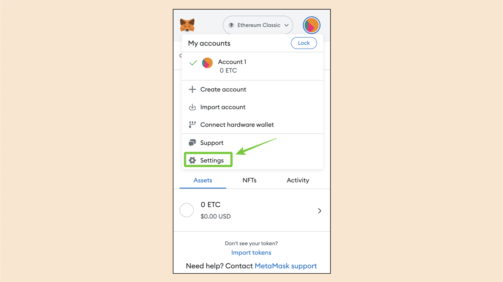

---
**You can listen to or watch this video here:**

<iframe width="560" height="315" src="https://www.youtube.com/embed/RnL9lrTI9NA" title="YouTube video player" frameborder="0" allow="accelerometer; autoplay; clipboard-write; encrypted-media; gyroscope; picture-in-picture; web-share" allowfullscreen></iframe>

---

If you are reading this, like tens of thousands of people around the world, it is most likely that you have your MetaMask set to point to the Ethercluster Ethereum Classic (ETC) URL endpoint which is used by your MetaMask mobile app or browser extension to send transactions and to query your ETC balances, tokens, and NFTs.

However, the Ethercluster URL will be discontinued on July 1st of 2023 by the ETC Cooperative who announced this the first week of January of this year:

https://etccooperative.org/posts/2023-01-02-the-ethereum-classic-rpc-url-is-changing-from-ethercluster-to-rivet-en

To change the endpoint on your MetaMask browser extension or your MetaMask mobile app is very simple. The new URL endpoint to use is the one provided by RIVET, a professional infrastructure team that was hired by the ETC Cooperative for this task.

To change your ETC endpoints on your MetaMask browser extension or mobile app, please follow the instructions in this post.

# Change the Endpoint on Your MetaMask Browser Extension

## 1. Open Your MetaMask Browser Extension

The first thing your need to do is to open your MetaMask browser extension as usual. 

Then click on the circle on the top right to open the main menu.

## 2. Click on “Settings”

In the next step you will see that the menu opens.

Click on the “Settings”option.

## 3. Click on “Networks”

In the next screen, click on “Networks” to see all the networks listed on your MetaMask browser extension.

## 4. Click on “Ethereum Classic”

In this case I have Ethereum, the default chain on MetaMask, and I have both the Ethereum Classic mainnet and the Mordor testnet. You may have other networks listed on your MetaMask, though.

If you happen to have the “Mordor” testnet, that one will not change, so it may stay as it is. 

Click on “Ethereum Classic” to open and see its settings.

## 5. See if “Ethercluster” Is Your Current ETC URL Endpoint

Next, a window will open on your browser on the Metamask settings page for the Ethereum Classic network.

If you see that you have the Ethercluster URL as your endpoint (RPC Url), which is this one:

https://www.ethercluster.com/etc

Then, it must be changed to this one:

https://etc.rivet.link

See the next screen.

## 6. Change the ETC Endpoint to RIVET

If it is Ethercluster, go ahead and delete the Ethercluster URL and then type:

https://etc.rivet.link

When you replaced the URL endpoint, press “Save”.

Congratulations! You have changed the URL endpoint to RIVET. 

Now your MetaMask browser extension will work fine after July 1st of 2023.

# Change the Endpoint on Your MetaMask Mobile App

## 1. Open Your MetaMask Mobile App

The first thing your need to do is to open your MetaMask mobile app as usual. 

Then, tap on the menu icon on the top left to open the main menu.

## 2. Tap on “Settings”

In the next step you will see that the menu opens.

Tap on the “Settings”option.

## 3. Tap on “Networks”

In the next screen, tap on “Networks” to see all the networks listed on your MetaMask mobile app.

## 4. Tap on “Ethereum Classic”

In this case I have Ethereum and its testnets, the default chains on MetaMask, and I have the Ethereum Classic mainnet. You may have other networks listed on your MetaMask mobile app, though.

If you happen to have the ETC “Mordor” testnet, that one will not change, so it may stay as it is. 

Tap on the “Ethereum Classic” network to open and see its settings.

## 5. See if “Ethercluster” Is Your Current ETC URL Endpoint

Next, you will see a screen with the Metamask settings for the Ethereum Classic network.

If you see that you have the Ethercluster URL as your endpoint (RPC Url), which is this one:

https://www.ethercluster.com/etc

Then, it must be changed to this one:

https://etc.rivet.link

See the next screen.

## 6. Change the ETC Endpoint to RIVET

If it is Ethercluster, go ahead and delete the Ethercluster URL and then type:

https://etc.rivet.link

When you replaced the URL endpoint, tap “Save”.

Congratulations! You have changed the URL endpoint to RIVET. 

Now your MetaMask mobile app will work fine after July 1st of 2023.

---

**Thank you for reading this article!**

To learn more about ETC please go to: https://ethereumclassic.org
