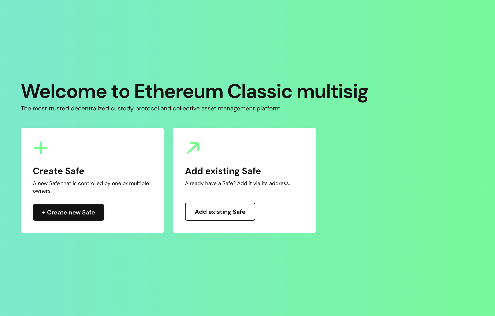
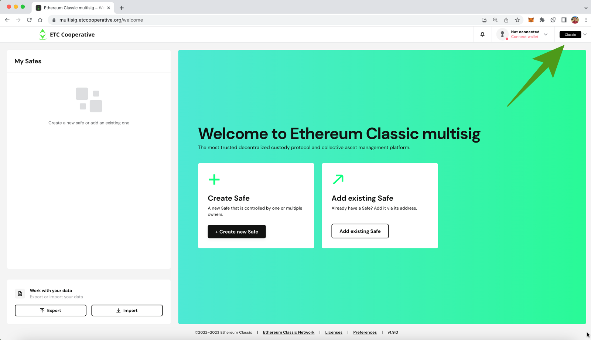
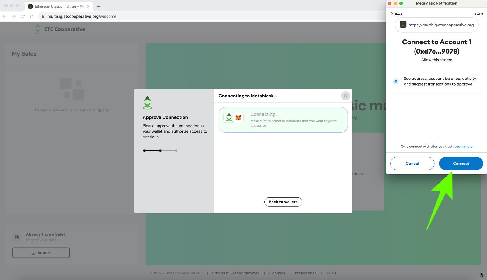
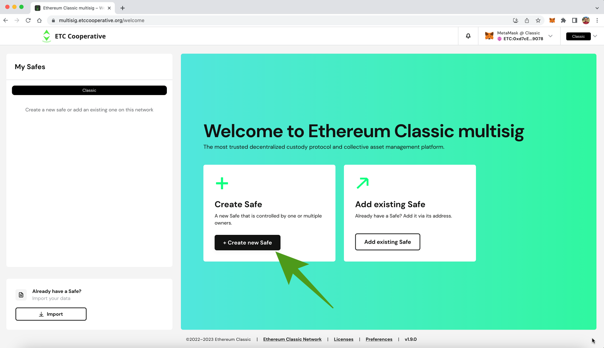
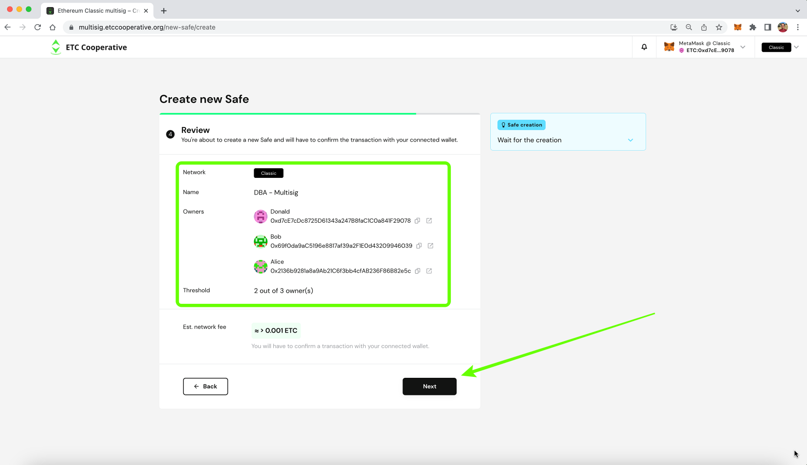
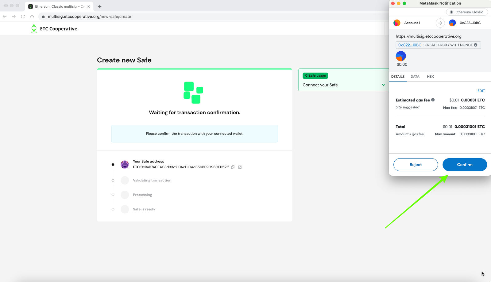
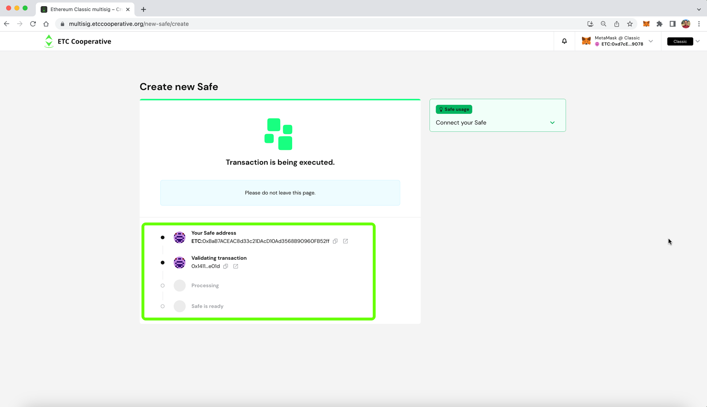
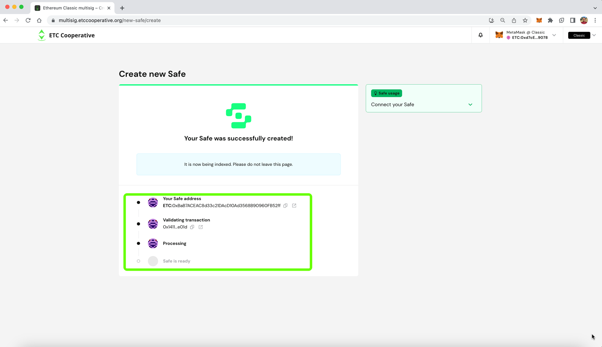
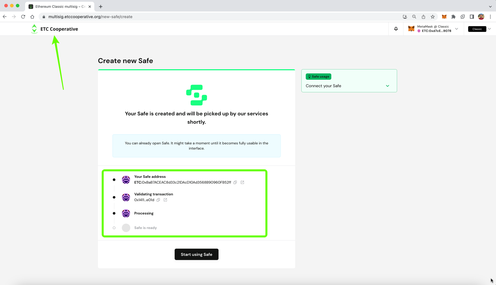

---
**You can listen to or watch this video here:**

<iframe width="560" height="315" src="https://www.youtube.com/embed/I6yS8SR_P6E" title="YouTube video player" frameborder="0" allow="accelerometer; autoplay; clipboard-write; encrypted-media; gyroscope; picture-in-picture; web-share" allowfullscreen></iframe>

---

In November of 2022, the ETC Cooperative [launched](https://ethereumclassic.org/blog/2022-11-11-the-ethereum-classic-safe-multisignature-wallet-explained) the Ethereum Classic Safe Multisignature wallet that has been renamed to "Catacomb ETC Wallet" and was totally redesigned.

In this post we will show the new user interface and explain how to create a new ETC multisignature wallet on the Ethereum Classic network.

In the next few posts we will explain how to use the multisignature wallet and how to export and import them to the application.

Please follow the steps below to create a new Catacomb multisignature wallet.

## 1. Go to Catacomb ETC Wallet

The first thing is to go to the Catacomb ETC Wallet at this address: https://multisig.etccooperative.org

## 2. Set Network

Once on the home, you need to set what network you will work on. For this, go to the dropdown menu on the top right and click on it to select the network.

## 3. Select "Classic"

When you see the dropdown menu, you will see two options "Classic" and "Mordor". 

Classic is the ETC mainnet or main blockchain, and Mordor is a testnet for developers. In our case, we are going to deploy an ETC multisig wallet on the ETC blockchain so we will select "Classic".

## 4. Connect a Wallet

In the next step, we have to connect a wallet to the Catacomb ETC Wallet, so for that click on the dropdown menu that says "connect wallet" in red on the top right, beside the networks dropdown menu.

## 5. Press "Connect"

In the next step, a button that says "Connect" will appear. Click on it. 

## 6. Select the Wallet to Use

In the next step, a menu with several options will appear. We will connect our MetaMask wallet for this example, but you may use any of the options provided.

## 7. We Log In to Our MetaMask (You May Use the Wallet You Selected)

In the next step, MetaMask will open automatically and we need to log in.

## 8. Select an Address to Use

In the next step, MetaMask will ask us which ETC wallet we wish to connect. We have only one, so we selected that one and pressed "Next" on MetaMask. 

## 9. Press "Connect"

Now MetaMask is ready to connect with Catacomb ETC Wallet, press the "Connect" button.

## 10. Create New Multisig Wallet

Now that we have selected the ETC blockchain to deploy the new ETC multisig wallet that we will create and the wallet that we will use, we can go ahead and create a new multisig wallet.

Click on "Create new Safe".

## 11. Field to Name New Multisig Wallet

In the next step, ETC multisig will provide a field to name this wallet.

## 12. Enter a Name

Go ahead and enter a name. We used the term "DBA - Multisig", but you may use whatever name is best for your use case. Then, press "Next".

## 13. Enter the Owners of the New Multisig Wallet

In the next step, Catacomb ETC Wallet will ask you to enter all the owners for this wallet. We used the "Add new owner" link to add three persons who will control this wallet: Donald, Bob, and Alice.

Then, you need to enter the ETC addresses controlled by Donald, Bob, and Alice that will be used to sign transactions for this multisig wallet.

Finally, you need to set the threshold of how many signatures are needed to sign transactions in this multisig wallet. For example, you may choose, 1 of 3, 2 of 3, or 3 of 3. 

In this case, we chose 2 of 3. This means that a minimum of 2 persons need to sign to send transactions to move funds from this wallet.

To proceed, press "Next".

## 14. Review Your Choices

In the next step, Catacomb ETC Wallet will ask you to review your choices and will show you the estimated network fees to deploy your wallet. 

If everything looks ok, then press "Next" to deploy your new multisig wallet on the ETC network.

## 15. Multisig Wallet Address Created, Confirm Wallet Creation

In the next step, notice that your new wallet address was created. This is the address that needs to be used from now on to receive and send ETC when using this multisignature wallet. Do not use the addresses provided for the persons to sign. Those are only to sign transactions, not to send and receive funds.

Now, Catacomb ETC Wallet will invoke your wallet again to send the transaction and smart contract to the ETC blockchain. 

Our MetaMask wallet opened and we clicked on "Confirm" to proceed. 

## 16. Check Status and Wait

In the next screen, Catacomb ETC Wallet will show you the status of the deployment of your new multisig wallet, which is a smart contract on the ETC network.

You will need to wait several minutes for the smart contract to be deployed on the ETC blockchain and for the Catacomb ETC Wallet app to associate with it.

## 17. Wait for Processing, Do Not Close the Window

After a while you will see that the "processing" step is on. You still need to wait a moment to proceed. Do not close your window.

## 18. Multisig Wallet Processed, Check on the Home 

After a few minutes, our Catacomb ETC Wallet application will tell you that you may start using your new multisig wallet, but it will take a bit longer to be completely functional. 

In the meantime we went to the home to see if our wallet is there.

## 19. Multisig Wallet Created!

Now, on the home of the Catacomb ETC Wallet application, we may see that our wallet was created.

In our next post we will explain how to use the Catacomb ETC Wallet we created!

---

**Thank you for reading this article!**

*The ETC Cooperative thanks the Safe team for the multisignature wallet redesign.*

To learn more about ETC please go to: https://ethereumclassic.org
