---
**您可以由此收听或观看本期内容:**

<iframe width="560" height="315" src="https://www.youtube.com/embed/I6yS8SR_P6E" title="YouTube video player" frameborder="0" allow="accelerometer; autoplay; clipboard-write; encrypted-media; gyroscope; picture-in-picture; web-share" allowfullscreen></iframe>

---

在2022年11月，ETC合作社推出了重新命名为“Ethereum Classic Multisig”的以太坊经典多签名钱包，并进行了全面重新设计。

在本文中，我们将展示新的用户界面，并解释如何在以太坊经典网络上创建一个新的ETC多签名钱包。

在接下来的几篇文章中，我们将解释如何使用多签名钱包，以及如何将其导出和导入到应用程序中。

请按照以下步骤创建一个新的以太坊经典多签名钱包。

## 1.前往以太坊经典多签钱包

T首先，前往ETC多签名钱包的地址: https://multisig.etccooperative.org

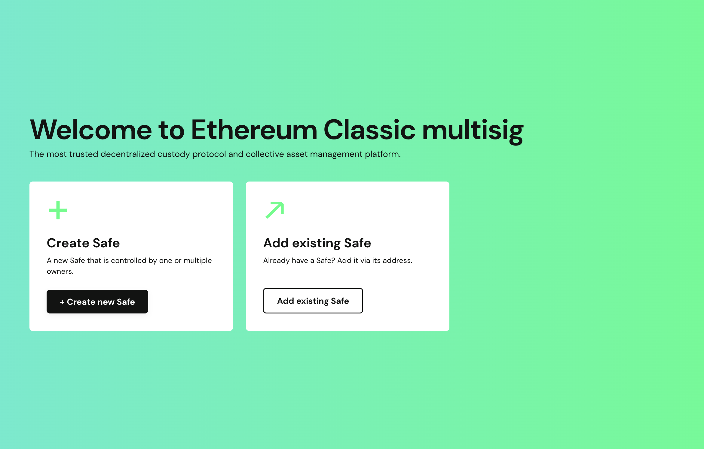

## 2.设置网络
在首页上，您需要设置您将要使用的网络。为此，请转到右上角的下拉菜单，并单击以选择网络。

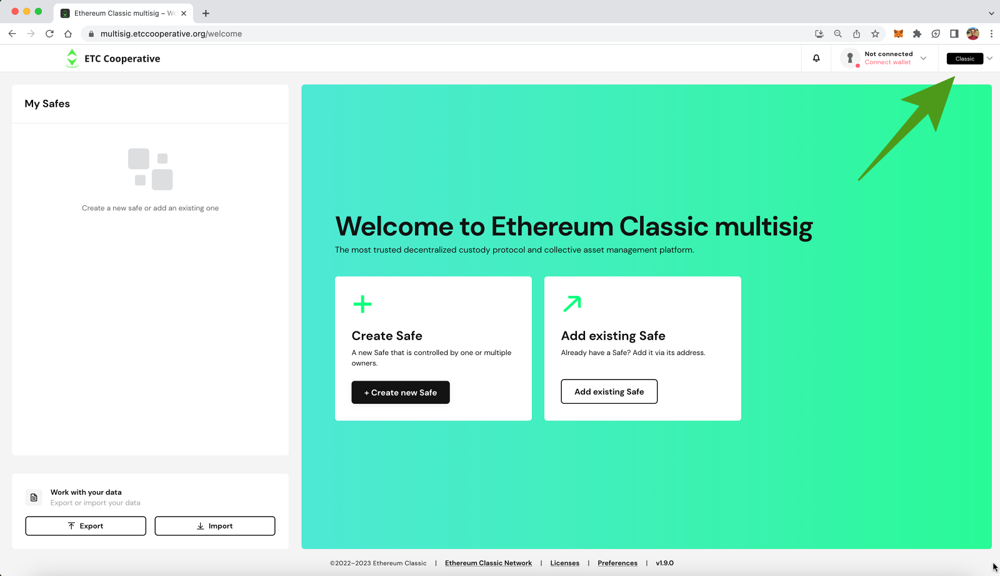

## 3.选择“classic”

当您看到下拉菜单时，您会看到两个选项："Classic"和"Mordor"。

Classic是ETC的主网或主区块链，而Mordor是供开发人员使用的测试网络。在我们的情况下，我们将在ETC区块链上部署一个ETC多签名钱包，因此我们将选择"Classic"。

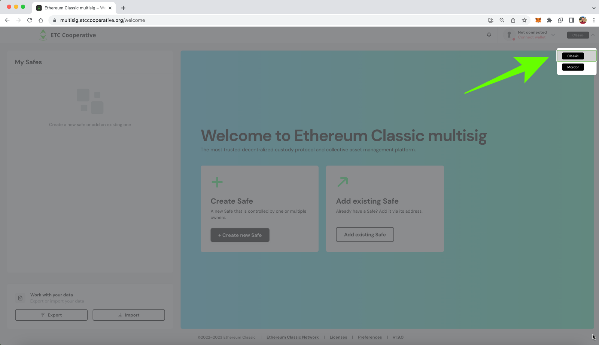

## 4.连接钱包

在接下来的步骤中，我们需要将钱包连接到ETC多签名钱包，因此请点击右上角的红色下拉菜单，上面标有"connect wallet"。

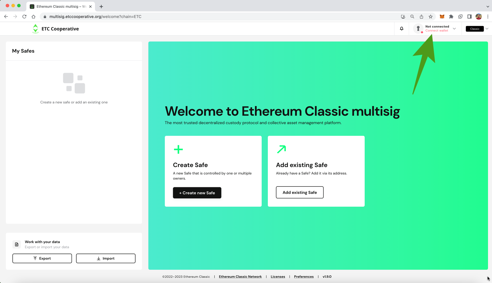

## 5.点击"Connect"（连接）

在接下来的步骤中，将出现一个标有"Connect"的按钮。请点击它。

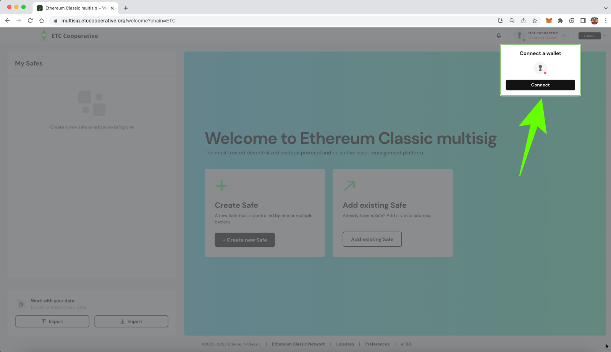

## 6.选择钱包进行使用

在接下来的步骤中，将出现一个带有多个选项的菜单。在本示例中，我们将连接我们的MetaMask钱包，但您也可以使用提供的其他选项之一。

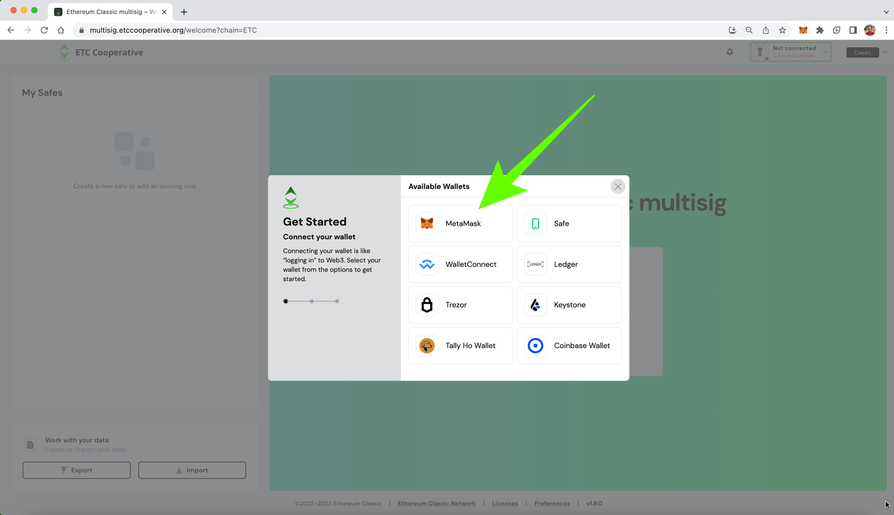

## 7.登陆Metamask(您可以使用您选择的钱包)

在接下来的步骤中，MetaMask将自动打开，我们需要登录。

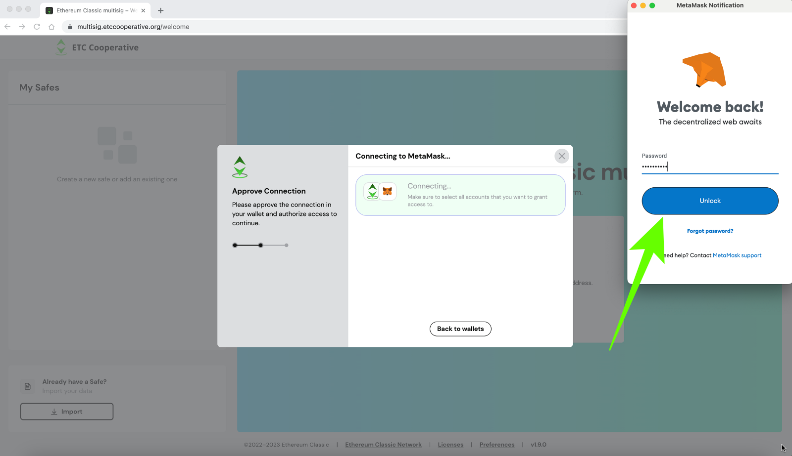

## 8.选择要使用的地址

在接下来的步骤中，MetaMask将询问我们要连接的ETC钱包。我们只有一个钱包，因此我们选择了该钱包，并在MetaMask上点击了"Next"。

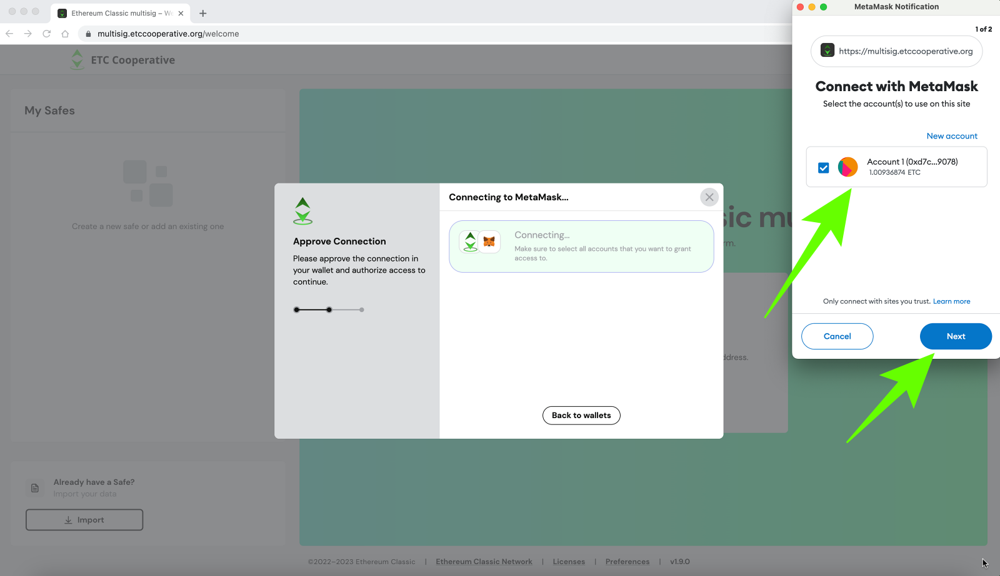

## 9.点击"Connect"

现在MetaMask已准备好与ETC多签名钱包连接，请点击"Connect"按钮。

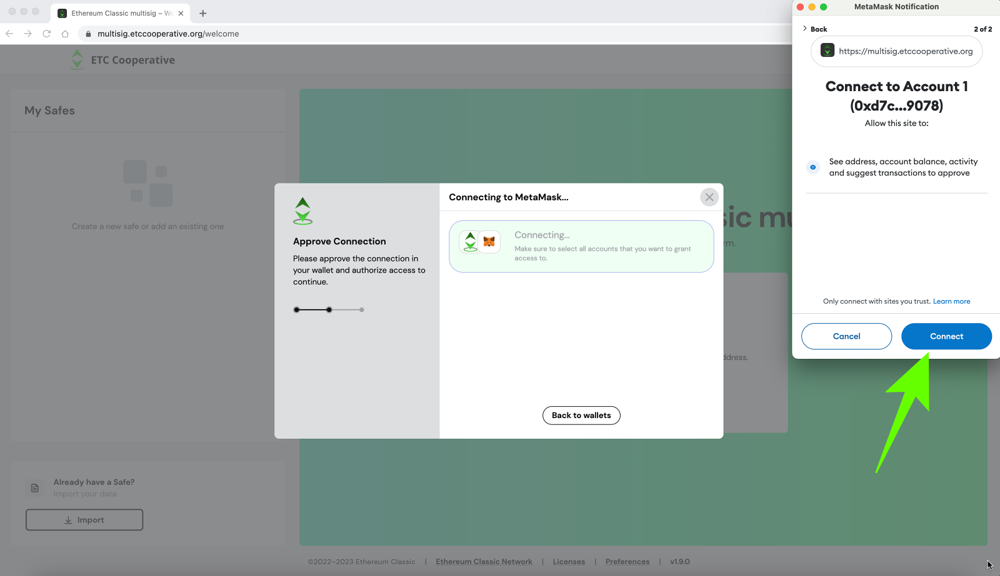

## 10.创建新的多签名钱包

现在，我们已经选择了ETC区块链来部署我们将要创建的新的ETC多签名钱包，并选择了要使用的钱包，我们可以继续创建一个新的多签名钱包。

点击"Create new Safe"。

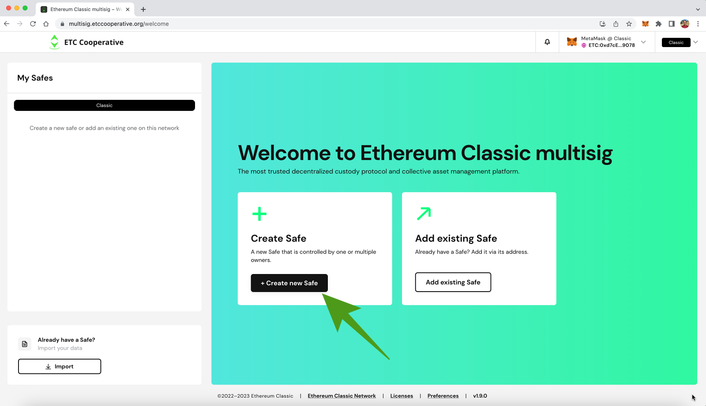

## 11.命名新的多签名钱包字段

在接下来的步骤中，ETC多签名钱包将提供一个字段用于命名该钱包

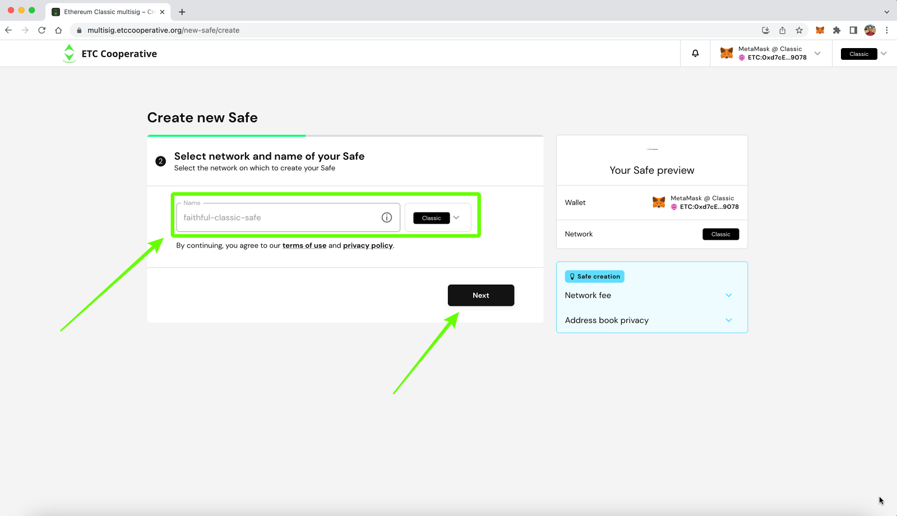

## 12.输入名称

请继续输入一个名称。我们使用了"DBA - Multisig"这个术语，但您可以根据您的用例使用任何最适合的名称。然后，点击"Next"。

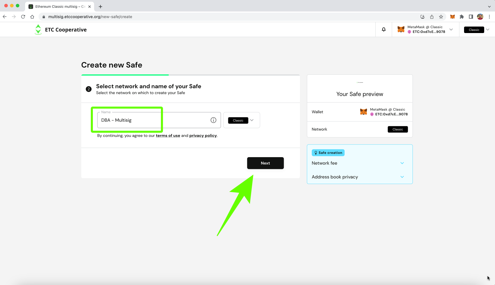

## 13.输入新的多签名钱包的所有者

在接下来的步骤中，Ethereum Classic多签名钱包将要求您输入该钱包的所有者。我们使用"Add new owner"链接添加了三个人，他们将控制该钱包：Donald、Bob和Alice。

然后，您需要输入由Donald、Bob和Alice控制的ETC地址，这些地址将用于为该多签名钱包签署交易。

最后，您需要设置在该多签名钱包中签署交易所需的签名数量的阈值。例如，您可以选择1 of 3、2 of 3或3 of 3。

在这种情况下，我们选择了2 of 3。这意味着至少需要2个人签署才能从该钱包中发送交易并转移资金。

要继续，请点击"Next"。

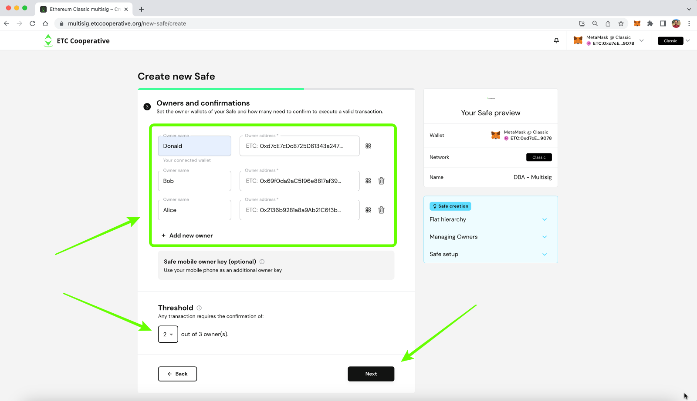

## 14.检查您的选择

在接下来的步骤中，ETC多签名钱包将要求您检查您的选择，并显示部署钱包的预计网络费用。

如果一切看起来都没问题，然后点击"Next"来在ETC网络上部署您的新多签名钱包。

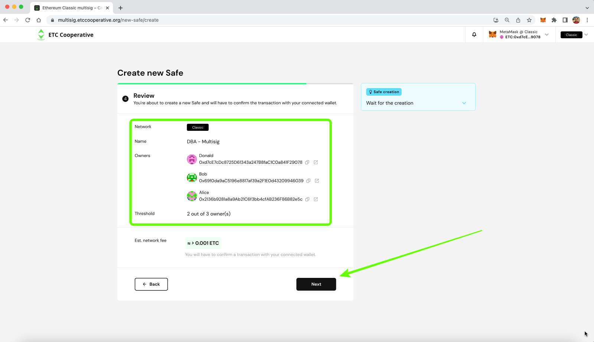

## 15.创建多签名钱包地址，确认钱包创建

在接下来的步骤中，请注意您的新钱包地址已经创建。这是以后使用该多签名钱包时需要使用的地址，用于接收和发送ETC。请不要使用为个人提供的地址进行发送和接收资金。

现在，ETC多签名钱包将再次调用您的钱包以发送交易和智能合约到ETC区块链。

我们的MetaMask钱包已经打开，我们点击"Confirm"继续。

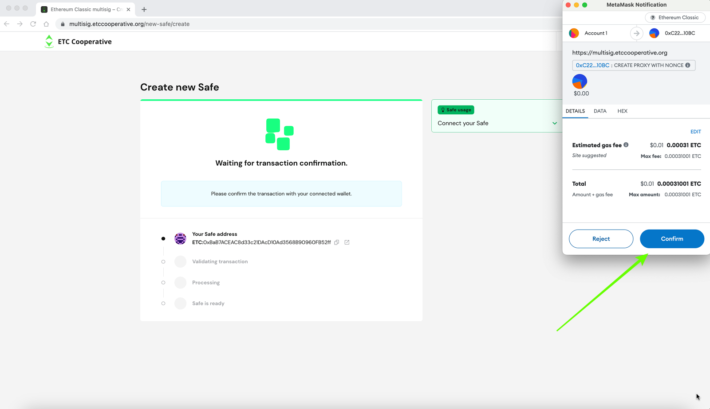

## 16.检查状态并等待

在接下来的界面上，ETC多签名钱包将显示您的新多签名钱包（在ETC网络上是一个智能合约）的部署状态。

您需要等待几分钟，让智能合约在ETC区块链上部署，并让ETC多签名应用程序与之关联。

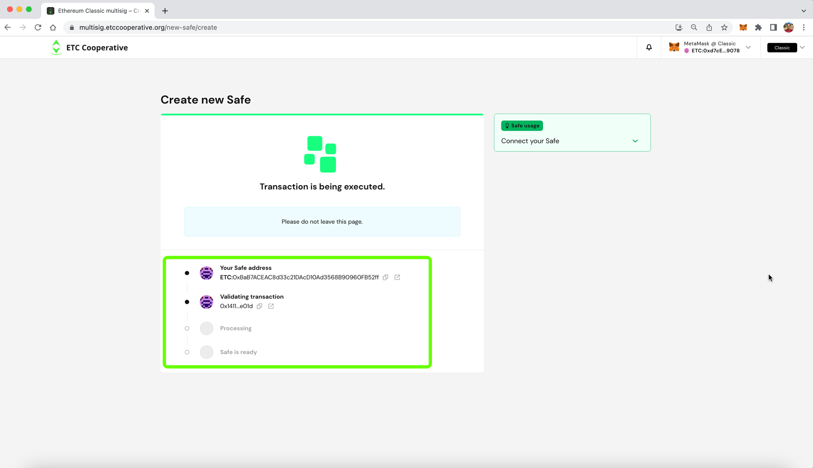

## 17.等待处理，请勿关闭窗口

过一段时间后，您将看到"processing"步骤已经开始。您仍然需要等待片刻才能继续。请不要关闭窗口。

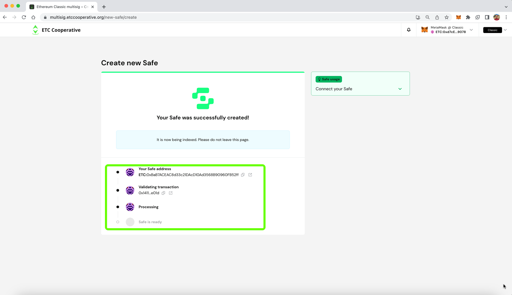

## 18.ETC多签名已处理，请在主页上查看

几分钟后，我们的ETC多签名应用程序将告诉您，您可以开始使用您的新多签名钱包，但完全功能可能需要更长时间。

在此期间，我们前往主页查看我们的钱包是否存在。

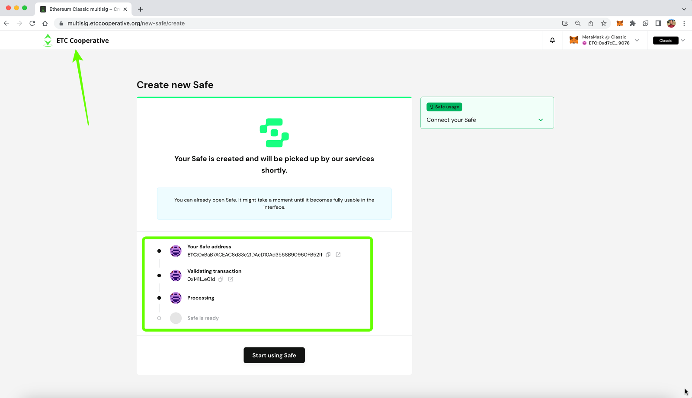

## 19.ETC多签名钱包已创建！

现在，在ETC多签名应用程序的主页上，我们可以看到我们的钱包已创建。

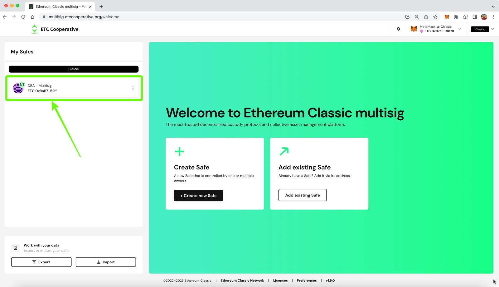

在我们的下一篇文章中，我们将解释如何使用我们创建的ETC多签名钱包！

---

**感谢您阅读本期文章**

*ETC合作社感谢Safe团队对多签名钱包进行的重新设计工作。*

了解更多有关ETC，欢迎访问: https://ethereumclassic.org
