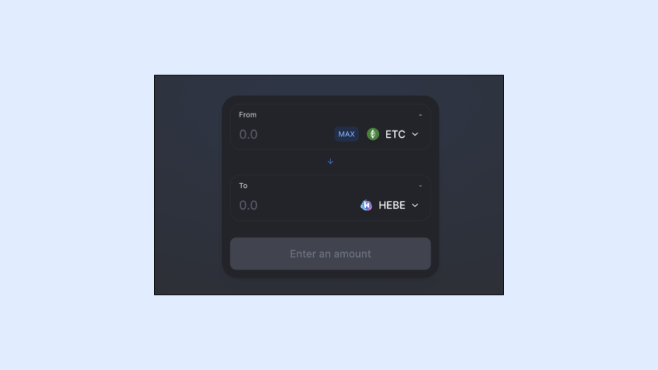
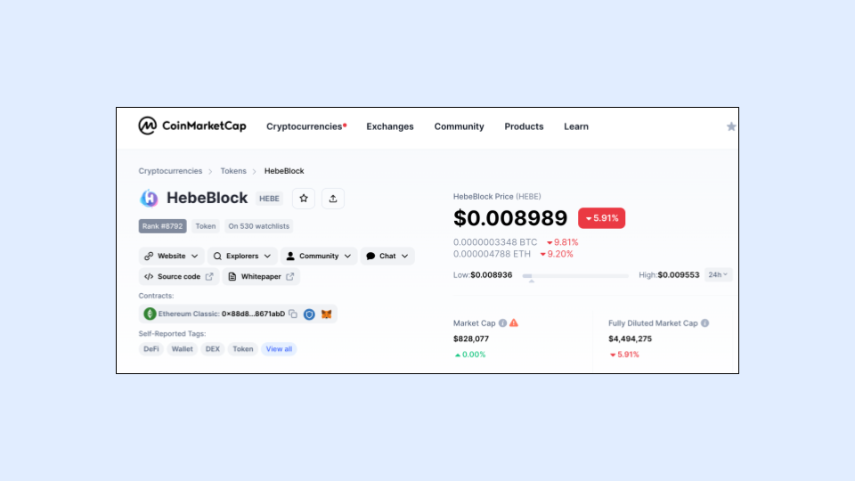
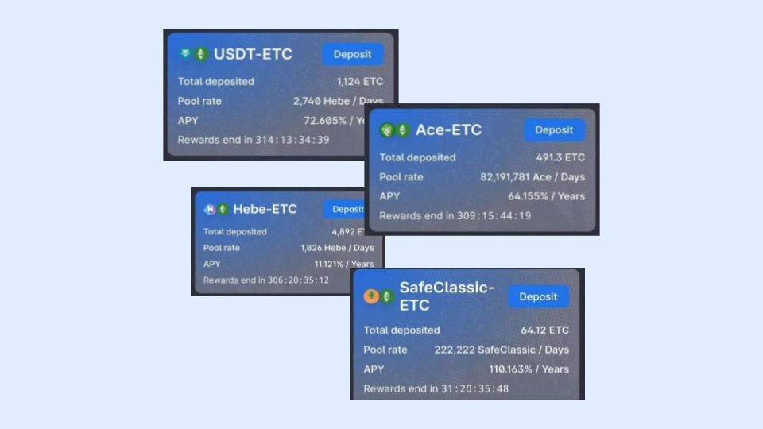
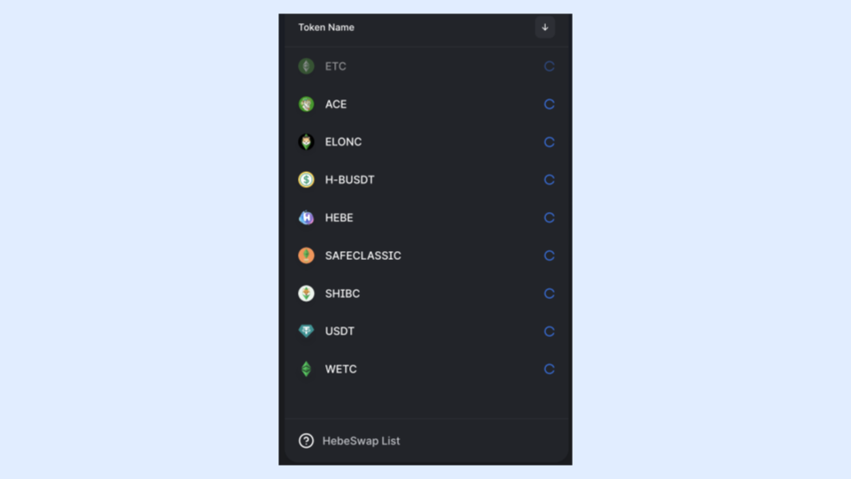
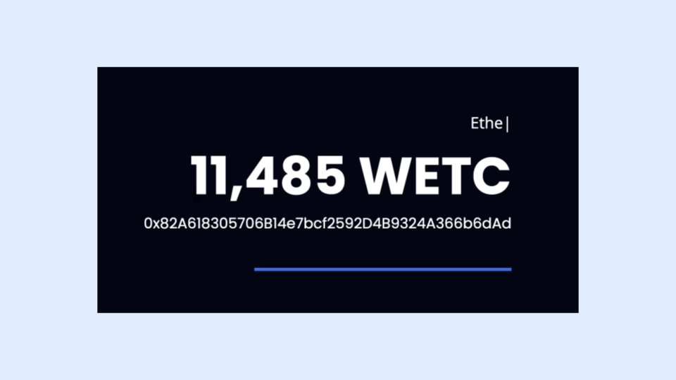

---
**You can listen to or watch this video here:**

<iframe width="560" height="315" src="https://www.youtube.com/embed/26ZpZiWWEsw" title="YouTube video player" frameborder="0" allow="accelerometer; autoplay; clipboard-write; encrypted-media; gyroscope; picture-in-picture; web-share" allowfullscreen></iframe>

---

## The HebeBlock Team

[HebeBlock](https://hebeblock.com/) (Hebe for short) is a team of Chinese origin that is dedicated to building dapps on Ethereum Classic (ETC). They are composed of three software engineers, including the founder, Zhang, a Java developer, CC, and Candy, who is a front end engineer.

Hebe is the brand that groups several of the products they have built and deployed in the ETC network. Zhang, CC, and Candy have been working in the ETC ecosystem for several years and are key participants in the community.

At the developer level, they maintain several nodes of the Mordor testnet of the ETC community, they mine it, and distribute [free mETC](https://easy.hebeswap.com/#/), the cryptocurrency of the testnet, to other developers who wish to try their dapps on Mordor.

## The Founder’s Commitment to Ethereum Classic

Hebe’s team has always maintained a firm commitment to ETC and they are a very prolific builder in the ecosystem. 

In a recent statement made to us, the founder expressed the following:

*At HebeSwap, we passionately believe in the unwavering potential of Ethereum Classic being the original Ethereum, the largest smart contract capable proof of work chain and its core values of decentralization, security, and immutability. Our commitment to these principles drives us to develop products that not only bolster the ETC ecosystem but also attract new users to join our thriving community. Together, we're fostering a more inclusive, sustainable, and resilient future for digital finance. Embrace the revolution with HebeSwap – where Ethereum Classic's vision comes to life.*

## Hebe Products

Hebe has deployed and maintains 11 dapps on the Ethereum Classic blockchain.

The most prominent of these are:

- HebeSwap, a decentralized exchange (DEX) [link](https://hebeswap.com/)
- Hens, an ETC domain name system [link](https://app.hens.domains/)
- Hebe Wallet, a non custodial crypto wallet [link](https://hebe.cc/)
- EtcScan, an ETC blockchain explorer [link](https://etcerscan.com/)
- Hebe Token Factory, a dapp for people to issue their own ERC-20 tokens [link](https://easy.hebeswap.com/#/)

## The HEBE Token

Like many DeFi teams have done, the Hebe team has launched the HEBE token, which trades in their HebeSwap decentralized exchange and is listed on CoinMarketCap with the symbol “HEBE”, to finance their operation.

The total supply of the token is 500,000,000 HEBE, of which there are 92,000,000 already issued.

The token is issued at a rate of 1,000,000 per month.
 
## A Future Governance DAO

The HEBE token will be used for governance purposes as well.

The HebeBlock team projects that they will be launching a DAO so the community may vote on development, upgrades, and compensation issues.

They estimate that when the token rises in value as the ecosystem grows, that the monthly issuance may be significantly reduced. For this they will have the DAO setup for the community to vote on these issues.

Owning HEBE tokens gives and will give users other benefits such as staking in liquidity pools (LPs), earning income from dapp fees, and other perks.

## Staking HEBE, ETC, and Other Coins

As to providing liquidity to the HebeSwap system of ERC-20 token trading pairs, users may purchase HEBE and match it with ETC, USDT, or other tokens to add volume to the corresponding LPs.

They call this “Staking” or “liquidity mining” as an analogy to earning passive income from providing capital in proof of stake chains or from mining ETC.

The way it works is that users may deposit cryptocurrencies into the liquidity pools in the proportions of the market price for each pair. Then, when traders pay commissions as they buy and sell these pairs, part of the commissions is paid as interest to the liquidity providers.

## Total Value Locked  Statistics

HebeSwap is the largest DEX dapp on the ETC DeFi ecosystem with a [total value locked (TVL)](https://defillama.com/chain/EthereumClassic?tvl=true) of around $350,000.

HebeSwap has 9 tokens listed of which 8 are ERC-20 tokens and one is ETC.

## External Tokens Through Multichain

All the external tokens, meaning the tokens that are not issued inside ETC but exist in other chains, are bridged into the Ethereum Classic network through a technology called Multichain.

An example of a cross-chain ERC-20 token that trades on HebeSwap through Multichain is USDT.

## Wrapped ETC

Wrapped ETC (WETC) is a way to send ETC to a smart contract and to transform it into an ERC-20 token so it is easier to use and trade in many dapps.

The Hebe team has launched one of the most popular WETC smart contracts and has more than 11,000 ETC wrapped.

## Using HebeSwap to Trade ERC-20 Tokens on Ethereum Classic

As said before, HebeSwap has become the largest decentralized exchange in Ethereum Classic, it is growing organically and is a fundamental piece of infrastructure for the ecosystem

In it, users may trade ETC for WETC, and then trade several other ERC-20 tokens. As liquidity grows in time, more native ERC-20 tokens will be listed and more cross-chain tokens will be brought to ETC that will be available on the DEX as well.

In part II of this series, we will provide a tutorial of how to trade on the HebeSwap DEX, for example buying HEBE and exchanging ETC for WETC.

---

**Thank you for reading this article!**

To learn more about ETC please go to: https://ethereumclassic.org
