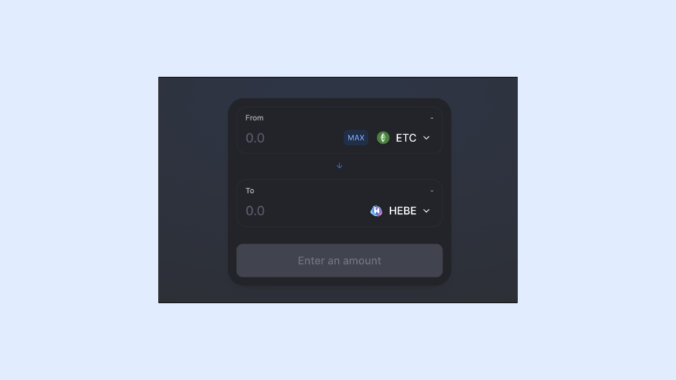
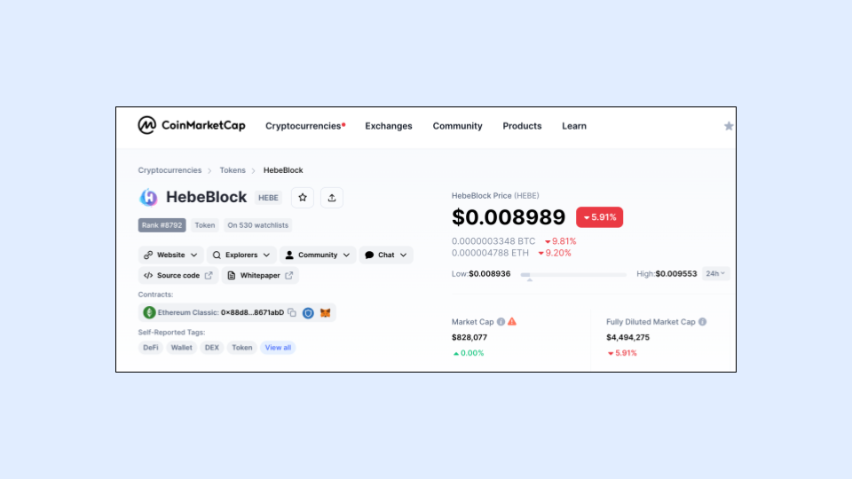
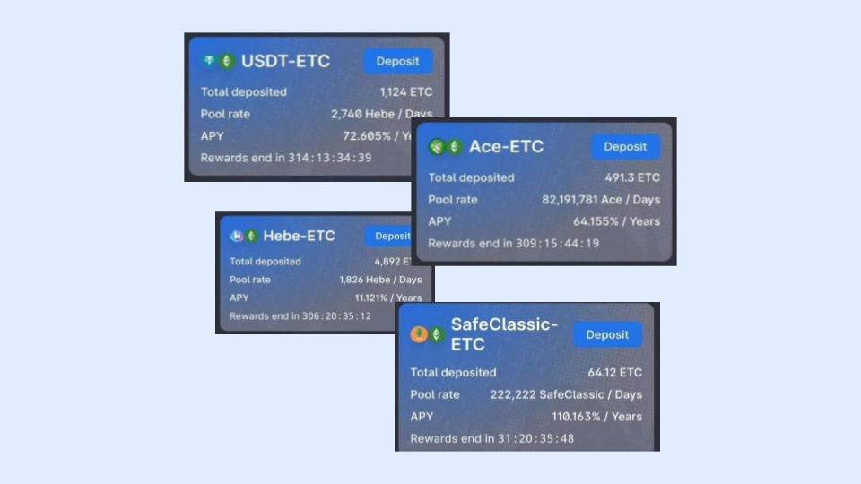
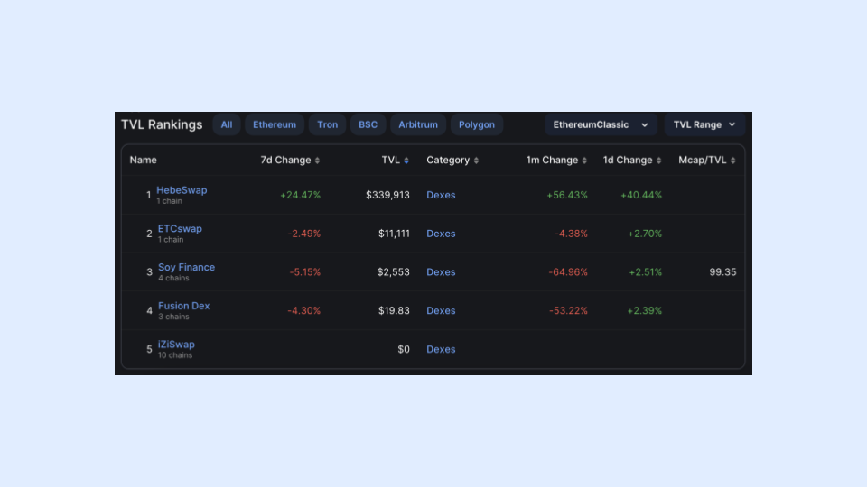
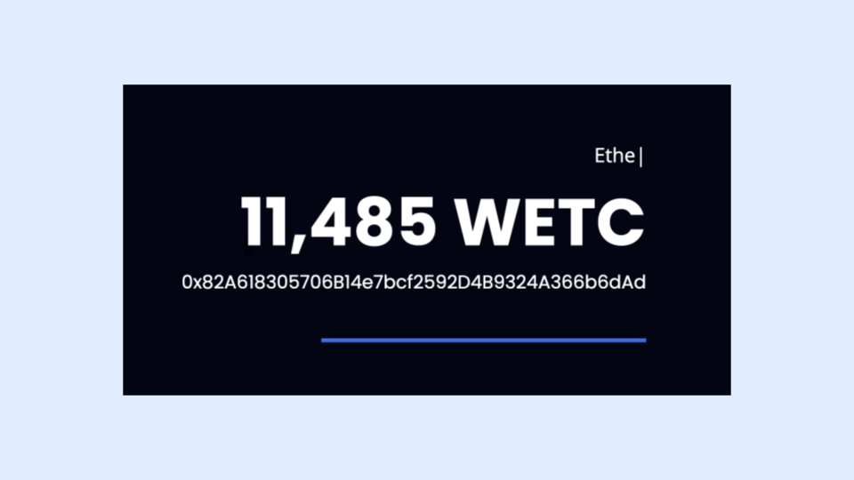

---
**您可以由此收听或观看本期内容:**

<iframe width="560" height="315" src="https://www.youtube.com/embed/26ZpZiWWEsw" title="YouTube video player" frameborder="0" allow="accelerometer; autoplay; clipboard-write; encrypted-media; gyroscope; picture-in-picture; web-share" allowfullscreen></iframe>

---

## HebeBlock团队

[HebeBlock](https://hebeblock.com/)简称Hebe）是一支源自中国的团队，致力于在以太经典（ETC）上构建dapps。团队由三名软件工程师组成，包括创始人张先生、Java开发者CC和前端工程师Candy。

Hebe是该团队所建立和部署在ETC网络上的多个产品的品牌。张先生、CC和Candy在ETC生态系统中工作了多年，并且是社区的重要参与者。

在开发者层面，他们维护着ETC社区的Mordor测试网络的多个节点，进行挖矿，并向其他希望在Mordor上尝试他们的dapps的开发者分发[免费的mETC（测试网络的加密货币）](https://easy.hebeswap.com/#/)。

## 创始人对以太经典的承诺

Hebe团队一直坚定地致力于ETC，并在该生态系统中是非常多产的建设者。

在最近的一份给我们的声明中，创始人表达了以下观点：

*在HebeSwap，我们对以太经典始终充满激情，认为它是最初的以太坊、最大的智能合约能力的工作量证明链，以及其分散化、安全性和不可变性的核心价值观。我们对这些原则的承诺驱使我们开发产品，不仅增强ETC生态系统，还吸引新用户加入我们蓬勃发展的社区。我们共同为数字金融的包容性、可持续性和弹性未来努力。与HebeSwap一起拥抱革命，让以太经典的愿景变为现实。*

## Hebe Products

Hebe在以太经典区块链上部署并维护了11个dapp。

其中最重要的包括：

- HebeSwap，去中心化交易所（DEX） [链接](https://hebeswap.com/)
- Hens，以太经典域名系统 [链接](https://app.hens.domains/)
- Hebe Wallet，非托管加密钱包 [链接](https://hebe.cc/)
- EtcScan，以太经典区块链浏览器 [链接](https://etcerscan.com/)
- Hebe Token Factory，用于发行自己的ERC-20代币的dapp [链接](https://easy.hebeswap.com/#/)

## HEBE代币

与许多DeFi团队一样，Hebe团队推出了HEBE代币，该代币在他们的HebeSwap去中心化交易所上交易，并在CoinMarketCap上以“HEBE”符号进行列出，用于为他们的运营提供资金。

该代币的总供应量为5亿个HEBE，其中已发行的数量为9200万个。

该代币的发行速度为每月100万个。
 
## 未来的治理DAO

HEBE代币也将用于治理目的。

HebeBlock团队计划推出一个DAO，让社区可以对开发、升级和补偿问题进行投票。

他们预计随着生态系统的发展，当代币价值上升时，每月的发行量可能会大幅减少。为此，他们将设置DAO，让社区对这些问题进行投票。

持有HEBE代币将给用户带来其他福利，例如在流动性池中进行质押（staking），从dapp费用中获得收入以及其他特权。

## 质押HEBE、ETC和其他代币

对于提供流动性给HebeSwap的ERC-20代币交易对系统，用户可以购买HEBE并将其与ETC、USDT或其他代币匹配，以增加相应流动性池的交易量。

他们将此称为“质押”或“流动性挖矿”，类比于在权益证明链上提供资金或挖矿以获取被动收入的方式，如挖掘ETC。

具体操作方式是，用户可以按照每对交易对的市场价格比例将加密货币存入流动性池中。然后，当交易者在购买和销售这些交易对时支付手续费，其中一部分手续费将用于支付给流动性提供者的利息。

## 总锁定价值统计

HebeSwap是ETC DeFi生态系统中最大的去中心化交易所（DEX）dapp，其[总锁定价值（TVL）](https://defillama.com/chain/EthereumClassic?tvl=true)约为35万美元。

HebeSwap上列出了9种代币，其中8种是ERC-20代币，另一种是ETC。

## 通过Multichain引入的外部代币

所有外部代币，也就是不在ETC内部发行但存在于其他链上的代币，都是通过名为Multichain的技术桥接到Ethereum Classic网络上的。

一个通过Multichain在HebeSwap上交易的跨链ERC-20代币的例子是USDT。

## 包装的ETC

包装的ETC（WETC）是一种将ETC发送到智能合约，并将其转换为ERC-20代币的方式，以便在许多dapp中更容易使用和交易。

Hebe团队推出了其中一个最受欢迎的WETC智能合约，已经包装了超过11,000个ETC。

## 在ETC上使用HebeSwap交易ERC-20代币

正如前面所述，HebeSwap已成为ETC上最大的去中心化交易所，它正在有机地增长，并成为该生态系统的基础设施的重要组成部分。

在HebeSwap上，用户可以将ETC交换为WETC，并交易其他多种ERC-20代币。随着时间的推移，随着流动性的增长，将有更多原生ERC-20代币上市，也会引入更多的跨链代币到ETC，这些代币也将在该去中心化交易所上提供交易。

在这个系列的第二部分，我们将提供一个教程，介绍如何在HebeSwap DEX上进行交易，例如购买HEBE并将ETC交换为WETC。

---

**感谢您阅读本期文章!**

了解更多有关ETC，欢迎访问: https://ethereumclassic.org
