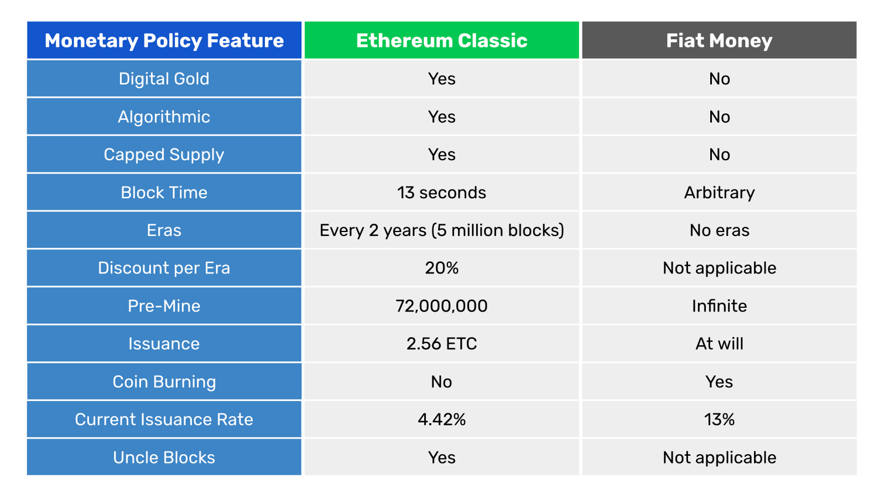
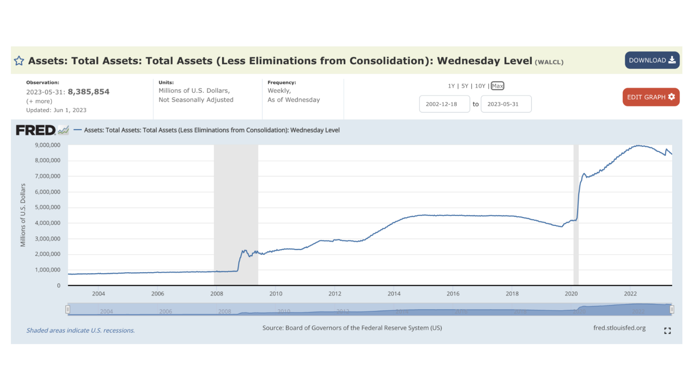

---
**You can listen to or watch this video here:**

<iframe width="560" height="315" src="https://www.youtube.com/embed/aoY6XT6MHM4" title="YouTube video player" frameborder="0" allow="accelerometer; autoplay; clipboard-write; encrypted-media; gyroscope; picture-in-picture; web-share" allowfullscreen></iframe>

---

In this post we will make a comparison of the Ethereum Classic (ETC) and fiat monetary policies.

We will use ETC as base money and fiat money as base money. This is, that we will describe ETC’s issuance and stock at the network protocol layer without taking into account any fractional reserve multiplier that may occur at the exchanges and dapps that use crypto for margin lending and lending in general.

In the same way, we will use the classical policies pertaining fiat money with regards to what is called “base money” or the money that the central bank issues without taking into account the multiplier of the money that occurs in the fractional reserve system that is managed by the rest of the banks of the economy.

When referring to “fiat money” generically, we will mainly describe the way the United States Federal Reserve manages the base money. However, this is nearly identical in all monetary systems in all national currencies across the world.

We start with the comparison table below and then we will explain each line.

## Digital Gold

ETC is digital gold and fiat money is not.

ETC is digital gold because it is a proof of work blockchain and the purpose of that consensus mechanism is to make it as costly to create ETC as it is costly to produce gold in the real world.

The way it works is that miners in the blockchain create blocks of transactions, and to stamp them cryptographically they need to do a lot of computational work, which uses a lot of electricity. Then, when the blocks are accepted by the rest of the network, the miners are credited newly issued coins by the algorithm.

The above system guarantees that ETC will be sound money as gold was in the old days, hence the term “digital gold”.

Fiat money is not gold nor digital gold because a) it ended the gold standard decades ago and b) there is hardly any cost whatsoever to print more fiat currency.

The way fiat money works is that only the treasury of the government is allowed to print physical paper money and mint coins, and the central bank is exclusively allowed to create money by crediting it in the accounts of banks.

As both of these money creation methods have very low marginal costs, then there is no capital nor energy invested to produce the money, hence any amounts may be created at any time. It is just the will of the government to decide. 

Therefore, fiat money can’t be scarce as gold or digital gold.

## Algorithmic

ETC’s monetary policy is algorithmic because in 2017 it migrated to a schedule that is set in stone as it establishes the whole future distribution in the software in the form of a supply algorithm.

The supply algorithm is a set of simple and transparent mathematical rules that establish what number of coins will be paid to miners per block, the frequency of the payments, and a schedule that will decrease these payments as time passes by.

Fiat money is decided by a committee of central bankers that meets every few months. They evaluate the state of the economy and of government finances, and they decide whether to expand the base money stock or whether to contract it. They also decide at what level they will set interest rates. Therefore, fiat money is not algorithmic, but managed by technocrats.

## Capped Supply

ETC has a capped supply of its coin. This means that it’s known what is the total amount of ETC that will ever exist.

Given Ethereum Classic’s frequency of payments to miners, the number of coins it issues per block, and its discount schedule, it will have a maximum supply of 210,700,000 ETC.

Fiat money does not have a cap and is decided subjectively by government officials. As said before, they meet frequently and decide how much base money they will print or redeem in the market. This is a recipe for biased manipulation of the supply as the government itself is the largest consumer of newly minted money, and this has led to ballooning deficits, unmanageable national debt, inflation, and chronic depreciation of the value of fiat money around the world.

The above chart is a perfect example of how the issuance of base money has grown uncontrollably in the last 20 years in the US. In 2002 the total base money, as represented by the central bank’s assets, was $712 billion. In 2023, it is more than $8.38 trillion. This is an average of more than 13% money issuance per year.

## Block Time

Ethereum Classic’s block time is 13 seconds per block. This means that ETC miners create 6,646 blocks per day.

The block time of a blockchain is important because it establishes how fast the coins will be created, thus regulates the supply, providing certainty to the economy. 

By modulating the block times and the number of coins created per block a blockchain can control the monetary policy in time and supply levels forever.

Fiat money is created whenever the government wishes and there is no guidance or certainty as to the base money supply projection other than the brief communications of the central bank every few months.

## Eras

Ethereum Classic’s issuance is divided in eras. Fiat money issuance is unpredictable and decided arbitrarily by a committee whenever they wish.

Eras in ETC are measured in blocks in which the payments to miners, thus the issuance of coins, will be the same for each era.

Ethereum Classic’s eras last 5 million blocks which, at 13 seconds per block, turns out to be more or less 2 years per era.

After each era ETC discounts the payment to miners.

## Discount Per Eras

In Ethereum Classic, the discount per era is 20%. 
This means that since genesis, ETC has paid miners 5 ETC per block in the first era, then 4 ETC, then 3.20, and now is paying 2.56 which is the current era.

Fiat money issuance has no eras, is decided arbitrarily by the government, and there are no parameters or limits to their actions.

This results in patterns as the one seen in the Federal Reserve’s assets (which is analogous to the monetary base) chart above. There is no certainty as to the money supply, it is prone to abuse and over emission, creating chronic inflation, and letting the government loose to overspend, leading nations to bankruptcy and poverty.

## Pre-Mine

Because Ethereum Classic and Ethereum were one single project since the beginning, and the project started with a crowd sale that resulted in an initial issuance, or what is called a “pre-mine”, then both ETC and ETH have a pre-mine stock of coins that were created at genesis block.

This premine stock for Ethereum Classic was 72,000,000 ETC of the current supply of 140,600,000.

Fiat money has an infinite pre-mine. This is because, as many central bankers have famously explained on national television, they can just go to a computer terminal and add trillions of units of the currency to the economy whenever they wish.

This means that central banks have an infinite stock of the currency, it’s just their prerogative how much they will use of it at any time.

## Issuance

The current era in ETC is era 4 which is between block 15,000,001 and 20,000,000. This means it is paying 2.56 ETC per block to miners as explained before.

The next payments will be discounted by 20% per era lowering them to 2.048 ETC, then 1.6384, 1.311072, and so on until it diminishes completely approximately by the year 2140.

As said several times before in this post, central banks may issue currency whenever they wish. There is no program, certainty, or limitations whatsoever other than the government officials’ opinions and biases.

## Coin Burning

Fiat money has a coin burning mechanism and ETC does not.

The way the coin burning works in fiat money may be explained by describing how it is issued first. To issue money, central bankers may do two thing, a) credit newly issued money in the accounts of banks directly when they require loans, and b) buy government bonds to finance the state, or buy other securities in the open market, all with newly issued currency.

To burn money, central banks usually just wait until the loans they gave or securities they bought mature and the counterparties have to pay back the interest and amortizations.

This is why in the chart of the Fed’s assets above, there are periods when the stock actually was reduced albeit temporarily.

## Current Issuance Rate

If we calculate the number of blocks ETC produces per year and multiply that by the block reward payments, then we will get the total number of coins issued per year. If we divide that by the current supply, then we will know the current inflation rate.

Because ETC produces blocks every 13 seconds, this equals to 2,425,790 blocks per year. If we multiply that number by 2.56 ETC issued per block, we will get 6,210,022 ETC issued per year in the current era. If we divide this by the current supply of 140,600,000 ETC, then we get a current inflation rate of 4.42%.

As shown in the Federal Reserve’s assets chart above, the average issuance rate of fiat base money in the US has been 13% in the last 20 years. In many nations it is catastrophically higher.

## Uncle Blocks

Fiat money does not have blocks, thus uncle blocks. Ethereum Classic has uncle blocks. 

Each time a block is created in ETC, there may be up to two extra blocks that will get paid a minimal fee for the effort of building them. This was done because due to ETC’s mining algorithm, there is a probability that more than one block may be built by miners per round.

However, the uncle block rate is around 5% per era in ETC, meaning that only in 5% of occurrences there are actually other blocks created in the network. In addition to this, the payments to uncles are very low (they are currently 0.32 ETC for both uncles whenever they appear) and they are discounted by 20% per era as the other rewards, so the impact on the supply and issuance in ETC is minimal.

---

**Thank you for reading this article!**

To learn more about ETC please go to: https://ethereumclassic.org
