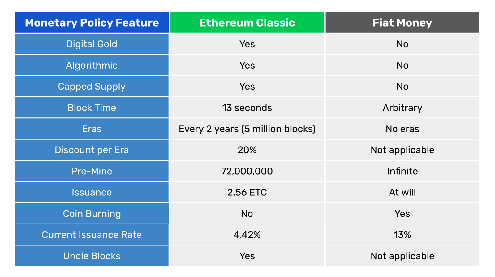

---
**您可以由此收听或观看本期内容:**

<iframe width="560" height="315" src="https://www.youtube.com/embed/aoY6XT6MHM4" title="YouTube video player" frameborder="0" allow="accelerometer; autoplay; clipboard-write; encrypted-media; gyroscope; picture-in-picture; web-share" allowfullscreen></iframe>

---

在本文中，我们将比较以太坊经典和法定货币的货币政策。

我们将以ETC作为基础货币，以法定货币作为基础货币。也就是说，我们将描述ETC在网络协议层面上的发行和存量，而不考虑在使用加密货币进行保证金借贷和一般借贷的交易所和去中心化应用（dapps）中可能发生的任何保留比例乘数。

同样地，我们将使用与法定货币相关的传统政策来描述中央银行发行的基础货币，而不考虑在由经济中其他银行管理的保留比例制度中发生的货币乘数。

当泛指"法定货币"时，我们主要描述美联储管理基础货币的方式。然而，这在世界范围内的所有国家货币的货币体系中几乎是相同的。

我们从下面的比较表开始，然后解释每一行。
  

## 数字黄金

ETC是数字黄金，而法定货币则不是。

ETC之所以被称为数字黄金，是因为它是一种工作量证明的区块链，这种共识机制的目的是使创建ETC的成本与在现实世界中开采黄金的成本相当。

其工作方式是区块链中的矿工创建交易区块，并通过进行大量的计算工作和消耗大量电力来对其进行密码学加密。然后，当区块被网络中的其他节点接受时，矿工将按照算法获得新发行的代币。

上述系统确保ETC将成为像古代黄金一样的有价值的货币，因此有了"数字黄金"这一术语。

法定货币既不是黄金，也不是数字黄金，因为：a）几十年前就取消了金本位制度，b）几乎没有任何成本来印刷更多的法定货币。

法定货币的运作方式是只有政府的国库被允许印刷纸币和铸造硬币，而中央银行则独家负责通过在银行账户中记账的方式创建货币。

由于这两种货币创造方法的边际成本非常低，因此几乎没有资本或能源投入到货币的生产中，因此可以随时创造任意数量的货币。这仅仅取决于政府的意愿。

因此，法定货币无法像黄金或数字黄金那样稀缺。

## 算法化

ETC的货币政策是算法化的，因为在2017年，它迁移到了一个固定的计划中，将整个未来的分发量以软件的形式以供应算法的方式确定下来。

供应算法是一组简单而透明的数学规则，确定每个区块将支付给矿工的代币数量、支付频率以及随着时间推移逐渐减少的支付计划。

法定货币由中央银行家委员会决定，他们每隔几个月会开会。他们评估经济状况和政府财政状况，并决定是扩大基础货币存量还是缩减它。他们还决定设置利率的水平。因此，法定货币不是算法化的，而是由技术专家管理的。

## 有限供应

ETC的代币供应是有限的。这意味着我们知道ETC的总量将永远不会超过多少。

根据以太坊经典向矿工支付的频率、每个区块发行的代币数量以及其折扣计划，其最大供应量将为2,107,000,000个ETC。

法定货币没有上限，并由政府官员主观决定。正如之前所说，他们经常开会，决定在市场上印刷或回收多少基础货币。这是一种导致供应偏向性操纵的做法，因为政府本身是新印钞票的最大消费者，这导致财政赤字膨胀、难以管理的国家债务、通货膨胀以及全球法定货币价值的持续贬值。

上面的图表是过去20年来美国基础货币发行无法控制增长的完美例证。在2002年，中央银行资产所代表的总基础货币为7120亿美元。而到2023年，这个数字已经超过了8.38万亿美元。这平均每年超过13%的货币发行量增长。

## 区块时间

以太坊经典的区块时间为每个区块13秒。这意味着每天ETC矿工会创建6,646个区块。

区块链的区块时间很重要，因为它决定了代币的创建速度，从而调控了供应量，为经济提供了确定性。

通过调节区块时间和每个区块创建的代币数量，区块链可以永久地控制货币政策和供应水平。

法定货币在政府希望时创造，并且除了每隔几个月中央银行的简短通讯之外，没有关于基础货币供应预测的指导或确定性。

## 时代

以太坊经典的发行被划分为时代。法定货币的发行是不可预测的，并且由一个委员会在任意时刻决定。

以太坊经典的时代以区块为单位进行衡量，在每个时代中，支付给矿工的代币发行量将保持不变。

以太坊经典的时代持续5百万个区块，根据每个区块13秒的时间计算，每个时代大约为2年。

每个时代结束后，ETC会对支付给矿工的代币进行折扣。

## 时代折扣

在以太坊经典中，每个时代的折扣率为20%。
这意味着自从创世纪以来，ETC每个区块支付给矿工的代币数量在第一个时代是5个ETC，然后是4个ETC，然后是3.20个ETC，现在支付的是2.56个ETC，即当前时代。

法定货币的发行没有时代概念，是由政府任意决定的，没有参数或限制。

这导致了上面所示的美联储资产图表中出现的模式。关于货币供应没有确定性，容易受到滥用和过度发行的影响，导致持续通货膨胀，并让政府过度支出，导致国家破产和贫困。

## 预挖

因为以太坊经典和以太坊从一开始就是一个项目，并且该项目通过众筹销售开始，从而产生了初始发行量，或者所谓的"预挖"，因此ETC和ETH都有一个在创世区块创建的预挖代币库存。

以太坊经典的预挖代币库存为72,000,000个ETC，占当前供应量的140,600,000个ETC。

法定货币有无限的预挖。这是因为，正如许多中央银行家在国家电视台上著名地解释过的那样，他们可以随时通过计算机终端向经济中增加数万亿单位的货币。

这意味着中央银行拥有无限的货币库存，只是取决于他们何时使用其中的多少。

## 发行量

以太坊经典目前处于第4个时代，该时代的区块范围为15,000,001至20,000,000。这意味着每个区块支付给矿工的代币数量为2.56个ETC，如前所述。

接下来的每个时代，发放的代币数量将以20%的折扣率递减，分别为2.048个ETC，1.6384个ETC，1.311072个ETC，直到在大约2140年完全减少为止。

正如在本文中多次提到的，中央银行可以随时发行货币。除了政府官员的意见和偏见外，没有任何计划、确定性或限制。

## 销毁代币

法定货币有一种销毁代币的机制，而以太坊经典则没有。

法定货币的销毁机制可以通过首先描述其发行方式来解释。为了发行货币，中央银行可以采取两种方式：a) 在银行需要贷款时，直接向其账户信贷新发行的货币，b) 购买政府债券以资助国家，或者在开放市场上购买其他证券，都使用新发行的货币。

要销毁货币，中央银行通常只需等待其提供的贷款或购买的证券到期，然后交易对手必须偿还利息和分期付款。

这就是为什么在上面的美联储资产图表中，有时库存实际上会暂时减少的原因。

## 当前发行速率

如果我们计算以太坊经典每年产生的区块数量，并将其乘以区块奖励支付，那么我们将得到每年发行的总代币数量。如果我们将其除以当前供应量，那么我们将知道当前的通胀率。

由于以太坊经典每13秒产生一个区块，这相当于每年产生2,425,790个区块。如果我们将该数字乘以每个区块发行的2.56个ETC，我们将得到当前时代每年发行的6,210,022个ETC。如果我们将这个数字除以当前供应量的140,600,000个ETC，那么我们得到当前的通胀率为4.42%。

如上所示的美联储资产图表显示，美国法定货币的平均发行速率在过去20年中为13%。在许多国家，这个数字更高得可怕。

## 叔区块

法定货币没有区块，因此也没有叔区块。以太坊经典有叔区块。

在以太坊经典中，每次创建一个区块时，可能会有多达两个额外的区块，这些区块会因为建造它们的工作而获得微小的费用。之所以这样设计，是因为由于ETC的挖矿算法，存在着矿工在每轮中建造多个区块的可能性。

然而，以太坊经典中每个时代的叔区块率约为5%，这意味着只有在5%的情况下实际上会在网络中创建其他区块。除此之外，叔区块的奖励非常低（目前它们为每个叔区块的0.32个ETC），并且像其他奖励一样，它们每个时代都会以20%的折扣率递减，因此对ETC的供应和发行影响很小。

---

**感谢您阅读本期文章!**

了解更多有关ETC，欢迎访问: https://ethereumclassic.org
