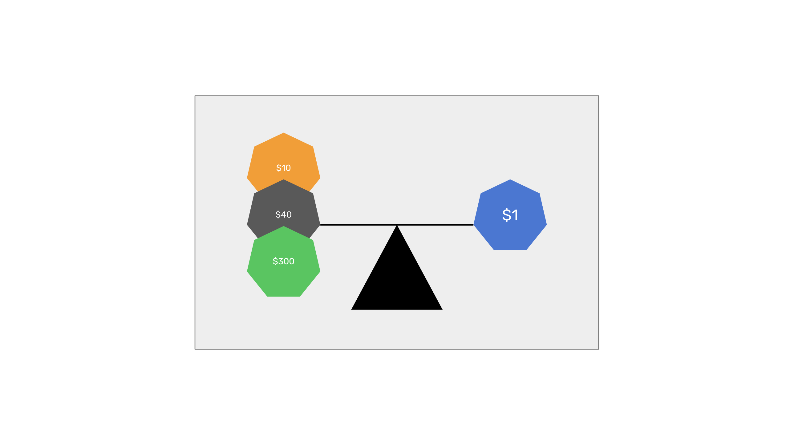

---
**You can listen to or watch this video here:**

<iframe width="560" height="315" src="https://www.youtube.com/embed/J1s7uyDgIZI" title="YouTube video player" frameborder="0" allow="accelerometer; autoplay; clipboard-write; encrypted-media; gyroscope; picture-in-picture; web-share" allowfullscreen></iframe>

---

In the previous class of the Ethereum Classic (ETC) course we explained what are stablecoins, convertible stablecoins in particular, how they work, and their risks. 

In this class we will explain what are algorithmic stablecoins, starting with a description of what are stablecoins in general, the two categories that exist, what are algorithmic stablecoins in particular, showing how they work, and, finally, their risks.

In the next few classes we will cover these other topics:

- Class 28: What Are Privacy Coins?
- Class 29: What Are Decentralized Finance (DeFi) Coins?
- Class 30: What Are File Storage Coins?

## What Are Stablecoins?

Stablecoins are cryptocurrencies that seek to have a stable value, usually mimicking the value of a fiat currency like the US dollar, that are pegged or collateralized by assets that may be the same fiat currencies they seek to mimic or other cryptocurrencies that serve as guarantee reserves to back their value.

The most popular stablecoins are:

- USDT - Issued by Tether Limited Inc.
- USDC - Issued by Center, a consortium formed by Circle and Coinbase.
- BUSD - Issued by Binance.
- DAI - Issued by Maker DAO.

Stablecoins are either convertible or algorithmic. In this class we will explain the latter.

## What Are Algorithmic Stablecoins?

Algorithmic stablecoins are one of the two general categories of stablecoins. The most popular and the main example of an algorithmic stablecoin is DAI.

These cryptocurrencies maintain a peg of one-to-one with a fiat currency that they seek to mimic.

Algorithmic stablecoins are guaranteed by other cryptocurrencies, such as Bitcoin, Ethereum, USDC, etc., and not by external reserves of the fiat currencies they seek to mimic as do convertible stablecoins.

The algorithmic stablecoins themselves are ERC-20 tokens inside blockchains such as ETC.

## How do Algorithmic Stablecoins Work?

1. Anyone with eligible crypto assets inside a programmable blockchain may send them to an algorithmic stablecoin vault smart contract to generate the stablecoin tokens.

2. When the algorithmic stablecoin vault smart contract receives crypto assets, then it creates (mints) the stablecoin tokens in a proportion according to a set margin. For example, someone may send $300 in crypto assets and receive $100 in the stablecoins or 100 stablecoins.

3. Once the algorithmic stablecoins are issued, they may be used for payments, to trade other tokens, NFTs, or crypto assets, or just hold them as a stablecoin.

4. The way the value of the algorithmic stablecoin is kept 1-to-1 to the fiat currency is that if it trades above $1, then people will convert more crypto assets into the stablecoin and lower its price. The same happens in reverse. If the stablecoin trades bellow $1, then people will buy it and convert it back into crypto assets.

5. When the algorithmic stablecoin vault smart contract receives the stablecoin tokens from a user, it redeems them and sends back the corresponding collateral. Users pay a fee when redeeming algorithmic stablecoins.

## What Are the Risks of Algorithmic Stablecoins?

Although the name of these stablecoins implies that their mechanics are algorithmic or automated, the truth is that all the parameters and ratios to maintain the stability of the algorithmic stablecoins are decided by a DAO of who’s token owners vote on all the variables based on their market analysis and subjective opinions.

This means that if the aggregate collateral crypto assets that back the algorithmic stablecoins crash or fail beyond the estimates of the voting members, then the stablecoins may lose their parity with their corresponding fiat currencies.

Algorithmic stablecoins are very complex systems and require many parts to be carefully calibrated to function properly.

---

**Thank you for reading this article!**

To learn more about ETC please go to: https://ethereumclassic.org

