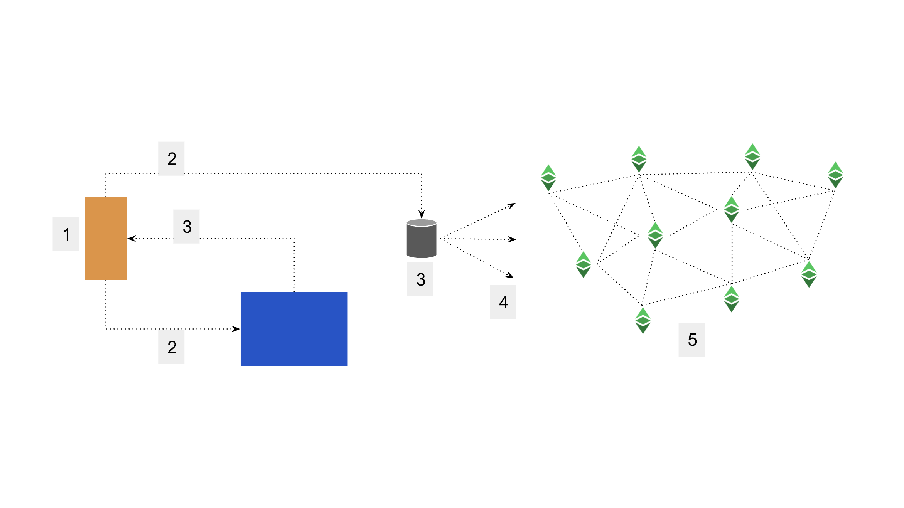
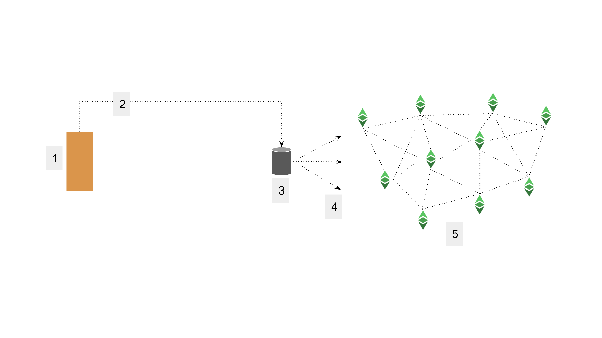
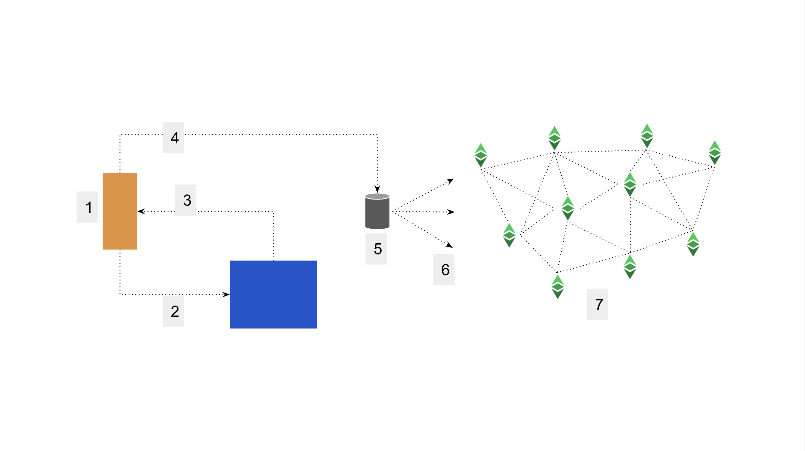
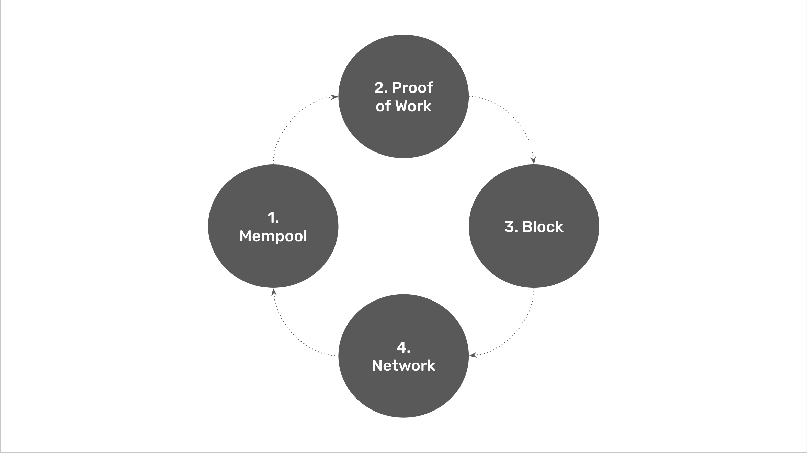
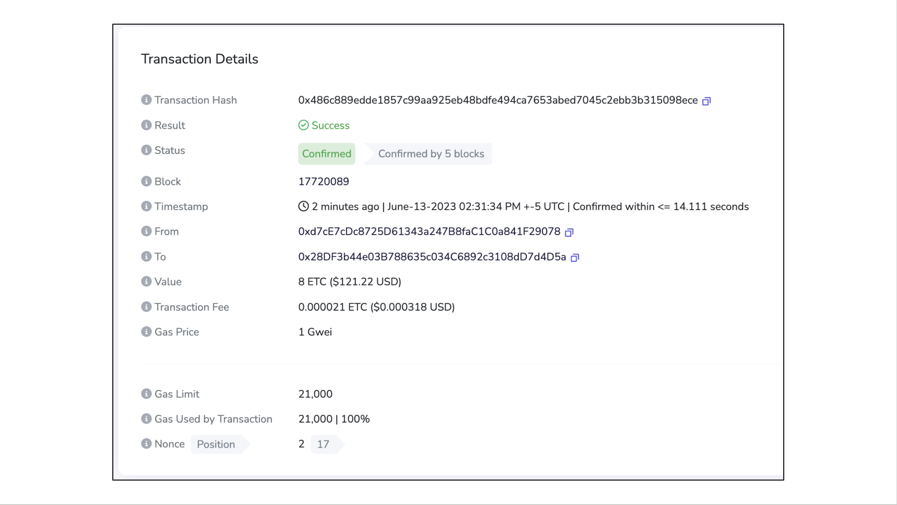

---
**You can listen to or watch this video here:**

<iframe width="560" height="315" src="https://www.youtube.com/embed/PD_aluJ_MVU" title="YouTube video player" frameborder="0" allow="accelerometer; autoplay; clipboard-write; encrypted-media; gyroscope; picture-in-picture; web-share" allowfullscreen></iframe>

---

Ethereum Classic (ETC) is a peer-to-peer network of computers around the world that hold a fully replicated copy of a ledger with accounts, balances, and smart contracts. 

To change the state of accounts, that is, to move money from one account to another, or to interact with smart contracts, the network is constantly receiving transactions sent by users worldwide.

When a transaction is sent to any node in ETC, it immediately retransmits it to the rest of the network to ensure that all nodes receive it. This happens within milliseconds.

Of all the nodes, a subset are what are called “miners” and these machines are the ones that do the work in “proof of work” to produce blocks, including these transactions into the blockchain, which is the name of the replicated ledger.

So, the questions are: What happens when a transaction is sent to ETC? When is a transaction accepted by the network? When is a transaction final or secure?

## Plain Transaction

There are two kinds of transactions that users typically send to ETC using their wallets: plain transactions or dapp or web3 transactions.

A plain transaction is usually to just move ETC from one address to another. The way it works is as follows:

1. The user enters the amount to send and the receiving address in the wallet app he or she is using and presses send
2. The wallet app sends the transaction to a remote node of the ETC network that it uses to process transactions
3. The remote node receives the transaction, confirms that the sending address has a sufficient balance, and that the transaction is correctly signed with the private key
4. The transaction is sent to the rest of the network
5. The rest of the network also verifies and processes the transaction and includes it in the blockchain forever

## Dapp or Web3 Transaction

A dapp or web3 transaction uses more steps and it calls smart contracts on the blockchain to execute more complex operations. The way it works is as follows:

1. The user goes to a dapp or web3 website and connects his or her wallet to that application
2. The user initiates a transaction, for example a DeFi trade or buying or selling an NFT, and presses send on the dapp or web3 application
3. The dapp or web3 application generates the transaction, which is usually to interact with a smart contract on the blockchain, and feeds it back to the user’s wallet
4. The user’s wallet then asks the user to accept and sign the transaction with his or her private key and sends it to a remote node of the ETC network that it uses to process transactions
5. The remote node receives the transaction and verifies that it is correct and signed
6. The transaction is sent to the rest of the network
7. The rest of the network also verifies and processes the transaction and includes it in the blockchain forever

## What Do Miners Do?

When we say above that the network “verifies and processes the transaction and includes it in the blockchain forever” what we mean is that the subgroup of the network nodes which are the miners get the transactions and include them in blocks. The way they do this is as follows:

1. Mempool: All the new transactions are accumulated in a pool of unprocessed transactions called the “mempool” which stands for “memory pool”
2. Proof of Work: Miners grab as many transactions as possible, giving preference to those that pay the highest fees. (This is why it is important to send transactions with the correct gas fees included.) A batch of transactions is created by each miner which is then hashed cryptographically in a process called proof of work
3. Block: After doing a lot of computational work and spending a lot of electricity, they stamp the batch of transactions with a cryptographic hash and create what is called a block of transactions
4. Network: When they have the block ready, then they immediately send it to the rest of the network for verification and full replication in all nodes of the system

## How Can I Know if a Transaction Is Included in the Chain?

When any transaction sent by a user goes through all the steps mentioned above, it will then be recorded in the blockchain forever, as said before.

Transactions themselves may take between 13 seconds (one block time) to 39 seconds (three block times) to be included in the ETC blockchain if it was sent with the correct gas fees. This is because miners create blocks in ETC every 13 seconds and sometimes the full replication and inclusion of a transaction into a block may take between one to three blocks.

If a transaction has very low fees or if there is a lot of traffic in the network it may take longer.

Once transactions are processed, users may check if they were included in the network by going to an ETC block explorer such as [Blockscout](https://blockscout.com/etc/mainnet/).

In the image above you may see a sample transaction on Blockscout, the main ETC explorer. You may check it out by going to the following link:

https://blockscout.com/etc/mainnet/tx/0x486c889edde1857c99aa925eb48bdfe494ca7653abed7045c2ebb3b315098ece

## The Different Risks of Senders vs Receivers

In an economic transaction, when sending money from one address to another in ETC, the one usually bearing the risk is the receiver. 

This is because the transaction may have been sent, but it may be uncertain when it will finally be included into the blockchain, if the sender entered the correct gas fees, if it was included in a finalized block or a stale block (also called uncle block), or if it may be reversed by a 51% attack.

To know more about how calculate these risks, and when to rest assured that a transaction is final, please see our next post entitled “What Is a Good Number of Block Confirmations?” which will be published after this one!

---

**Thank you for reading this article!**

To learn more about ETC please go to: https://ethereumclassic.org
